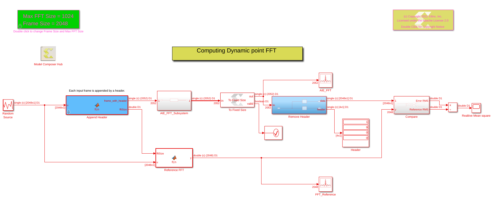
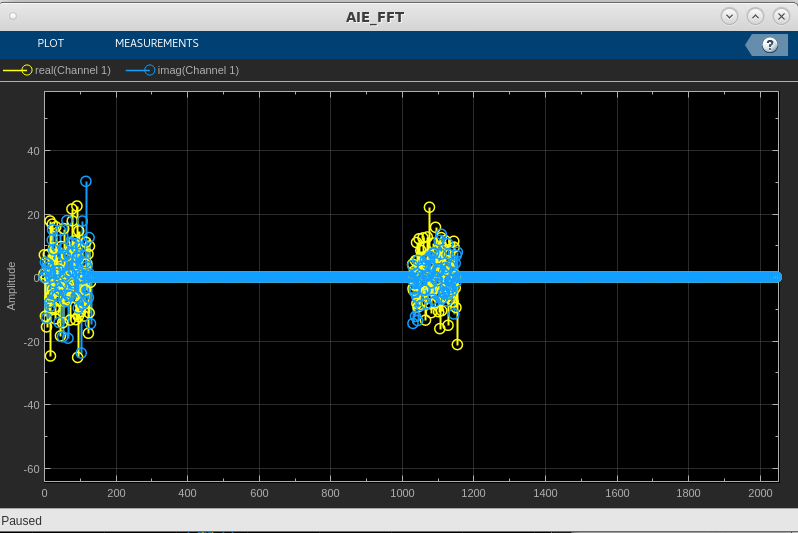

# AI Engine Dynamic Point FFT

The AI Engine Dynamic Point FFT block in Vitis Model Composer allows taking FFT of different sizes (up to a maximum FFT size) of the input frame. The FFT size is determined by a header that is appended to every input frame. This example showcases the use of this block.

## Knowledge nuggets

:bulb: Every input frame must be appended by a header.

:bulb: If the FFT size (N) is smaller than the frame size, the block takes the N point FFT of the first N samples in the input frame, and discards the rest of the samples in the frame.

:bulb: If the frame size is a multiple (M) of max FFT size, M FFT iterations will be performed on a given input frame, resulting in multiple iterations of output samples, reducing the numer of times the kernel needs to be triggered to process a given number of input data samples. As a result, the overheads inferred during kernel triggering are reduced and overall performance is increased.

The picture below depicts the output of a Dynamic Point FFT block with a 128 point FFT, an input frame size of 2048 random inputs, and max fft size of 1024.

--------------
Copyright 2022 Xilinx

Licensed under the Apache License, Version 2.0 (the "License");
you may not use this file except in compliance with the License.
You may obtain a copy of the License at

    http://www.apache.org/licenses/LICENSE-2.0

Unless required by applicable law or agreed to in writing, software
distributed under the License is distributed on an "AS IS" BASIS,
WITHOUT WARRANTIES OR CONDITIONS OF ANY KIND, either express or implied.
See the License for the specific language governing permissions and
limitations under the License.

