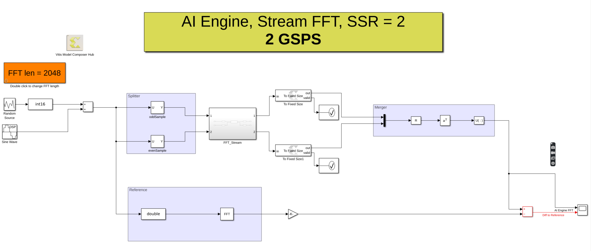

# Stream based FFT with Super Sample Size of 2

In this example we use the stream based FFT block to create a design that can process data at up to 2 GSPS. Each stream input into the block has a rate of 1 GSPS. 

## Knowledge nuggets

:bulb: To achieve the 2GSPS rate, we use PLIO blocks with 64 bit width and a frequency of 500 MHz

--------------
Copyright 2022 Xilinx

Licensed under the Apache License, Version 2.0 (the "License");
you may not use this file except in compliance with the License.
You may obtain a copy of the License at

    http://www.apache.org/licenses/LICENSE-2.0

Unless required by applicable law or agreed to in writing, software
distributed under the License is distributed on an "AS IS" BASIS,
WITHOUT WARRANTIES OR CONDITIONS OF ANY KIND, either express or implied.
See the License for the specific language governing permissions and
limitations under the License.

