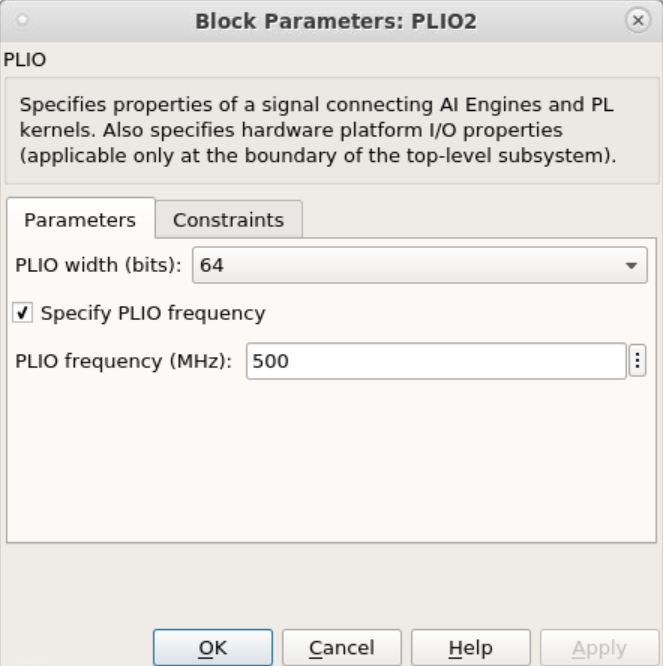

# Stream based FFT with Super Sample Rate of 2 running at 2 GSPS

In this example we use the stream based FFT block to create a design that can process data at up to 2 GSPS. Each stream input into the block has a rate of 1 GSPS. With SSR of two, you can have up to 4096 point FFT. For FFT larger than 4096, you should increase the SSR. For example, for SSR of 4, the block will have four input streams and four output streams and can process data at 4 GSPS.

&nbsp;&nbsp;&nbsp;
#### AI Engine Subsystem (FFT_Stream)

## Knowledge nuggets

:bulb: To achieve the 2GSPS rate, we use PLIO blocks with 64 bit width and a frequency of 500 MHz

:blub: Note that we have explicitly set the number of cascade stages for the FFT stream block (in the Advanced tab) to one. 

:bulb: To verify the data rates, set the Hub block (see below). Simulink Data Inspector will open after code generation and you can see the data rates for each stream output there. 

--------------
Copyright 2022 Xilinx

Licensed under the Apache License, Version 2.0 (the "License");
you may not use this file except in compliance with the License.
You may obtain a copy of the License at

    http://www.apache.org/licenses/LICENSE-2.0

Unless required by applicable law or agreed to in writing, software
distributed under the License is distributed on an "AS IS" BASIS,
WITHOUT WARRANTIES OR CONDITIONS OF ANY KIND, either express or implied.
See the License for the specific language governing permissions and
limitations under the License.

