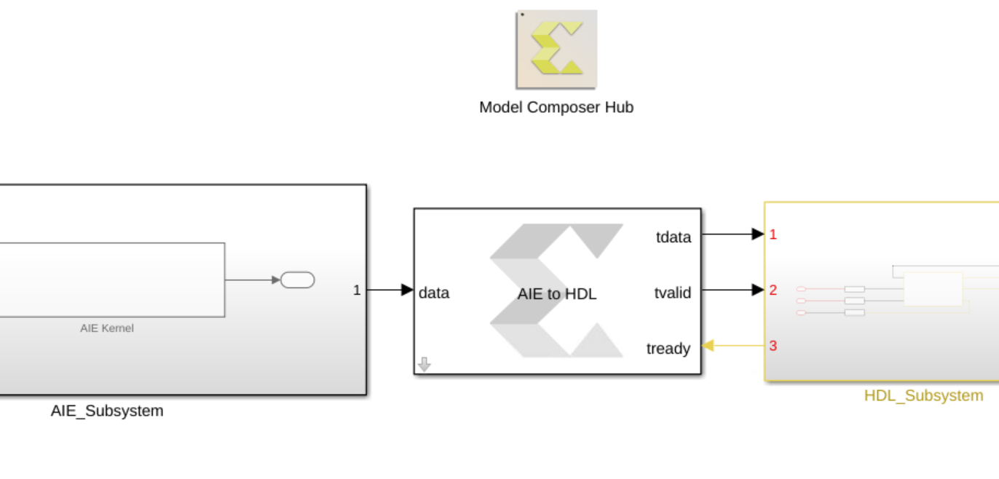

# PL + AI Engine design Examples 
Versal AI Core devices are highly integrated, multicore compute platform that can adapt with evolving and diverse algorithms. These devices include both Programmable Logic (PL) and an AI Engine array. Vitis Model Composer provides a design environment, based on industry standard MATLAB and Simulink tools, to model and simulate designs with both PL and AI Engine components.

  

# Examples

<table style="width:100%">
 <tr>
 <td width="35%" align="center"><b>Topic</b>
 <td width="65%" align="center"><b>Description</b>
 </tr>
 <tr>
 <td align="left">
   <a href="./AIE_HDL/README.md">Designs with both AI Engine and HDL blocks</a>
 </td>
 <td>Examples of designs with both AI Engine kernels and HDL blocks. Here you can see examples of importing Verliog code into Model Composer and co-simulation with AI Engine   blocks at high speeds.
 </td>
 </tr>
 <tr>
 <td align="left">
   <a href="./AIE_HLS/README.md">Design with both AI Engines and HLS kernels</a>
 </td>
 <td>Example of a design with both AI Engine kernels and an HLS kernel.
 </td>
 </tr>
  
   <tr>
 <td align="left">
 <a href="./FFT2D/README.md">2D FFT (AI Engines + HDL/HLS) </a>
 </td>
 <td> The designs here showcase 2D-FFTs that are implemented both in AI Engines and Programmable Logic(PL). In one example the PL is implemented using HLS and in another example the PL is implemented using HDL blocks in Vitis Model Composer.</td>
 </tr>
  
   <tr>
 <td align="left">
   <a href="./SingleStreamSSR_FIR_withPL/README.md">Super Sample Rate FIR filter with PL</a>
 </td>
 <td> This design showcases a Super Sample Rate FIR filter to process a 4GSPS input stream. In this design we consider latencies within the kernels, which are implemented into the FIFO's included in AXI-Stream Interconnect(PL). 
 </td> 
 </tr>
  
   <tr>
 <td align="left">
 <a href="./Tx_chain_200MHz/README.md">TX Chain 200MHz </a>
 </td>
 <td> This design showcases the Vitis Model Composer implementation of the commslib example, TX chain 200MHz, which is part of the communications Library Early access program.</td>
 </tr>
  
 </table>
