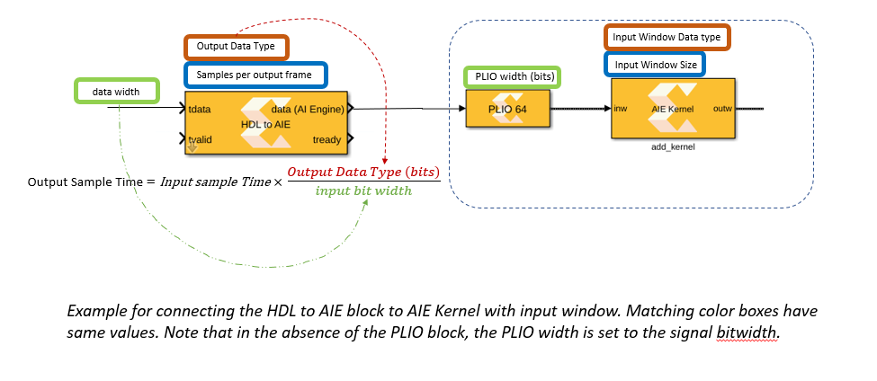

# Connecting AI Engine blocks with HDL blocks
In Vitis Model Composer, simulation of the AI Engine blocks is untimed while the simulation of HDL blocks is timed (cycle accurate). 
If you are simulating a heterogeneous system with both PL (modeled with HDL blocks) and AI Engine, you need to use “AIE to HDL” and “HDL to AIE” blocks to properly 
manage the sampling times across the two domains. This mini tutorial explains how to set these two blocks properly and what to be aware of.

# Setting the AIE to HDL block 
## Step 1 Set the system clock
You should start by setting the system clock for your HDL design. This is set in the Clocking tab in the System Generator block. 
The default is 10ns, meaning that your design will be clocked at 100MHz. On the same tab, another corresponding parameter is “Simulink system period”. 
These two numbers define the scaling factor between time in a Simulink simulation, and time in the actual hardware implementation. 
To learn more about these two parameters, refer to [UG1483](https://www.xilinx.com/support/documentation/sw_manuals/xilinx2021_1/ug1483-model-composer-sys-gen-user-guide.pdf). 
In this writeup, we assume your HDL design is a single rate design. The sample time for the HDL blocks in your design should be set to the “Simulink system period”. See Step 3.

## Step 2 Know the initiation interval(ii) of your HDL design
A factor in setting the Output Sample Time in the AIE to HDL block is the initiation interval of the HDL subsystem. 
As mentioned earlier, simulation in HDL domain is cycle accurate. 
An HDL design may not be ready to accept a new data at every cycle (the tready signal from the HDL design will be set to zero when the HDL design cannot accept new samples). 
For example, if an HDL design accepts a new sample every 10th cycles, the design would have an initiation interval (or ii) of 10. A design that can accept a new sample at every clock cycle has an initiation interval of one.

## Step 3 Set the parameters of the AIE to HDL block
Set the output sample time to the “Simulink System Period” set in the System Generator block. 
The output data type parameter is limited to 32, 64, and 128 bits wide. This reflects the permissible data bit-width between AI Engine array and PL. 
There are more constraints in place. For example, if the input signal is of type int64, the output data type can only be of type int64, and uint128. 
(Note that the block will pack the incoming 64bit data into 128 bits). If the input is of type int16(c), then the output should be uint32, uint64, or uint128.  

## Step 4 Set the input sample rate into the AIE to HDL block
Set the sample period of the signal entering the AIE to HDL block to

*Output Sample Time x Input Size x ii*

To set the input sample period to the AIE to HDL blocks, you should set the input sample time of the source blocks that ultimately lead into the AIE to HDL block.
Let’s understand the reason for this formula. 
For the moment, assume ii is one (tready is always set to one). 
If the input to the “AIE to HDL block” is a variable size signal of size *Input Size*, and the period is 
*Input Period* (you can determine the sample period by opening the [Timing Legend](https://www.mathworks.com/help/simulink/ug/how-to-view-sample-time-information.html) in Simulink),
this means in the time period *Input Period* we are feeding *Input Size* samples into the block. 
To prevent the internal buffer of the block to overflow, the output rate from the AIE to HDL block should be the same as its input. 
The input rate is *(Input Size)/(Input Period)* and the output rate is *1/(Output Sample Time)*. When ii is larger than one, the output rate is reduced to *1/(Output Sample Time)/ii*. 

# Setting the HDL to AIE block 

## Step 1 Set the Output Data Type
The Output Data Type should be set to the data type that the consuming AI Engine block accepts. 
Note that the size you set for the PLIO should match the input bitwidth to the HDL to AIE 
block while the output data type of the AIE to HDL block should match the input data type of the consuming AIE block. See the figure at the buttom of this page.

## Step 2 Set the Output frame size
Let’s assume the consuming AIE block has a window input size of P, or it has a 
stream input that needs to read P samples to unblock (for example a readincr_v4 requires 4 input samples to unblock). Set samples per output frame to P.

## Step 3 Set the Output Sample Time
Set the Output Sample Time to:

output sample time= input sample time*(output bit width)/(input bit width)

## Step 4 Set the tready Sample Time
tready Sample Time should be the same as the HDL design sample time.

# Examples
In this GitHub repository, you can find several examples in which the AIE to HDL and HDL to AIE blocks are being used:

* <a href="../../Designs/FFT2D">2D FFT (AI Engines + HDL/HLS) </a>
* <a href="../../AIE_HDL/README.md">Designs with both AI Engine and RTL blocks</a>

--------------
Copyright 2020 Xilinx

Licensed under the Apache License, Version 2.0 (the "License");
you may not use this file except in compliance with the License.
You may obtain a copy of the License at

    http://www.apache.org/licenses/LICENSE-2.0

Unless required by applicable law or agreed to in writing, software
distributed under the License is distributed on an "AS IS" BASIS,
WITHOUT WARRANTIES OR CONDITIONS OF ANY KIND, either express or implied.
See the License for the specific language governing permissions and
limitations under the License.
