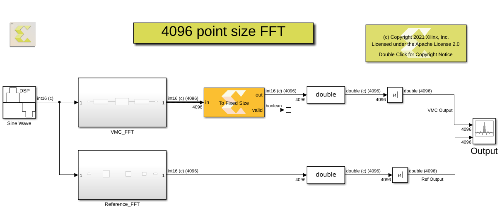
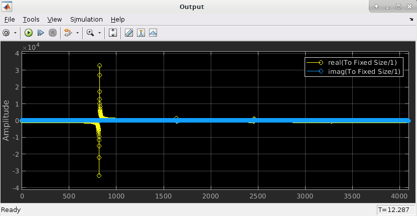

# 4K point size FFT

The FFT block within the AI Engine library supports the point size of 2^N, where N is in the range 4 to 11 inclusive. However, for cint16 datatype, the FFT size can be 2^12(4096), provided the FFT receives and outputs data to/from kernels on the same processor. This example demonestrates the usage of 'stream to window' and 'window to stream' widgets which helps in mapping the complete FFT operation to single AI Engine processor as shown below. 

Image below depicts the output of DSPlib AI Engine FFT for a complex sinusoidal input:

------------
Copyright 2020 Xilinx

Licensed under the Apache License, Version 2.0 (the "License");
you may not use this file except in compliance with the License.
You may obtain a copy of the License at

    http://www.apache.org/licenses/LICENSE-2.0

Unless required by applicable law or agreed to in writing, software
distributed under the License is distributed on an "AS IS" BASIS,
WITHOUT WARRANTIES OR CONDITIONS OF ANY KIND, either express or implied.
See the License for the specific language governing permissions and
limitations under the License.
