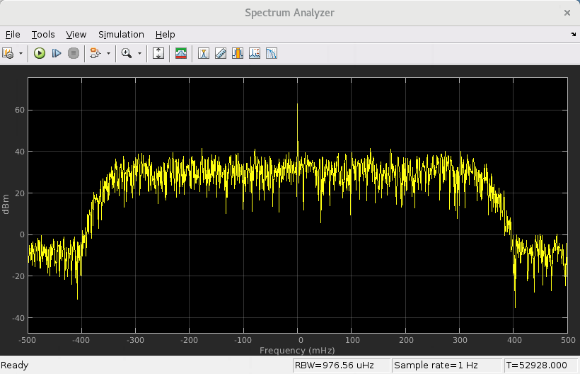

# Vector Real Time Parameter (RTP)
This is an example of an AIE Kernel that is controlled by a syncronous RTP input. The value of the RTP input changes between a wide filter and a narrow filter.

## Knowledge nuggets
:bulb: An RTP input can be a scaler or a vector.

:bulb: Note the usage of 'RTP Source' block. This block allows you to convinienetly set the RTP input source to an AI Engine block.

:bulb: In this example, the RTP input is a _sync_ input. For the kernel to run, a write to the input parameter needs to take place at every invocation of the kernel or else the kernel will not run. For this reason, using the _repmat_ command in MATLAB, in the RTP source block, we set the RTP value to _[repmat(narrow_filter,1, 512), repmat(wide_filter,1, 512)]_. As such, for the first 512 invocations, we pass the narrow filter to the kernel, and for the next 512 invocations, we pass the wide filter to the kernel.

:bulb: In the RTP source block, we set the _"Form output after final data"_ parameter to _Cycle repetition_ so that the switch between the narrow filter and wide filter described above will continue until the end of the simulation. 

------------
Copyright 2020 Xilinx

Licensed under the Apache License, Version 2.0 (the "License");
you may not use this file except in compliance with the License.
You may obtain a copy of the License at

    http://www.apache.org/licenses/LICENSE-2.0

Unless required by applicable law or agreed to in writing, software
distributed under the License is distributed on an "AS IS" BASIS,
WITHOUT WARRANTIES OR CONDITIONS OF ANY KIND, either express or implied.
See the License for the specific language governing permissions and
limitations under the License.
