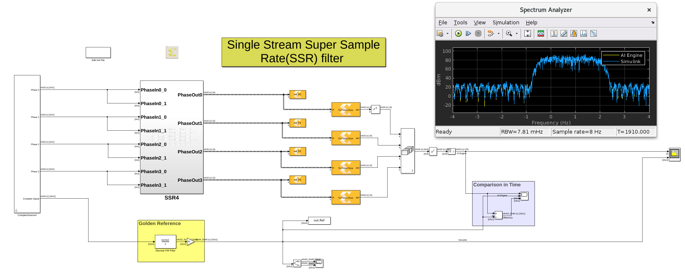

# Single Stream SSR FIR
This model showcases a single stream super sample rate FIR filter to process a 4 GSPS stream build with 16 AI Engine kernels. In addition, we compare the output of the AI Engine design with a Simulink FIR filter that we consider as our golden reference.

