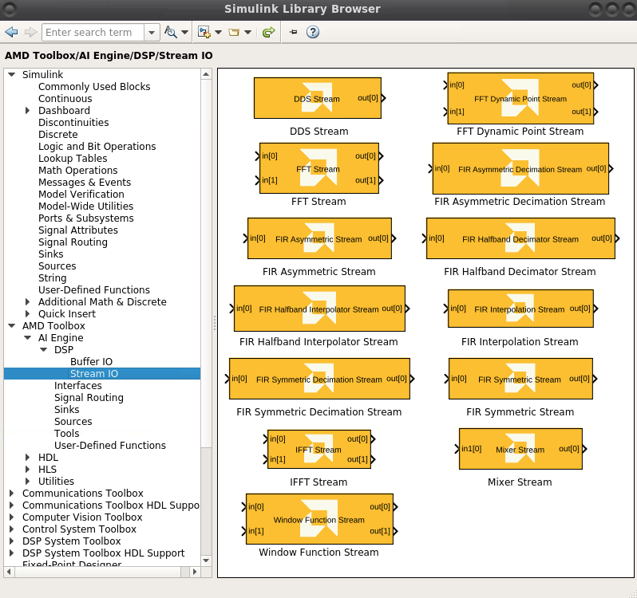

# Using AI Engine functions from DSPlib

DSPlib is a library of commonly used DSP functions optimized for AI Engines. To facilitate the use of these functions in a design, Vitis Model Composer provides different DSPlib functions as blocks within the Xilinx Toolbox/AI Engine library. You can conveniently drag and drop one of these blocks into your model from the Simulink Library browser and configure the block.

Here we demonstrate how you can use these functions in Vitis Model Composer.

Here you see examples for FIR,FFT and Matrix Multiply functions.

## Knowledge nuggets

:bulb: For FIR and FFT examples, we are using the blocks available in AIEngine/DSPlib library directly. However, for matrix multiply example, we are importing the function as a graph from the  DSPlib [Git hub location].

:bulb: When importing the graph, you use the graph header file from 'dsplib/L2/include'to import the function.

## Examples
- [Using the AI Engine FIR block from the library browser](fir/README.md)
- [Using the AI Engine SSR FIR block from the library bowser to achieve 4 Gsps](fir_ssr/README.md)
- [Usign the AI Engine FFT block from the library browser](fft/README.md)
- [Importing Matrix Multiply from DSPLib as a block](matrix_multiply/README.md)

--------------
Copyright 2020 Xilinx

Licensed under the Apache License, Version 2.0 (the "License");
you may not use this file except in compliance with the License.
You may obtain a copy of the License at

    http://www.apache.org/licenses/LICENSE-2.0

Unless required by applicable law or agreed to in writing, software
distributed under the License is distributed on an "AS IS" BASIS,
WITHOUT WARRANTIES OR CONDITIONS OF ANY KIND, either express or implied.
See the License for the specific language governing permissions and
limitations under the License.
