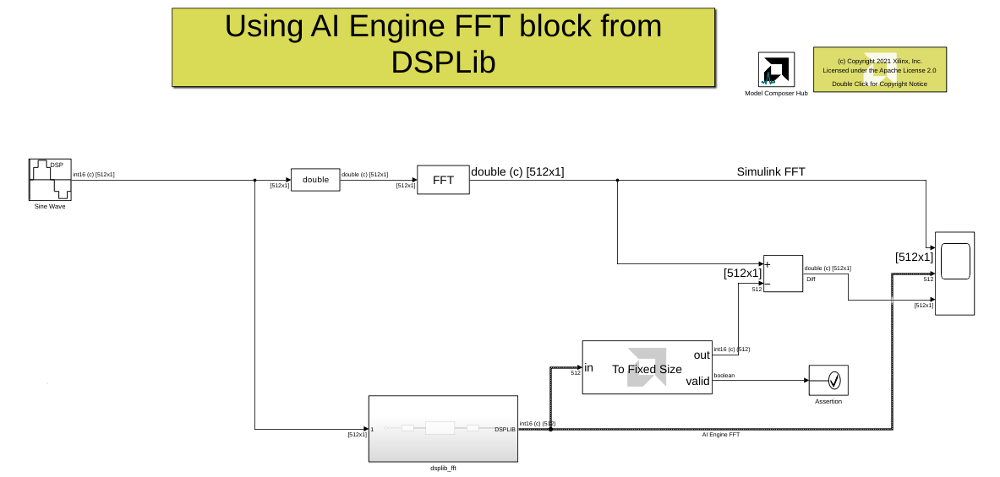
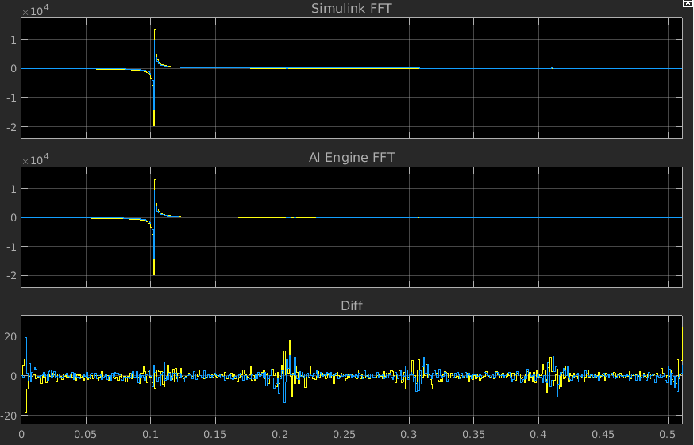

# Using DSPLib AI Engine FFT directly from the library browser

This example demonestrates using the AI Engine FFT block in Model Composer and comparing the results to the Simulink FFT block. 

## Knowledge nuggets

:bulb: Note the usage of the [environment varibale](https://www.mathworks.com/help/matlab/ref/setenv.html) in MATLAB to more easily set the paths in the AIE Graph block mask.

:bulb: Note the usage of the *To Fixed Size* block to convert a variable size signal to a fixed size signal. This is needed to compare the output of the AIE block to the output of the FFT block from Simulink (which is a fixed size signal). Note this is only valid if the variable size signal is fully packed. Otherwise, the *To fixed size* block will insert zeros when samples are missing. To make sure this is not the case, you can check the status output of the *To fixed Size* block. 

Image below depicts the output of DSPlib AI Engine FFT for a complex sinusoidal input:

------------
Copyright 2020 Xilinx

Licensed under the Apache License, Version 2.0 (the "License");
you may not use this file except in compliance with the License.
You may obtain a copy of the License at

    http://www.apache.org/licenses/LICENSE-2.0

Unless required by applicable law or agreed to in writing, software
distributed under the License is distributed on an "AS IS" BASIS,
WITHOUT WARRANTIES OR CONDITIONS OF ANY KIND, either express or implied.
See the License for the specific language governing permissions and
limitations under the License.
