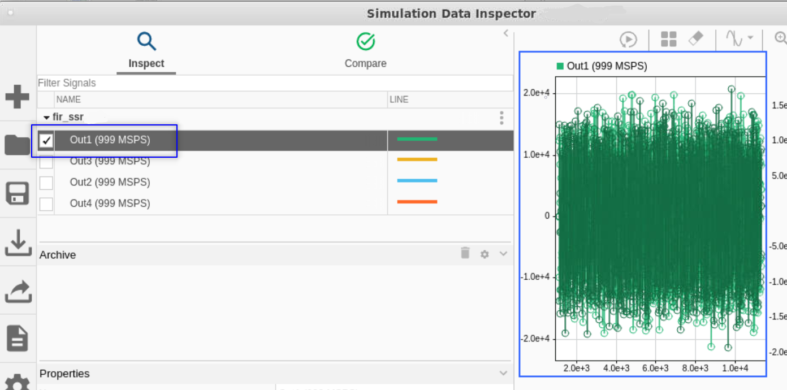
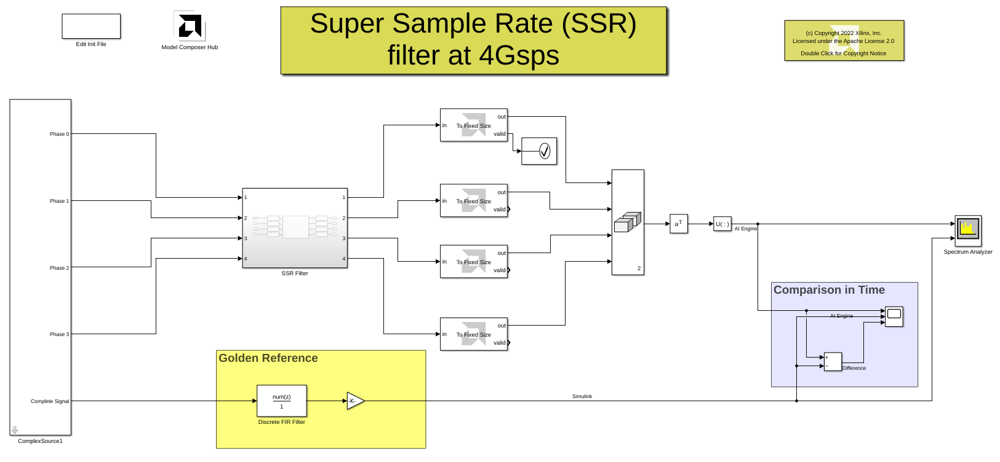

# Using DSPLib AI Engine SSR FIR directly from the library browser

This example demonstrates using the AI Engine 'FIR Asymmetric Filter' block with an SSR of 4 in Vitis Model Composer to achieve a high throughput and comparing the results to the Simulink FIR block.

Each stream input to the filter block has a thoughput of close to 1 GSPS for a total of 4 GSPS. To achieve this throughput the following factors are in play:

* 64 bit wide PLIO blocks on all the inputs and outputs.
* PL frequency specified in the PLIO block at 500 MHz.
* A high value for the parameter "Input frame size" on the filter block, in this case 8192. Note this parameter is the sum of the signal sizes of all the four inputs. A larger value means at each invocation of the filter, more samples will be processed which reduces the total overhead we incur when we invoking the kernel. 

## Knowledge nuggets

:bulb:  The input data is split over four ports, where each successive sample is sent to a different input port in a round-robin fashion

:bulb: The number of AI Engines used is equal to SSR^2 * CASC_LEN (in this case 4^2*2=32)

:bulb: Note that the Spectrum Analyzer block accepts a Variable Size Signal as input. Likewise, Simulink *Scope* block and *Display* block also accept variable size signals as inputs.

:bulb: Note how you can design the filter using the *Filter Design and Analysis tool* and directly pass the resulting taps to the AI Engine 'FIR Asymmetric Filter' block. 

------------
Copyright 2022 Xilinx

Licensed under the Apache License, Version 2.0 (the "License");
you may not use this file except in compliance with the License.
You may obtain a copy of the License at

    http://www.apache.org/licenses/LICENSE-2.0

Unless required by applicable law or agreed to in writing, software
distributed under the License is distributed on an "AS IS" BASIS,
WITHOUT WARRANTIES OR CONDITIONS OF ANY KIND, either express or implied.
See the License for the specific language governing permissions and
limitations under the License.
