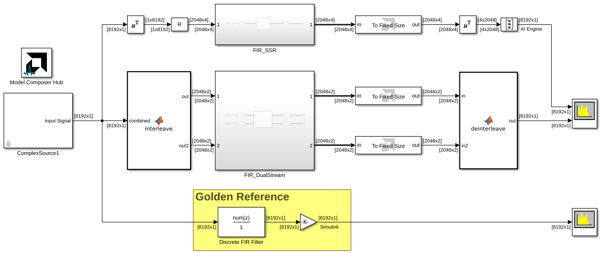
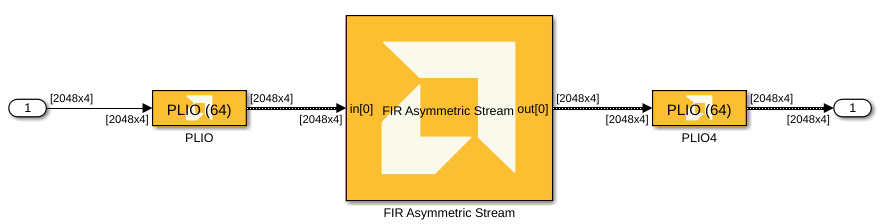
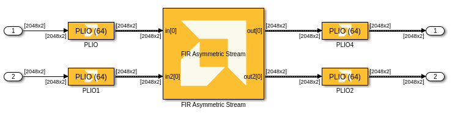
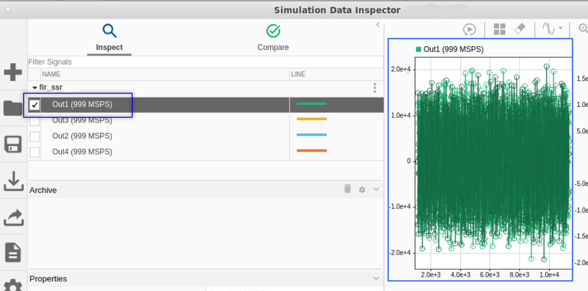
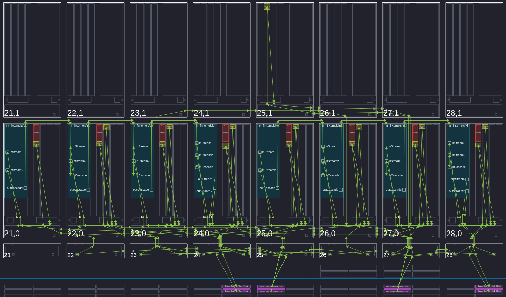
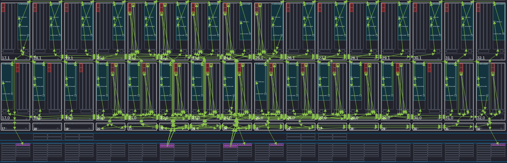

# Using DSPLib AI Engine SSR FIR 

This example demonstrates using the AI Engine **FIR Asymmetric Stream** block to achieve a FIR filter with a throughput of 4 GSPS. 

Each stream input to the filter has a throughput of close to 1 GSPS, so at least 4 streams are required to achieve a throughput of 4 GSPS.

>**Why does each stream have a throughput of 1 GSPS?** 
>
>According to the [Vitis DSP Library documentation](https://docs.amd.com/r/en-US/Vitis_Libraries/dsp/user_guide/L2/func-fir-filtersAIE.html_6_2), a single-kernel 16-tap single-rate asymmetric FIR implemented on AIE device (`cint16` data and `int16` coefficients) offers a throughput of 998 MSa/s. We can add a second kernel (increase the cascade length to 2) to double the FIR length to 32.
>
>To accurately model this throughput in VMC, we set the **PLIO** blocks' width to 64 bits and the PL frequency to 500 MHz. 2 `cint16` samples are transferred on each PL clock cycle for a maximum total throughput of 1 GSPS on each stream.

Two approaches are shown:

1. **FIR Asymmetric Stream block with `SSR=4`:** In this case the filtering operation is parallelized 4 times across multiple AI Engine tiles.

>The SSR value inside the FIR block is set to **Inherit from number of input columns**. The FIR input is a matrix with 4 columns, so the SSR value will be 4.
>
>To experiment with different SSR values, change the `SSR` variable in the MATLAB workspace and Update Diagram (Ctrl+D).

2. **FIR Asymmetric Stream block with `SSR=2` and dual stream input/outputs:** This approach takes advantage of dual stream inputs/outputs on AI Engine tiles (for the AIE architecture) to use fewer tiles for the same number of streams.

To study each implementation, open the **Vitis Model Composer Hub** block, select either the `FIR_SSR` or `FIR_DualStream` subsystem, and run **Analyze** from the Analyze tab.

To view each implementations throughput after AIE simulation concludes, click **View AIE simulation output and throughtput**. Both approaches achieve the expected throughput on each stream:

However, the dual stream approach uses fewer AI Engine tiles. To view the resource utilization, select **Open Vitis Analyzer** from the Vitis Model Composer Hub block. When the Vitis Analyzer opens, select **Array** from the Analysis menu.

The dual stream approach uses 9 tiles: 

compared to the `SSR=4` approach which uses 32 tiles:

## Related Examples

* [This](../../SingleStreamSSR_FIR/README.md) is another example of a high throughput filter built from scratch instead of using the block from the AMD AI Engine DSP library.

* [This](../../../AIENGINE_plus_PL/AIE_HDL/SingleStreamSSR_FIR_withPL/README.md) is an example of an AI Engine/Programmable Logic heterogeneous design where the AI Engine is also built from scratch instead of using the block from the AMD AI Engine DSP library along with HDL blocks feeding the AI Engine array and receiving the filtered data back from the array.

------------

Copyright (c) 2025 Advanced Micro Devices, Inc.

Licensed under the Apache License, Version 2.0 (the "License");
you may not use this file except in compliance with the License.
You may obtain a copy of the License at

    http://www.apache.org/licenses/LICENSE-2.0

Unless required by applicable law or agreed to in writing, software
distributed under the License is distributed on an "AS IS" BASIS,
WITHOUT WARRANTIES OR CONDITIONS OF ANY KIND, either express or implied.
See the License for the specific language governing permissions and
limitations under the License.
