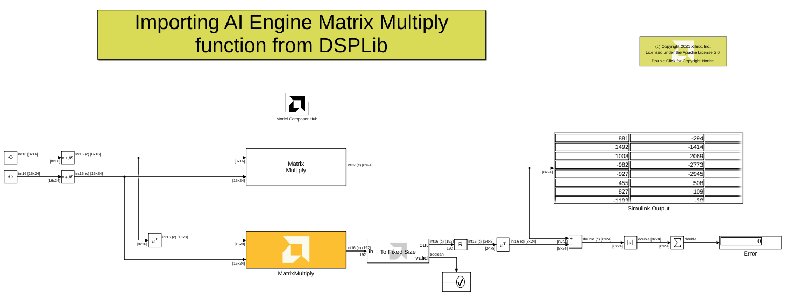

# Importing AI Engine matrix multiply from DSPLib as a block into Model Composer

This example demonstrates importing a matrix multiply function as a block into Model Composer and comparing the results to Simulink matrix multiply. In this example, we use the import graph block to import the matrix multiply function.

## Knowledeg nuggets

:bulb: Note the usage of the [environment variable](https://www.mathworks.com/help/matlab/ref/setenv.html) in MATLAB to more easily set the paths in the AIE Graph block mask.

:bulb: Note this example is using the AI Engine DSP library that is shipping with Vitis Model Composer. We are using the command *setenv("DSPLIB_ROOT",xmcLibraryPath('get','dsplib'))* to set the DSPLIB_ROOT environmental variable.

:bulb: Note we are importing matrix multiply as a graph.

------------
Copyright 2021 Xilinx

Licensed under the Apache License, Version 2.0 (the "License");
you may not use this file except in compliance with the License.
You may obtain a copy of the License at

    http://www.apache.org/licenses/LICENSE-2.0

Unless required by applicable law or agreed to in writing, software
distributed under the License is distributed on an "AS IS" BASIS,
WITHOUT WARRANTIES OR CONDITIONS OF ANY KIND, either express or implied.
See the License for the specific language governing permissions and
limitations under the License.
