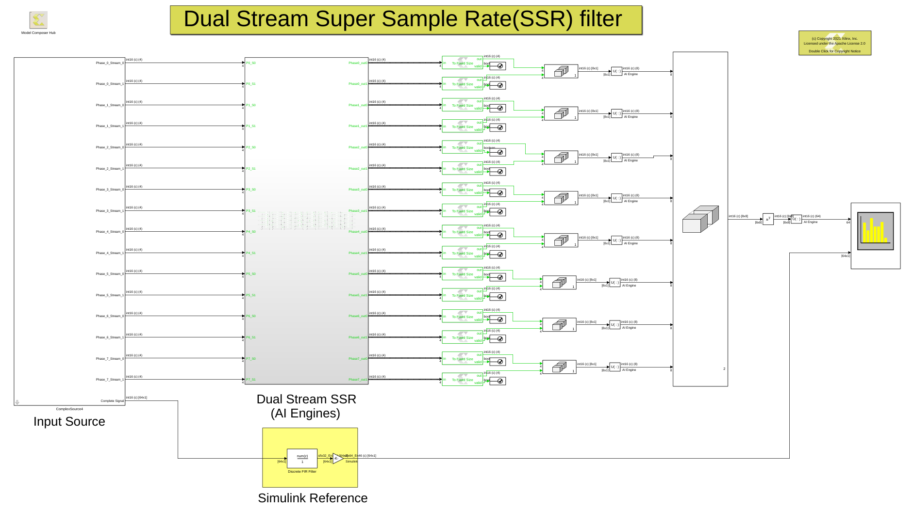

# Dual Stream SSR FIR
This model showcases a dual stream Super Sample Rate (SSR)
FIR filter to process a 16 GSPS stream built with 64 AI Engine kernels. In addition, we compare the output of the AI Engine design with a Simulink FIR filter block that we consider as our golden reference.

For more details on how to build this design and some of the theoretical aspect of it click [here](https://github.com/Xilinx/Vitis-Tutorials/tree/2021.1/AI_Engine_Development/Design_Tutorials/02-super_sampling_rate_fir/DualStreamSSR).

## Knowledge nuggets
:bulb: In the Model Composer Hub block select *"Plot AIE Simulation output and estimate throughput"* to see the throughput for each output signal after running aiesimulation. 
  
  

------------
Copyright 2021 Xilinx

Licensed under the Apache License, Version 2.0 (the "License");
you may not use this file except in compliance with the License.
You may obtain a copy of the License at

    http://www.apache.org/licenses/LICENSE-2.0

Unless required by applicable law or agreed to in writing, software
distributed under the License is distributed on an "AS IS" BASIS,
WITHOUT WARRANTIES OR CONDITIONS OF ANY KIND, either express or implied.
See the License for the specific language governing permissions and
limitations under the License.
