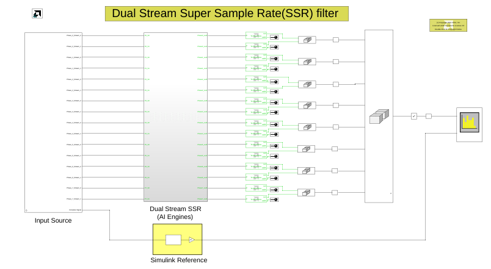

# Dual Stream SSR FIR
This model showcases a dual stream Super Sample Rate (SSR)
FIR filter to process a 16 GSPS stream built with 64 AI Engine kernels. In addition, we compare the output of the AI Engine design with a Simulink FIR filter block that we consider as our golden reference.

For more details on how to build this design and some of the theoretical aspects of it click [here](https://github.com/Xilinx/Vitis-Tutorials/tree/2025.1/AI_Engine_Development/AIE/Design_Tutorials/02-super_sampling_rate_fir/DualStreamSSR).

## Knowledge nuggets
:bulb: In the Model Composer Hub block select *"Plot AIE Simulation output and estimate throughput"* to see the throughput for each output signal after running aiesimulation. 
  
  

------------

Copyright (c) 2025 Advanced Micro Devices, Inc.

