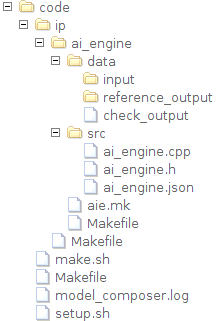
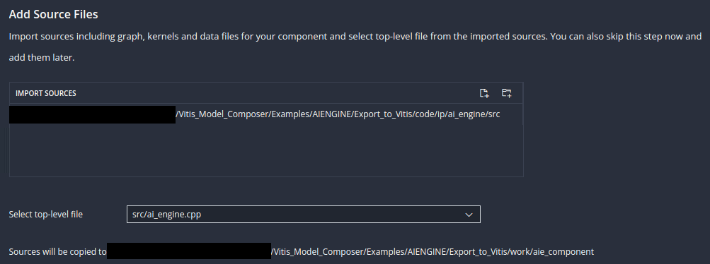
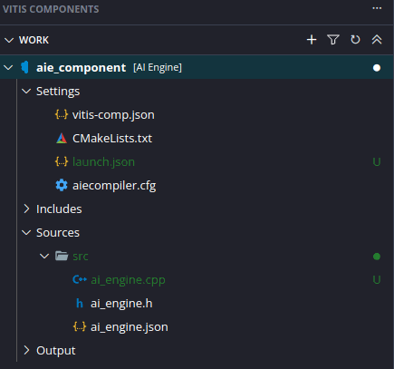

# Export AI Engine Design from Vitis Model Composer to Vitis

In this tutorial, we will show how to export an AI Engine design into a 
Vitis system project after it has been simulated and validated in Vitis 
Model Composer.

In the early stages of the development cycle, it is critical to verify 
the functional behavior of the AI Engine kernels and graph. Vitis Model 
Composer is an ideal choice for testing and debugging at this level 
because of the speed of iteration and the high level of data visibility it 
provides the AI Engine developer.

To run on Versal hardware, the finished AI Engine design must be linked 
to data movers running on the PL and a host application running on the PS. 
This linking step, as well as the subsequent packaging of the finished 
hardware image, is accomplished via a Vitis project.

There are 2 ways to export an AI Engine design from Vitis Model Composer:

1. **Generate Code**: This generates the AI Engine graph and kernel 
code for the AI Engine design. This approach does not require a pre-existing Vitis 
platform. The exported code can be brought into Vitis as an 
**AI Engine Component**.

2. **Generate libadf.a**: In addition to the above, Vitis Model Composer
runs the AI Engine code through the AI Engine Compiler 
to produce a libadf.a. Vitis Model Composer also produces HLS C++ source 
code for datamovers and a connectivity graph (.cfg file) that describes 
how the AI Engine and datamovers are connected. This approach requires
a pre-existing base or custom Vitis platform. The build artifacts can be
brought into Vitis as a **System Project**.

This tutorial will describe both approaches.

## Tutorial System Design

The design that will be used is shown in the following figure:


The AI Engine part of the design, consisting of the Interpolator, 
Polarclip, and Classifier kernels, is simulated by and generated from 
Vitis Model Composer.

## Examine the AI Engine Design

Open and run the Vitis Model Composer testbench for the AI Engine part of 
the design.

```
open_system('aie_testbench');
sim('aie_testbench');
```

This model implements the AI Engine processing cascade using AIE Kernel 
blocks. The output of simulating the AI Engine processing cascade is 
compared to a reference output. The AI Engine output is also displayed on 
a scope. To see how the input and reference output data is loaded into 
Model Composer, go to the **Simulink toolstrip -> Modeling -> Model 
Settings -> Model Properties -> Callbacks -> PostLoadFcn**.

After simulating the processing chain and verifying its functionality, it 
can be exported to Vitis for integration into a larger project.

## Approach 1: AI Engine Component

### Generate AI Engine Code

First, we will generate AI Engine graph code from the design in Vitis Model Composer.

1. In the `aie_testbench` model, double-click on the **Vitis Model Composer** **Hub** block.

2. Ensure that the Hub block is configured as follows for the `ai_engine` subsystem. 


3. Click **Generate**.

Wait for code generation to complete.


After code generation is complete, explore the contents of the generated `code` folder:



The generated code folder contains a folder called `ip` that contains subfolders for each AI Engine and HLS IP in the design. Each individual IP subfolder contains a `src` folder containing the IP's source code. In this design, the `ip/ai_engine/src` folder contains the AI Engine code we will bring into Vitis as a component.

### Create AI Engine Component in Vitis

Next, we will create a new Vitis workspace and add an AI Engine component to it.

1. Open a Linux terminal in this tutorial directory.

2. Configure your shell to run Vitis: `source (path to Xilinx installation)/Vitis/2023.2/settings64.sh`.

3. Start the Vitis IDE: `vitis -w work &`.

This creates a new folder called `work` in the current folder and opens it as a Vitis workspace. The Vitis Unified IDE opens to the Welcome page.

4. The Workspace panel on the left side identifies the `work` folder as the current workspace. The workspace is currently empty. Select **Create AI Engine Component**.


5. Leave the component name and location as their defaults. Click **Next**.


6. Select the **Add Folder** button under Import Sources.


7. Add the `src` folder from the AI Engine IP that you generated from Vitis Model Composer.

8. Make sure the top-level file is `src/ai_engine.cpp`. Click **Next**.



9. Select a part, platform, or hardware design. In the screenshot below, the VCK190 base platform is selected. Click **Next**.


10. On the Summary screen, click **Next**.

The AI Engine Component is created in the Vitis workspace.



### Configure and Build AI Engine Component

Our AI Engine design in Vitis Model Composer was implemented using custom kernel code. Before building the AI Engine component, it is necessary to add the path to that kernel code to the component's include path.

1. Double-click the file `aiecompiler.cfg` in the AI Engine Component.

2. Under Include Directory, click **Add Item**.

3. Add this example's folder to the include path:


>If your AI Engine design contains blocks from the Vitis Model Composer AI Engine DSP library, you must add the following locations to the include path:
> * `./xmc_aie_lib`
> * `(Model Composer install location)/tps/xf_dsp/L1/src/aie`
> * `(Model Composer install location)/tps/xf_dsp/L1/include/aie`
> * `(Model Composer install location)/tps/xf_dsp/L2/include/aie`
>
>The Model Composer install location can be found by typing `xmcPathInfo` in the MATLAB Command Window.

4. To build the AI Engine Component, in the Flow Navigator select **AIE Simulator/Hardware -> Build**.


After the build completes, confirm that `Build Finished successfully` appears in the Output console. The build outputs, including the `libadf.a`, are visible in the component workspace.


You can now continue working with this component in Vitis, including debugging and integrating with other components to build a system project.


## Approach 2: Vitis System Project

