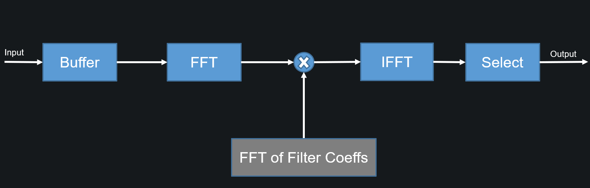
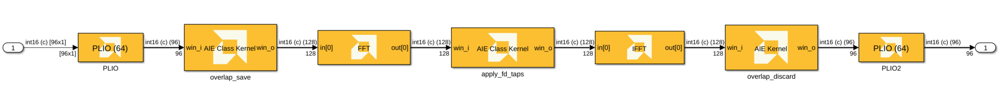
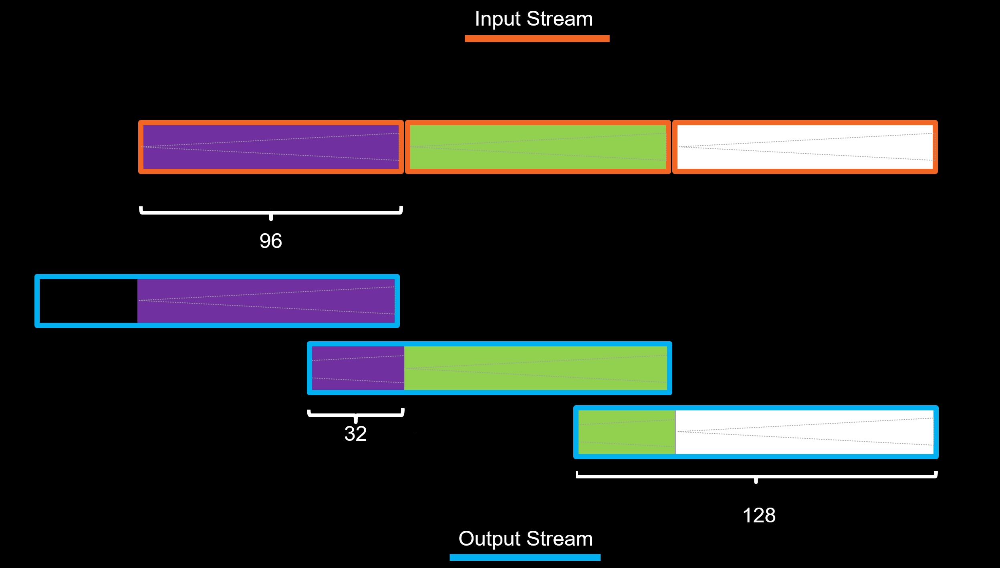
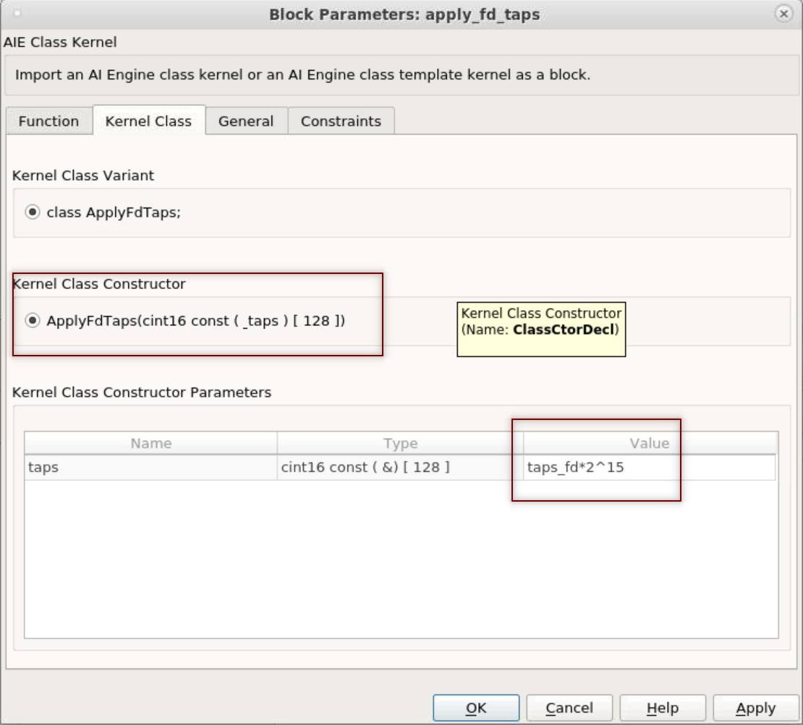
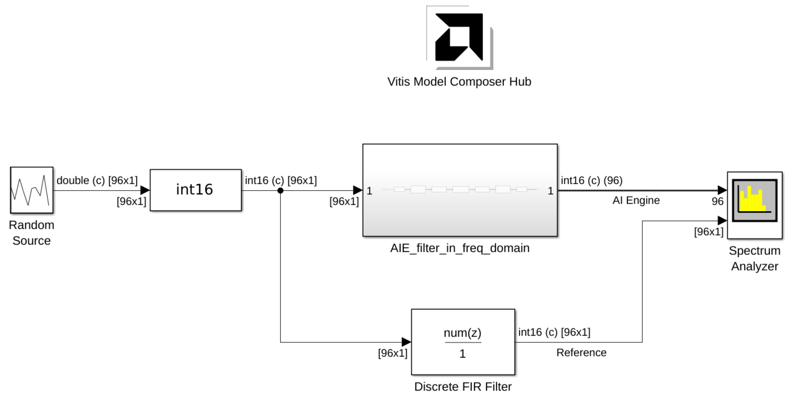
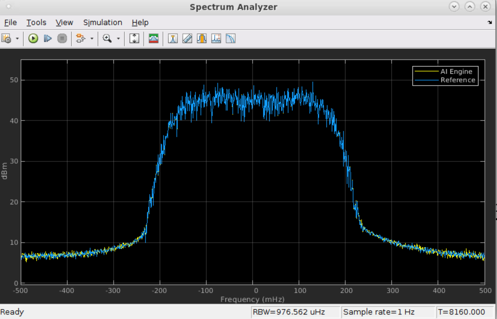
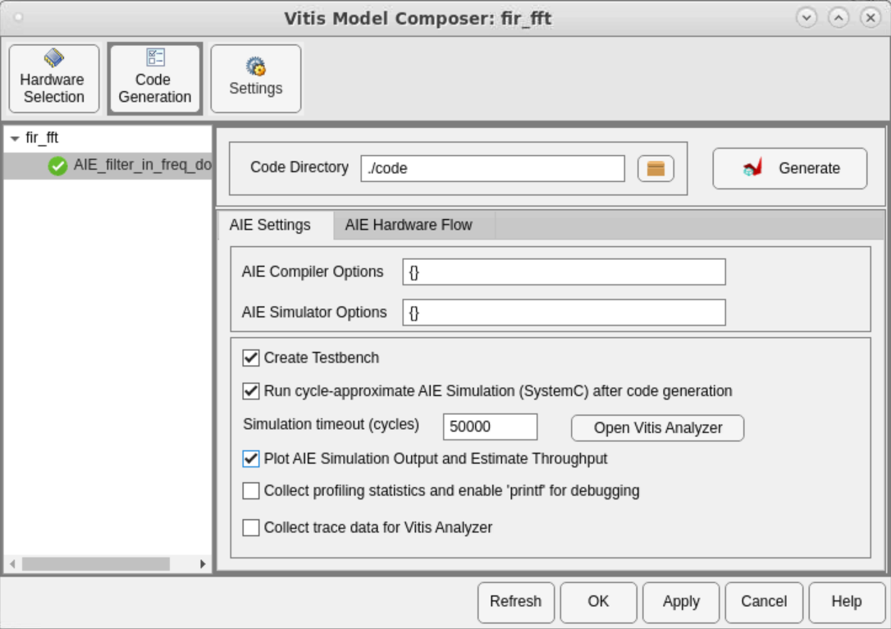
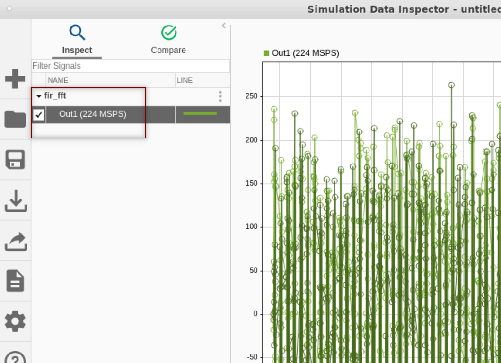
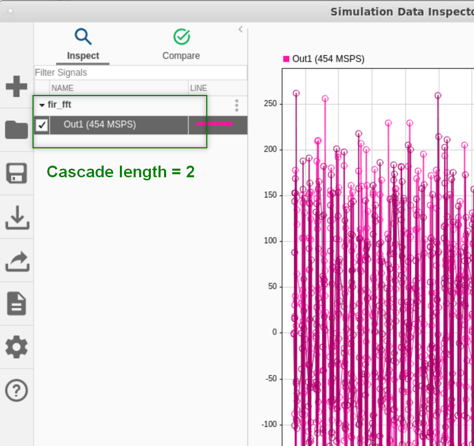

# Filtering in Frequency Domain

In the frequency domain, the filtering operation involves the multiplication of the Fourier transform of the input and the Fourier transform of the 
impulse response followed by an inverse Fourier transform.
As the length of the impulse response increases, the frequency-domain filtering technique becomes more efficient compared to time-domain filtering.

## The Algorithm

This example uses the Overlap-Save method. The diagram below depicts this algorithm at a high level:




The input stream is partitioned into overlapping blocks of size NFTT, with an overlap of NumLen samples. NFFT is the FFT length and NumLen is the length of the FIR filter. The FFT of each block of input samples is computed and multiplied with the FFT of length NFFT of the FIR numerator. The inverse fast Fourier transform (IFFT) of the result is performed, and the last NFFT – NumLen samples are streamed the output. The remaining samples are discarded.

In this example the FFT length is 128 and the filter length is 32.

The time domain and the filter domain coefficients for this example are calculated in the MATLAB script, _test_tap32_fft128.m_.

## The Design



This design uses the Class Import block to import the Overlap-Save and applying the frequency domain coefficients. The class declaration for the Overlap-Save is shown below:

```
class OverlapSave {
    private:
    alignas(32) cint16 overlap_state [TAP_NUM];

    public:
    void overlap_save(adf::input_buffer<cint16,adf::extents<WIN_SIZE> > & restrict win_i,
                      adf::output_buffer<cint16,adf::extents<FFT_SIZE> > & restrict win_o);

    static void registerKernelClass()
    {
        REGISTER_FUNCTION(OverlapSave::overlap_save);
    };
};
```

Note that the Class is using a state array variable which is the same size as the filter length.

The image below depicts how the Overlap-save algorithm processes input data to generate output blocks of 128 samples each:



Note the second class that applies the filter coefficients is using a non-default constructor to initialize a static array with the frequency domain filter coefficients. The image below depicts the block mask where the filter coefficients is passed to the constructor. 



## Simulation results

In this design, we are comparing the output of the frequency domain filtering using the AI Engine blocks with FIR block from MathWorks DSP System Toolbox. 



The output of the spectrum analyzer is shown below. As you can see the output of the two paths are almost completely overlapping. 



## Throughput

It is easy to access the throughput of this design in Model Composer. You need to generate code and run the cycle approximate aie simulation from the Hub block. Set the hub block as shown below:



After running the cycle approximate aie simulation, the Simulink Data Inspector will pop up and you would see the output signal and the estimated throughput there:



### Increasing thoughput by using more AI Engine cores
The estimated throughput of 326 MHz is limited by the FFT blocks. To increase the throughput, you can increase the value of the Number of Cascade Length parameters of the FFT and IFFT blocks. This spreads the FFT operation over more than one AI Engine tile and will result in a throughput increase. The results for Number of Cascade Length of 2 and 4 are shown below:

| Cascade length = 2      | Cascade length = 4  |
| ------------- |:-------------:|
|      |  |


Note that there are three factors in play that result in a higher throughput:
* PLIO of width 64
* PLIO frequency of 500MHz
* Number of cascade length of 4 for each FFT


