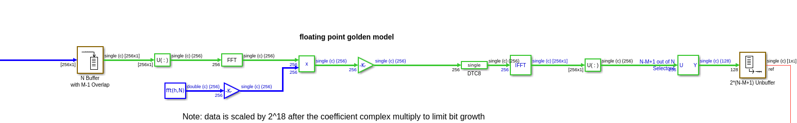
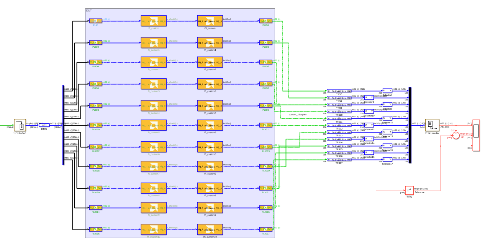
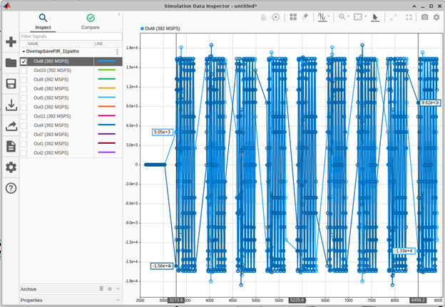
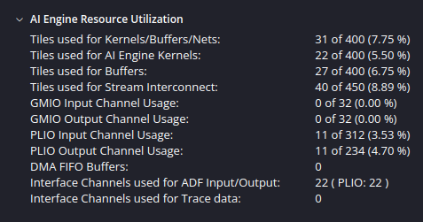
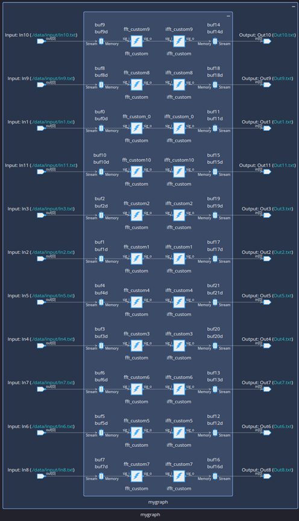
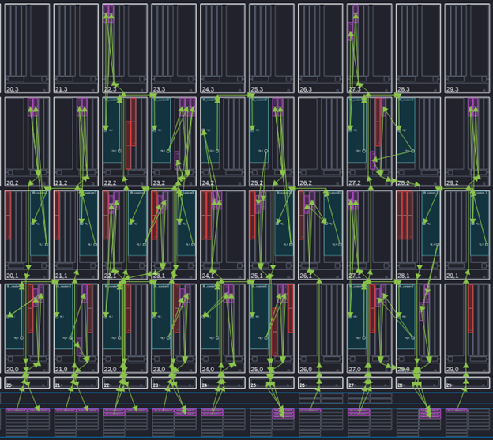

# Filtering in Frequency Domain

Time domain filtering involves convolution (i.e.: multiply and add operations).  In the time domain if the signal and the filter length are both of length-N, we can say the arithmetic complexity is of order N2.  

Convolution in the time domain is equivalent to multiplication in the frequency domain implying that FFTs can be used to perform filtering.  Frequency domain filtering is used to improve filtering efficiency as N becomes larger.  Typically, the critical threshold for efficiency improvements based on the filter order N is somewhere between 32 and 64 taps.   Below the threshold time domain convolution is more efficient while above the threshold frequency domain filtering is more efficient

The disadvantage to filtering in the frequency domain is the latency incurred by the processing time of the FFT & IFFT.  The advantage is as the number of filter taps increases frequency domain filtering becomes more efficient compared to using a convolution approach in the time domain.
 
There are multiple approaches to use an FFT to perform fast filtering in the frequency domain.  One approach is the overlap and save method.  In the overlap and save method it is the input that is overlapped and, therefore, must be saved.  This method has also been called overlap and discard because the overlapping portion of the output blocks are discarded.  In practice it is best to select M as the first power of 2 plus 1 that is larger than the minimum desired filter order and then set N=2*(M-1).  This corresponds to an FFT size of N and the blocks of data will contain N/2 samples.  It is worth noting that if ½ the output FFT samples will be discarded, the output sample rate is correspondingly ½ the input sample rate per path for the resulting frequency domain FIR implementation.  

## The Algorithm

Although Simulink provides a frequency domain FIR the functionally equivalent model can be created from lower level functional blocks i.e.:

The time domain filter coefficients can be run through an FFT to derive the frequency domain coefficients.  Buffer blocks and selector blocks can assist in performing the functionality of overlapping the input data and discarding the unnecessary FFT output samples.
 
After a single path is developed and validated, in a practical application increasing the throughput is a simple exercise in replicating the single path to achieve the desired throughput.

## The Design

In this case the goal is to perform M=129 tap, >2Gsps frequency domain filtering using N=256 point Fourier Transforms.
A time domain FIR that uses 3 real multipliers to build a complex multiplier would require 3*129=387 Real MACs/output sample while the FFTs, complex multiply, & iFFT require 42 real multiplies.  For this example, the frequency domain filter is 387/42 = 9.2x more efficient.
A custom, 256-point FFT was implemented using 4 stages of a aie::fft_dit_r4_stage radix 4 FFT function call using the ibuff and tbuff memory scratchpads to pass data between radix 4 function calls:  

  aie::fft_dit_r4_stage<64>(ibuff, tw4a_1, tw4a_0, tw4a_2, FFT_PTS, SHIFT_FFT, SHIFT_FFT, FFTn, tbuff);
  aie::fft_dit_r4_stage<16>(tbuff, tw4b_1, tw4b_0, tw4b_2, FFT_PTS, SHIFT_FFT, SHIFT_FFT, FFTn, ibuff);
  aie::fft_dit_r4_stage< 4>(ibuff, tw4c_1, tw4c_0, tw4c_2, FFT_PTS, SHIFT_FFT, SHIFT_FFT, FFTn, tbuff);
  aie::fft_dit_r4_stage< 1>(tbuff, tw4d_1, tw4d_0, tw4d_2, FFT_PTS, SHIFT_FFT, SHIFT_FFT, FFTn, ibuff);

The cint16 coefficient look up table and multiply operation was integrated into the AIE FFT as a simple for loop:

// complex FIR coeffs array
  alignas(aie::vector_decl_align) const cint16 coeff[256] = { {16383,0},…};
  aie::accum<cacc48,4> acc; // accumulator register
  auto pCoeff = aie::cbegin_vector<4>(coeff); // setup pointer to coeff

  // complex filtering loop...
  for (unsigned lp=0; lp<32; lp++) // process 32*4*2=256 samples
    chess_prepare_for_pipelining
    { 
        FFT_data = *pI++; // 32 bit complex data * 4 = 256 bits
        coeff_data = *pCoeff++; // 16 bit complex data * 4 = 128 bits
        acc = aie::mul(FFT_data, coeff_data);
        writeincr(sig_o, acc); // write out 4, cacc48 samples
        
        FFT_data = *pI++;
        coeff_data = *pCoeff++;
        acc = aie::mul(FFT_data, coeff_data);
        writeincr(sig_o, acc);
        
    } // end of lp for loop

By using the cascade connection between the FFT and iFFT adjacent AIEs are guaranteed, and a cacc48 bit connection is established directly between the FFT AIE & iFFT AIE to improve throughput and reduce latency (as compared to using an axi buffer or axi stream connection):  

As our discussion focuses on designing with AIEs the overlap and save input and data output discard is better left to PL implementation which is left as an exercise for the PL designer.

## Simulation results

Using the Model Composer Simulation Data Inspector the throughput is a consistent 392Msps per AIE path:

To obtain >2Gsps we require ceil (2Gsps/392Msps/2) = 11 copies of a single path.  Please remember we divided the sample rate of a single path by 2 because 50% of the output samples need to be discarded.

We added some constraints for Vitis (i.e.: {'--xlopt=2', '--Xmapper=BufferOptLevel7'} to improve the buffering optimization and Vitis indicates the following resources are used:

The graph level connectivity shows what we expect: 

While the array view shows that 22 compute engines are required for computation, only subsections of each data memory are utilized:

