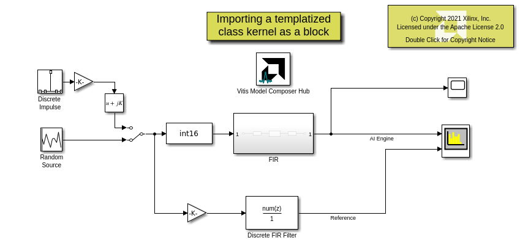

# Importing a templatized class kernel as a block

In this example we import a Finite Impulse Response (FIR) Filter as a block into Model Composer. 
This filter is expressed as a class. Furthermore, this is a templatized class. The template parameters specify the number of 
samples per frame and a shift factor. The constructor for this class takes in the filter taps.

## Knowledge nuggets

:bulb: Note that the *AIE Class* block determines the class template parameters and the constructor parameters and builds up a mask with appropriate fields allowing you to specify the values for these parameters.

:bulb: Note the class is defined in a namespace. The namespace is used to specify a fully qualified name in the block mask in the "Kernel class" field.

:bulb: Note the usage of AIE Signal Spec block to specify the size and frequency of the PLIOs in the model.

:bulb: You can directly connect a variable size signal to a scope, display block, or a specturm analyzer. Or you can use the *Variable size signal to workspace* block to move the data to MATLAB workspace.

--------------
Copyright 2020 Xilinx

Licensed under the Apache License, Version 2.0 (the "License");
you may not use this file except in compliance with the License.
You may obtain a copy of the License at

    http://www.apache.org/licenses/LICENSE-2.0

Unless required by applicable law or agreed to in writing, software
distributed under the License is distributed on an "AS IS" BASIS,
WITHOUT WARRANTIES OR CONDITIONS OF ANY KIND, either express or implied.
See the License for the specific language governing permissions and
limitations under the License.
