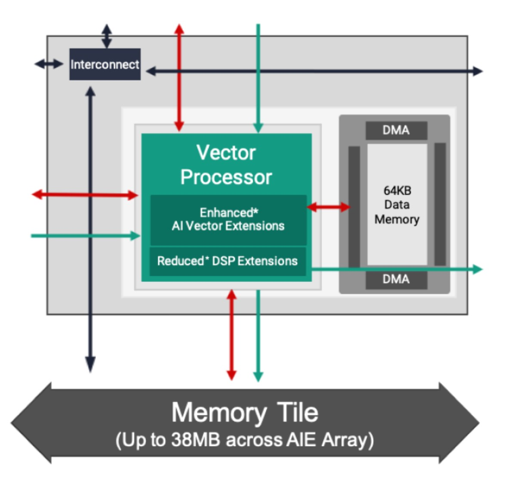
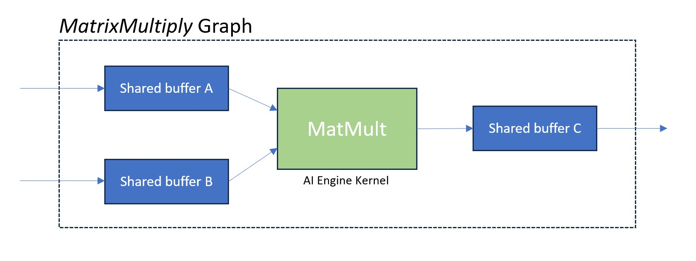
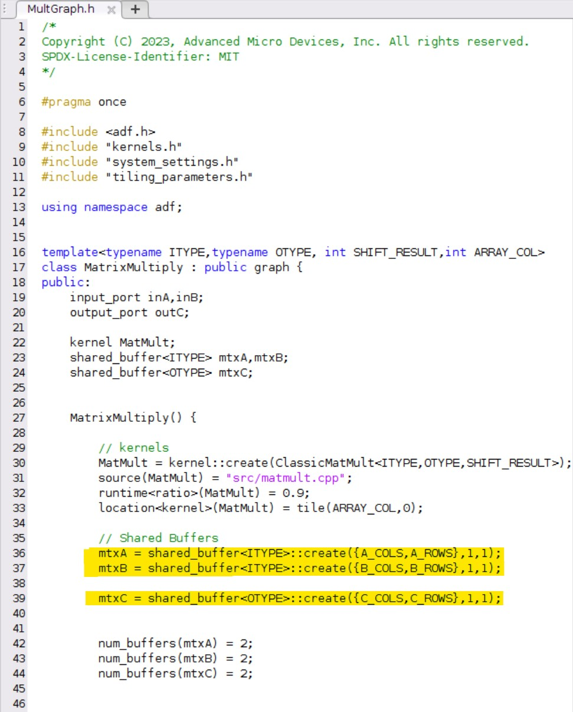
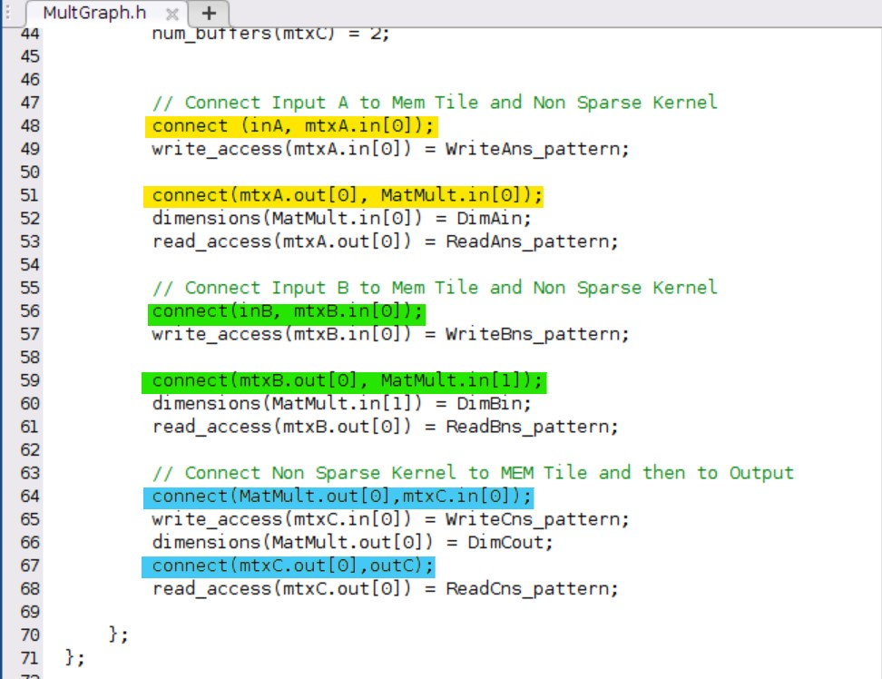
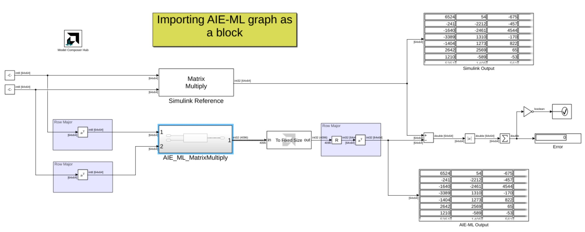

# Importing AIE-ML graph into Vitis Model Composer as a block
## What is AI Engine-ML?
The AI Engine-ML architecture is optimized for machine learning, enhancing both the compute core and memory architecture. These devices are capable of both ML and advanced signal processing.
To learn more about the AIE-ML devices, refer to [this](https://docs.xilinx.com/r/en-US/am020-versal-aie-ml) documentation.

The AIE-ML Memory tile is introduced in the AIE-ML architecture to significantly increase the on-chip memory inside the AIE-ML array. This new functional unit reduced the utilization of PL resources including block RAMs and URAMs. 

## Imported graph code
Let's start by taking a closer look into the graph code. The picture below depicts the connectivity of the graph:

The screenshot below depicts the graph code [MultGrpah.h](./src/MultGraph.h) we are importing using the AIE-Graph import block in Vitis Model Composer. Here we are setting up three shared buffers, two for the input and one for the output.

Later in the graph code we connect the two inputs of the graph to the inputs of the two shared buffers and connect the outputs of these two shared buffers to the AI Engine kennel (highlighted in yellow and green). Likewise, in the output, we connect the output of the AI Engine kernels to the input of the output shared buffer and the output of the output shared buffer to the graph output (highlighted in blue).

## Importing the AIE Graph block into Vitis Model Composer

To import graph code as a block, we start by getting the _AIE Graph_ block from the Simulinlk library browser:

We then double click on the block and set the parameters as shown below and click **Import**. 

In the next tab, we enter the values of the template parameters of the graph. Note that the graph we are importing is templatized with four template parameters. Once we enter the values for the template parameters we click **Build**:

In the next tab, we set the size of the inputs and the output:

After clicking ok, the block is set to connect to other blocks in Simulink. 

# Simulink design

The image below depicts the Simulink design. Note that we are comparing the output of the graph block with the matrix multiply block in Simulink. 

