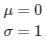
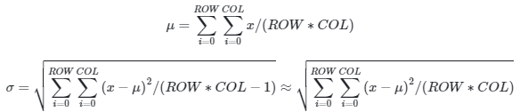
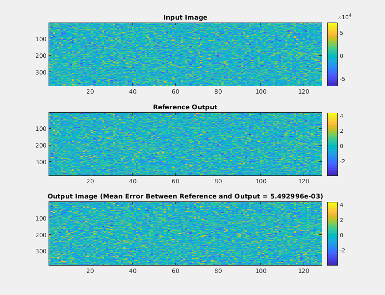

# Normalization on AIE-ML Devices

## Introduction

This example demonstrates normalization of a 2D data frame on AIE-ML devices.

It demonstrates, in Vitis Model Composer, the following features of AIE-ML devices:

* Shared buffers for AIE-ML memory tiles
* `bfloat16` data type

## Algorithm

This example targets z-score normalization that scales elements of a frame, making the frame output have the following distribution:

 

Assume the input frame is a `COL * ROW` matrix (data is stored column first). For each element in a frame, it computes the corresponding element as:

 

Where:

 

For this example, the following specifications are chosen:

* `COL`: `128`
* `ROW`: `1384`
* Data Type: `bfloat16`

## Design

The Vitis Model Composer model imports the normalization design as AI Engine Kernel blocks. For a detailed description of the example design and its kernel functions, refer to the [AIE-ML Performance Analysis Tutorial](https://github.com/Xilinx/Vitis-Tutorials/tree/2024.1/AI_Engine_Development/AIE-ML/Feature_Tutorials/13-aie-ml-performance-analysis). The Vitis Model Composer example uses Version 4 of the normalization design.

Here are the relevant features of the Vitis Model Composer model: 

* Design inputs and outputs are processed via the model callbacks. To view the callbacks, right-click on the design canvas, select **Model Properties**, then **Callbacks**.
* In the `PostLoadFcn` callback, tiling parameters for the shared buffers are defined in MATLAB structure arrays. For example, the tiling parameters for the input shared buffer are displayed below.
```
% Input Memtile, Write Access
mtxA_w = [];
for i=0:2
    pattern = struct('buffer_dimension', [COL,ROW], 'tiling_dimension', [COL,ROW/PLIO_NUM], 'offset', [0,ROW/PLIO_NUM*i]);
    mtxA_w = [mtxA_w, pattern];
end

% Input Memtile, Read Access
mtxA_r = [];
for i=0:5
    pattern = struct('buffer_dimension', [COL,ROW], 'tiling_dimension', [K_COL,K_ROW], 'offset', [0,K_ROW*i])
    mtxA_r = [mtxA_r, pattern];
end
```

This shared buffer has 3 write (input) ports and 5 read (output) ports. The tiling parameters are stored in 3x1 and 5x1, respectively, MATLAB structure arrays. For more information on the format of the MATLAB structure, refer to the [Shared Buffer](https://github.com/Xilinx/VMC_Help/tree/2024.1/AIE/Shared_Buffer/README.md) block help.

* Input data is initially stored in the MATLAB workspace. The data is then brought into the Simulink model, and the AI Engine design, via a **RTP Source** block. The **RTP Source** block outputs the workspace data for the first simulation time step, then goes empty for the remainder of the simulation. This keeps the AI Engine kernel's input buffer from overflowing. For more information, refer to the [RTP Source](https://github.com/Xilinx/VMC_Help/tree/2024.1/UTIL/RTP_Source/README.md) block help.
* The AI Engine design inputs and outputs `bfloat16` floating-point data. The **Convert To Bfloat16** and **Convert From Bfloat16** blocks convert between the Simulink `single` data type and the `bfloat16` data type.
* Because this design has a feedback loop within the AI Engine subsystem, an **Algebraic Loop Breaker** block is needed to compile and run the model. For more information, see the [Algebraic Loop Breaker](https://github.com/Xilinx/VMC_Help/tree/2024.1/UTIL/AlgebraicLoopBreaker/README.md) block help.
* The **Variable Size Signal to Workspace** block conveniently writes the AI Engine design outputs to the MATLAB workspace as vectors.
* The model's `StopFcn` callback retrieves the results from the MATLAB workspace, compares them to a reference output, and plots the results.

   

The following plots are shown:
* **Input Image:** Input data to the AI Engine normalization algorithm.
* **Reference Output:** Reference normalization output, calculated by the MATLAB command: `output = (input-mean(input,'all'))/std(input,1,'all')`.
* **Output Image:** Output from the AI Engine normalization algorithm.

The input and output data appear similar, but note the difference in the ranges. The mean error between the AI Engine implementation and the reference output is also displayed.

------------
Copyright (c) 2024 Advanced Micro Devices, Inc.