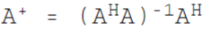
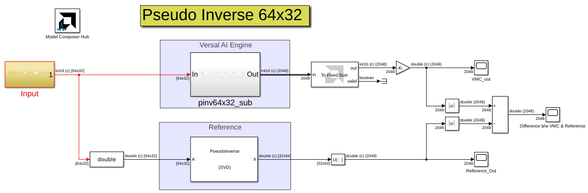
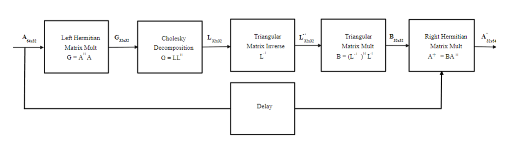
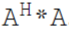
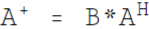

# Pseudo Inverse 64x32

This example implements a Pseudo Inverse for a 64x32 matrix. The Pseudo Inverse is computed as .

On AI Engine, Pseudo Inverse is implemented as a sub-graph using the following kernels:

* `matmul_NxL_LxN`
* `cholesky_32x32`
* `trimat_inv_32x32`
* `window_copy_1in_2out`
* `trimatmul_32x32_32x32`
* `matmul_right_herm`

The following block diagram shows implementation details:

The design implementation details are as follows.

* `matmul_NxL_LxN`: Performs a matrix multiplication of . The output matrix `G` is a Hermitian matrix and so upper triangular elements can be skipped. Output matrix `G` is a column major stair case matrix with granularity of `4` i.e., on every 5th column the length of matrix is reduced by granularity of `4`.
* `cholesky_32x32`: Using Cholesky Decomposition, `G` matrix is decomposed to `L` matrix. The generated matrix is a column major stair case matrix with granularity of `4` and the elements above diagonals are zero. Cholesky Decomposition requires exact conjugates for correct results.
* `trimat_inv_32x32`: Computes the inverse of `L` matrix and generates an output matrix `L^(-1)` of column major stair case matrix, with granularity of `8` (on every 9th column the length of matrix is reduced by granularity of `8`).
* `trimatmul_32x32_32x32`: Computes a Lower triangular matrix multiplication `B = (L^(-1))^H * L^(-1)`. Two copies of `L^(-1)` that are inputs to `trimatmul_32x32` are generated using `window_copy_1in_2out`.
* `matmul_right_herm`: Computes the final result of Pseudo Inverse: .

------------
Copyright 2021 Xilinx
Copyright 2022-2024 Advanced Micro Devices, Inc.

Licensed under the Apache License, Version 2.0 (the "License");
you may not use this file except in compliance with the License.
You may obtain a copy of the License at

    http://www.apache.org/licenses/LICENSE-2.0

Unless required by applicable law or agreed to in writing, software
distributed under the License is distributed on an "AS IS" BASIS,
WITHOUT WARRANTIES OR CONDITIONS OF ANY KIND, either express or implied.
See the License for the specific language governing permissions and
limitations under the License.
