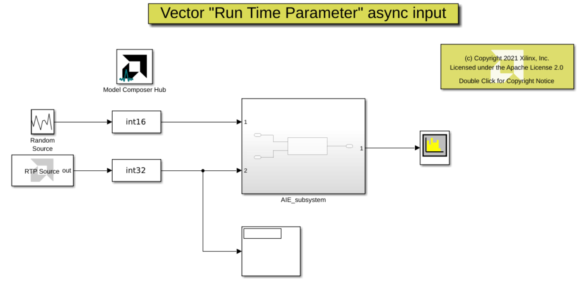

# Vector asynchronous Real Time Parameter (RTP)
This is an example of an AIE DSP filter that is controlled by a asynchronous RTP input. The value of the RTP input changes between a wide filter and a narrow filter.

## Knowledge nuggets
:bulb: An RTP input can be a scaler or a vector.

:bulb: Note the usage of 'RTP Source' block. This block allows you to convinienetly set the RTP input source to an AI Engine block.

:bulb: In this example, the RTP input is an asynchronous input. Asynchronous parameters can be changed at any time by a controlling processor such as the Arm® processor. They are read each time a kernel is invoked. If there are no input RTP values at the time of the invocation, (in Vitis Model Composer this is modeled as an empty variable size signal at the time of invocation), the kernel will proceed with the previous value of RTP. 

In the provided example, it is important to note that the value of the RTP parameter is set as _[narrow_filter, nan(length(narrow_filter),500), wide_filter, nan(length(narrow_filter),500)]_. The block's output is typically an empty variable size signal, except for two instances in time. Initially, a narrow band filter is applied to the RTP input of the FIR block. Consequently, the output of the RTP source block remains empty, but the FIR block utilizes the coefficients of the narrow band filter until the wide band filter is introduced. From that point onward, the filter employs the coefficients of the wide band filter. This pattern repeats in a cycle. 

:bulb: In the RTP source block, we set the _"Form output after final data"_ parameter to _Cycle repetition_ so that the switch between the narrow filter and wide filter described above will continue until the end of the simulation. 

------------
Copyright 2020 Xilinx

Licensed under the Apache License, Version 2.0 (the "License");
you may not use this file except in compliance with the License.
You may obtain a copy of the License at

    http://www.apache.org/licenses/LICENSE-2.0

Unless required by applicable law or agreed to in writing, software
distributed under the License is distributed on an "AS IS" BASIS,
WITHOUT WARRANTIES OR CONDITIONS OF ANY KIND, either express or implied.
See the License for the specific language governing permissions and
limitations under the License.
