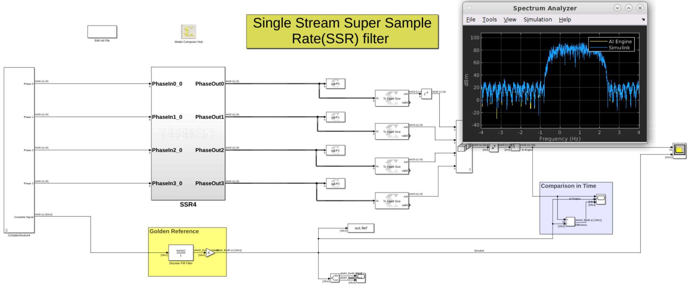

# Single Stream SSR FIR
This model showcases a single stream super sample rate FIR filter to process a 4 GSPS stream built with 16 AI Engine kernels. In addition, we compare the output of the AI Engine design with a Simulink FIR filter block that we consider as our golden reference.

For more details on the design of the FIR kernels click [here](https://github.com/Xilinx/Vitis-Tutorials/tree/2025.1/AI_Engine_Development/AIE/Design_Tutorials/02-super_sampling_rate_fir/SingleStreamSSR). 

------------

Copyright (c) 2024 Advanced Micro Devices, Inc.

