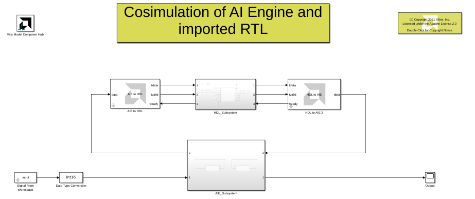

# Designs with AI Engine and imported RTL

This example demonstrates co- simulation of AI Engines and imported RTL.

## Knowledge nuggets

:bulb: The inputs to the HDL domain and the outputs of the HDL domain are always scalar signals. 

:bulb: When the output of the AI Engine block is a vector, the HDL domain must be sampled at a higher sampling rate or else the internal memory of the *AIE to HDL block* will overflow.
In this example, the input to the interface block has a period of 128. Since the input size is 256, then the sample time is 128/256=.5. So the sample time of the HDL domain should be at most .5. The sampling time of the HDL domain is set in the *Input Gateway* blocks.

:bulb: Moreover, the design in the HDL domain has an initiation interval of 19. In other words, it takes 19 cycles before the input can accept a new sample. As such, we need to further reduce the sample time by a factor of at least 19 to avoid memory overflow in the interface blocks. In this example we set the sample time to .5/20.

------------
Copyright 2020 Xilinx

Licensed under the Apache License, Version 2.0 (the "License");
you may not use this file except in compliance with the License.
You may obtain a copy of the License at

    http://www.apache.org/licenses/LICENSE-2.0

Unless required by applicable law or agreed to in writing, software
distributed under the License is distributed on an "AS IS" BASIS,
WITHOUT WARRANTIES OR CONDITIONS OF ANY KIND, either express or implied.
See the License for the specific language governing permissions and
limitations under the License.
