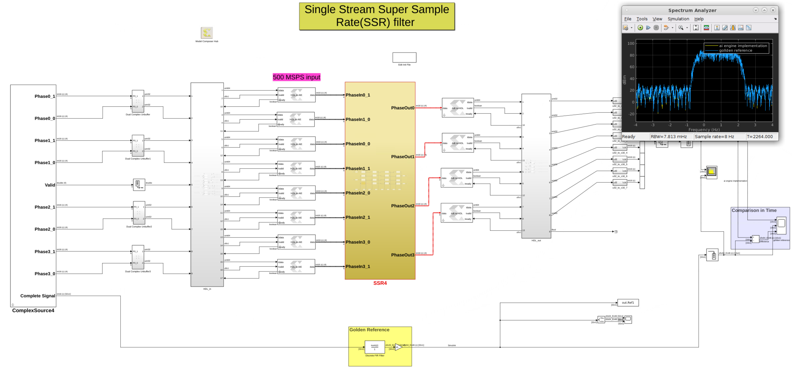

# Single Stream SSR FIR with PL
This design showcases a Super Sample Rate FIR filter to process a 4GSPS input stream. In this design we consider latencies within the kernels, which are implemented into the FIFO's included in AXI-Stream Interconnect(PL).

For more details on the design of the FIR kernels click [here](https://github.com/Xilinx/Vitis-Tutorials/tree/2025.1/AI_Engine_Development/AIE/Design_Tutorials/02-super_sampling_rate_fir). 

------------
Copyright 2020-2022 Xilinx
Copyright 2022-2024 Advanced Micro Devices, Inc.

Licensed under the Apache License, Version 2.0 (the "License");
you may not use this file except in compliance with the License.
You may obtain a copy of the License at

    http://www.apache.org/licenses/LICENSE-2.0

Unless required by applicable law or agreed to in writing, software
distributed under the License is distributed on an "AS IS" BASIS,
WITHOUT WARRANTIES OR CONDITIONS OF ANY KIND, either express or implied.
See the License for the specific language governing permissions and
limitations under the License.
