# Versal FFT

In this example, we will show how to use the Cooley-Tukey algorithm to implement a high performance (low latency, high sample rate) FFT that takes advantage of both the AI Engine and Programmmable Logic (PL) of Versal devices.

Two FFT example designs are included using Vitis Model Composer: 
1) a **9.12 GSPS** `cint16`, 32K point FFT comprised of 16, 2K point AIE FFTs and a PL based SSR=16, 16-point PL FFT. 
2) a **18.24 GSPS** `cfloat`, 32K point FFT comprised of 32, 1K point AIE FFTs and a PL based SSR=32, 32-point PL FFT.

## Algorithm

The Cooley-Tukey algorithm is a common Fast Fourier Transform algorithm. It re-expresses the discrete Fourier transform (DFT) of an arbitrary composite size N=P*Q
in terms of P DFTs of sizes Q and Q DFTs of size P. To learn more refer to [this](https://en.wikipedia.org/wiki/Cooley%E2%80%93Tukey_FFT_algorithm) Wikipedia page.

The image below shows an overview of the operations needed for Cooley-Tukey algorithm. 

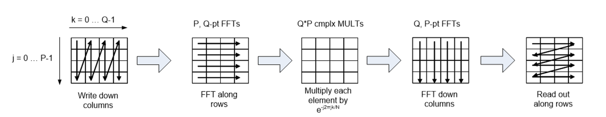

As the image demonstrates, the algorithm is going through the following steps:

1. Arrange data in a PxQ matrix.
2. Take Q point FFT along the rows.
3. Multiply the result with twiddle factors.
4. Take P point FFT along the columns.
5. Read the matrix in a row-wise manner.

The N point DFT can be replaced by as many as P,Q-point row FFTs and Q,P-point column FFTs. By using exactly P,Q point row FFTs and Q,P point column FFTs you maximize the sample rate and eliminate the need for 2/3 of the transposes as shown below for a 16-point example.

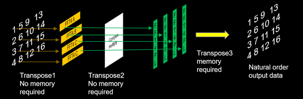

If you map the P,Q point row FFTs and complex rotation to Versal AIEs and the Q,P point FFTs to PL, we have a **simple, flexible and efficient recipe** for implementing a high performance, lower latency, hybrid FFT where the possible output sample rate = (the number of P parallel paths) * (slowest P, Q-point row FFT path sample rate) = P*z Msps.  

Instead of using 4,4-point column FFTs a single, PL based SSR FFT can be used to process the parallel row FFT data.  If the PL clock is 2x (or greater than) that of the output sample rate for the P parallel AIE FFT paths then you can use a SSR=Q/2 (assuming we can close timing in the PL), P point column FFT to save resources.  If the output PL clock rate is 4x (or greater than) that of the output sample rate for the P parallel AIE paths then you can use SSR=Q/4 P point column FFT, etc. to save resources.  

The number of AIE row FFTs must be carefully chosen or you could run out of PLIO for multiple parallel instances.  For larger point size FFTs either increase the point size of the Q-point row FFTs or the number of rows (i.e.: P).  For example, if you need a 128K point FFT you could use 32, 8K-point row FFTs and a 32-point column FFT. 

## Design

The Versal FFT design can be simulated using Vitis Model Composer. The design is divided into two parts:

1. **AI Engine Design**: The first part of the algorithm (row FFTs and complex rotation) is implemented in the AI Engines using the AI Engine library blocks.
2. **HDL Design**: The second part of the algorithm (column FFT and transpose operation) is implemented in the Programmable Logic using the HDL library blocks.

The AI Engine implementation for the fixed-point design is shown below:

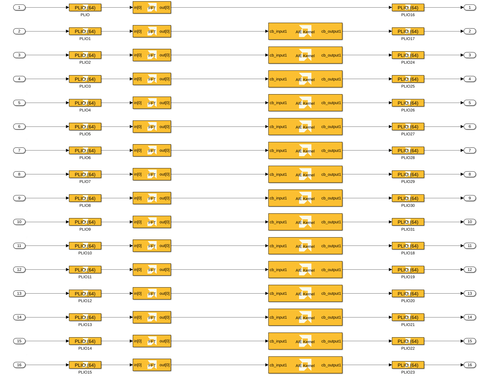

As shown in the image above, the AI Engine implementation is divided into the following steps:

1. 16 FFTs of size 2048 are performed. The FFT block is part of the AMD AI Engine DSP library.
2. Complex rotation is performed by multiplying the output of the FFTs by twiddle factors. Here we are using the _AIE Kernel block_ to import AI Engine kernel code into Vitis Model Composer as a block. The twiddle multiplies are implemented in the `exp_calc_fixed`/`exp_calc_float` C++ source code files.

The HDL implementation for the fixed-point design is shown below:

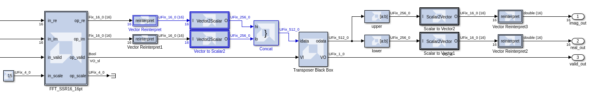

First, the logic in the `extract_re_and_im` subsystem packs the 16 incoming AXI streams from the AI Engine into an HDL vector. Then, the **Vector FFT** block performs the SSR=16, 16-point FFT. The 16, `cint16` outputs of the Vector FFT are packed into a scalar, 512-bit wide signal for input to the transpose operation, which is implemented as an **HDL Black Box**.

The AI Engine and PL implementations for the floating point design are architected similarly. 

## Results

### PL

The PL clock frequency, stored in the variable `clk_freq`, is 570 MHz. This value is specified in the **HDL Clock Settings** panel of the Vitis Model Compoer Hub block:

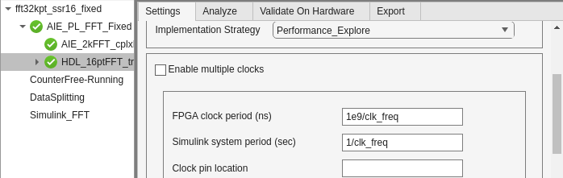

It is also specified in each PLIO block of the AI Engine design. Note also that the PLIO is 64 bits wide:

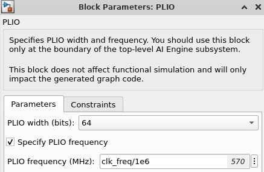

The Hub block's **Analyze** tab can be used to run timing and resource analysis on the design, post Vivado synthesis and/or implementation. This shows that the design closes timing at 570 MHz:

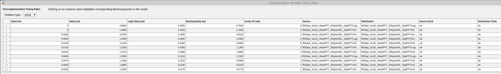

This corresponds to an overall throughput of **9.12 GSPS** for SSR=16, and **18.24 GSPS** for SSR=32. 

The SSR=16 design uses the following PL resources:

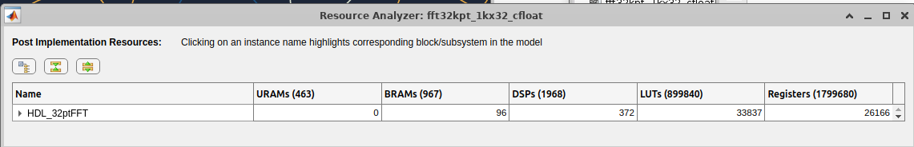

### AI Engine

To do timing analysis on the AI Engine design, we need to run cycle-approximate AIE simulation from the **Analyze** tab of the Vitis Model Composer Hub block. The AIE simulation output matches the Simulink output for each channel.

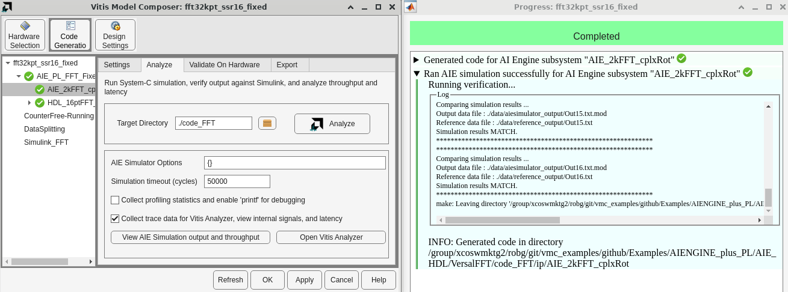

The throughput of each AI Engine output channel can be viewed by clicking **View AIE simulation output and throughput**:

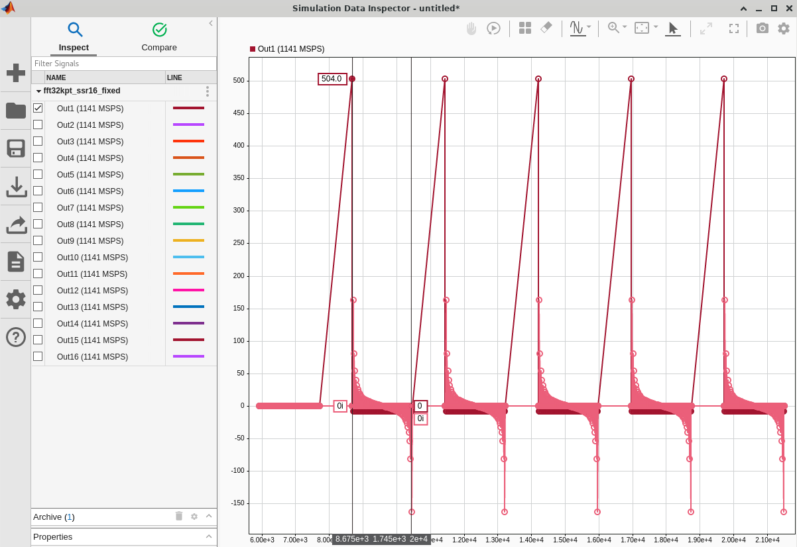

In order to accurately calculate the throughput, we need to add cursors around the output data burst. Once we do this, it shows that each AI Engine channel's throughput is 1140 MSPS. The AI Engine operates on 1 `cint16` sample per clock cycle, so this is well within the capabilities (clock rate of 1250 MHz) of the VCK190 evaluation board we are using. Keep in mind that 64 bits of data (2 `cint16` samples) are transferred to the PL on each PL clock cycle, so an AIE throughput of 1140 MSPS corresponds to a PL clock rate of 570 MHz. 

The AI Engine resource utilization can be found by clicking **Open Vitis Analyzer**.

**SSR=16:**

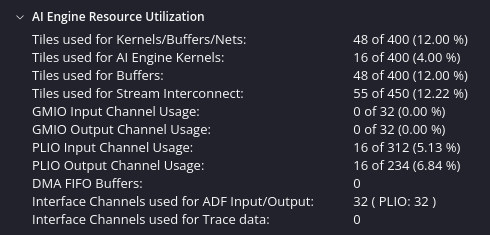

The SSR=16 design uses 16 input PLIO channels, 16 output PLIO channels, and a total of 55 AI Engine tiles (16 for AI Engine kernels, 39 for buffers or interconnects).

**SSR=32:**

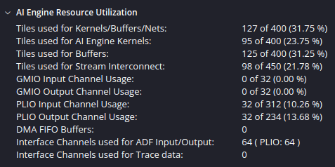

The SSR=32 design uses 32 input PLIO channels, 32 output PLIO channels, and a total of 127 AI Engine tiles (95 for AI Engine kernels, 32 for buffers or interconnects).

The reason AIE kernel usage did not scale linearly with SSR is that in the SSR=32 design, extra cascaded kernels were added to the row FFTs to achieve the desired throughput. The **Number of cascade stages** parameter in each AIE FFT block is set to 3:

------------

Copyright (c) 2025 Advanced Micro Devices, Inc.