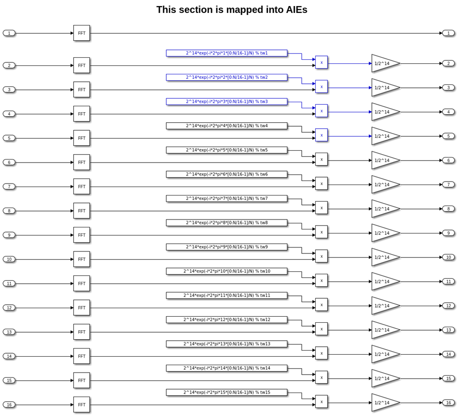
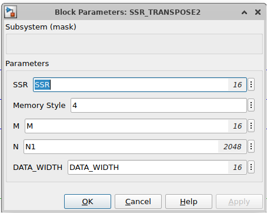
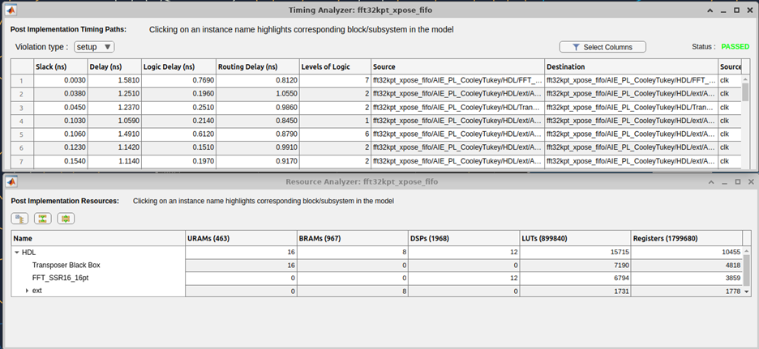
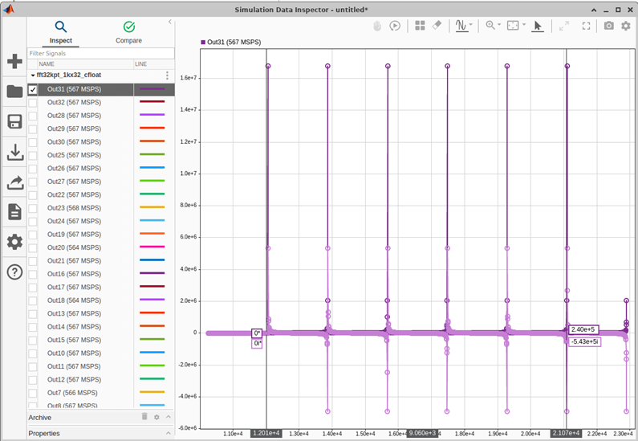
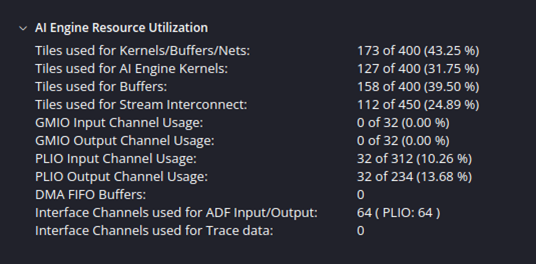
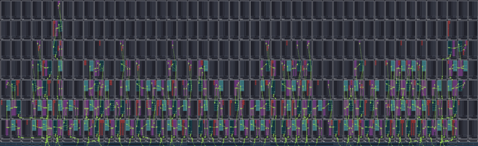

# Versal FFT

In this example, we will show how to use the Cooley-Tukey algorithm to implement a high performance (low latency, high sample rate) FFT that takes advantage of both the AI Engine and Programmmable Logic (PL) of Versal devices.

Two FFT example designs are included using Vitis Model Composer: 
1) a **9 GSPS** `cint16`, 32K point FFT comprised of 16, 2K point AIE FFTs and a PL based SSR=16, 16-point PL FFT. 
2) a **18 GSPS** `cfloat`, 32K point FFT comprised of 32, 1K point AIE FFTs and a PL based SSR=32, 32-point PL FFT.

## Algorithm

The Cooley-Tukey algorithm is a common Fast Fourier Transform algorithm. It re-expresses the discrete Fourier transform (DFT) of an arbitrary composite size N=P*Q
in terms of P DFTs of sizes Q and Q DFTs of size P. To learn more refer to [this](https://en.wikipedia.org/wiki/Cooley%E2%80%93Tukey_FFT_algorithm) Wikipedia page.

The image below shows an overview of the operations needed for Cooley-Tukey algorithm. 

As the image demonstrates, the algorithm is going through the following steps:

1. Arrange data in a PxQ matrix.
2. Take Q point FFT along the rows.
3. Multiply the result with twiddle factors.
4. Take P point FFT along the columns.
5. Read the matrix in a row-wise manner.

The N point DFT can be replaced by as many as P,Q-point row FFTs and Q,P-point column FFTs. By using exactly P,Q point row FFTs and Q,P point column FFTs you maximize the sample rate and eliminate the need for 2/3 of the transposes as shown below for a 16-point example.

If you map the P,Q point row FFTs and complex rotation to Versal AIEs and the Q,P point FFTs to PL, we have a **simple, flexible and efficient recipe** for implementing a high performance, lower latency, hybrid FFT where the possible output sample rate = (the number of P parallel paths) * (slowest P, Q-point row FFT path sample rate) = P*z Msps.  

Instead of using 4,4-point column FFTs a single, PL based SSR FFT can be used to process the parallel row FFT data.  If the PL clock is 2x (or greater than) that of the output sample rate for the P parallel AIE FFT paths then you can use a SSR=Q/2 (assuming we can close timing in the PL), P point column FFT to save resources.  If the output PL clock rate is 4x (or greater than) that of the output sample rate for the P parallel AIE paths then you can use SSR=Q/4 P point column FFT, etc. to save resources.  

The number of AIE row FFTs must be carefully chosen or you could run out of PLIO for multiple parallel instances.  For larger point size FFTs either increase the point size of the Q-point row FFTs or the number of rows (i.e.: P).  For example, if you need a 128K point FFT you could use 32, 8K-point row FFTs and a 32-point column FFT. 

There are two examples provided to facilitate how the design works: 

1. a 32K fixed point FFT 
2. a 32K floating point FFT  

The fixed point uses 2K-point row FFTs by 16-point column FFTs while the floating-point version has 1K-point row FFTs by 32-point column FFTs.  Please note as part of the fixed point FFT example is a detailed Simulink model that demonstrates how to create the complex rotation coefficients for an N point FFT based on the row index.

## Design

The Versal FFT design can be simulated using Vitis Model Composer. The design is divided into two parts:

1. **AI Engine Design**: The first part of the algorithm (row FFTs and complex rotation) is implemented in the AI Engines using the AI Engine library blocks.
2. **HDL Design**: The second part of the algorithm (column FFT and transpose operation) is implemented in the Programmable Logic using the HDL library blocks.

The AI Engine implementation for the fixed-point design is shown below:

As shown in the image above, the AI Engine implementation is divided into the following steps:

1. 16 FFTs of size 2048 are performed. The FFT block is part of the AMD AI Engine DSP library.
2. Complex rotation is performed by multiplying the output of the FFTs by twiddle factors. Here we are using the _AIE Kernel block_ to import AI Engine kernel code into Vitis Model Composer as a block. The twiddle multiplies are implemented in the `exp_calc_fixed`/`exp_calc_float` C++ source code files.

The HDL implementation for the fixed-point design is shown below:

First, the logic in the `extract_re_and_im` subsystem packs the 16 incoming AXI streams from the AI Engine into an HDL vector. Then, the **Vector FFT** block performs the SSR=16, 16-point FFT. The 16, `cint16` outputs of the Vector FFT are packed into a scalar, 512-bit wide signal for input to the transpose operation, which is implemented as an **HDL Black Box**.

The SSR transpose operation is a unique implementation that only requires ½ the memory resources compared to a traditional ping-pong buffer approach.  The transpose block gives the user the option to trade memory resources using the Memory Style option:

where the memory options are: 
*	4 - ULTRA 
*	0 - AUTO 
*	1 - BRAM 
*	5 – MIXED

The AI Engine and PL implementations for the floating point design are architected similarly. 

## Results

### Fixed Point FFT Results (2K point row AIE FFTs x 16 point, SSR=16 PL FFT)

#### PL

The SSR=16 PL design closes timing with a 570MHz clock and with the transpose targeting URAM requires the following resources:

Because the SSR=16, 16 point FFT can process 16 samples at a 570MHz, we need to verify that the AIE FFTs can process data at a minimum of 570Msps / path (for 16 paths). The overall sample rate then is ~570Msps*16=~9Gsps.

#### AI Engine

To do timing analysis on the AI Engine design, we need to run cycle-approximate AIE simulation from the **Analyze** tab of the Vitis Model Composer Hub block. The AIE simulation output matches the Simulink output for each channel.

The throughput of each AI Engine output channel can be viewed by clicking **View AIE simulation output and throughput**:

In order to accurately calculate the throughput, we need to add cursors around the output data burst. Once we do this, it shows that the throughput is between 635-742 MSPS. 

The AI Engine resource utilization can be found by clicking **Open Vitis Analyzer**.

The SSR=16 design uses 16 input PLIO channels, 16 output PLIO channels, and 16 AIE compute tiles and some percentage of 48-16=32 for buffers.

### Floating Point FFT Results (1K point row AIE FFTs x 32 point, SSR=32 PL FFT)

#### PL

The PL clock frequency, stored in the variable `clk_freq`, is 570 MHz. This value is specified in the **HDL Clock Settings** panel of the Vitis Model Compoer Hub block:

It is also specified in each PLIO block of the AI Engine design. Note also that the PLIO is 64 bits wide:

The Hub block's **Analyze** tab can be used to run timing and resource analysis on the design, post Vivado synthesis and/or implementation. The PL based, cfloat, SSR=32, 32-point FFT and transpose closes timing at 570 MHz:

and requires the following PL resources:

#### AI Engine

If the PL SSR FFT closes timing at 570MHz, this means the PL could process 32 samples (i.e.: 1 sample from each of 32 parallel AIE paths) at a 570MHz rate.  Therefore, each of the 32, AIE 1K-point FFT paths that feed the PL SSR FFT needs to process data at ~570Msps.  

If we compile the AIE FFTs paths with cascade=1 this yields a 240 MSPS throughput per AIE path, with cascade=2 a ~398 MSPS throughput, or with cascade=3 a 564-568 MSPS throughput. You can view the 32 parallel path AIE sample rates by using the Simulation Data Inspector:

This corresponds to an overall 32K point FFT sample rate of ~564Msps*32 = **~18 GSPS**.

Each AI Engine compute path should require 4 AI Engine compute tiles, 3 for the FFT (with a cascade length of 3) and 1 for the complex rotation. One compute path does not have a complex rotation, so we would estimate a total of 4*32-1 = 127 AIE compute tiles. This can be confirmed by opening Vitis Analyzer and looking at the `aiecompile_summary` report:

Please note some percentage of 173-127=46 AIE buffer memories are also required:

------------

Copyright (c) 2026 Advanced Micro Devices, Inc.