# Multirate Filter Chain Example model using both AI Engines and Programmable Logic (HDL)

In this section we showcase a Multirate Filter Chain design using both AI Engines and Programmable Logic.

## Knowledge nuggets
:bulb: You can seamlessly connect AI Engine blocks to HDL kernel blocks.

:bulb: _AIE to HDL_ blocks are needed for connectivity between AIE blocks and HDL blocks. 

## Introduction

Open the example design "chain_complex.slx" and note the key elements explained below:

### Multirate Filter Chain Design: 

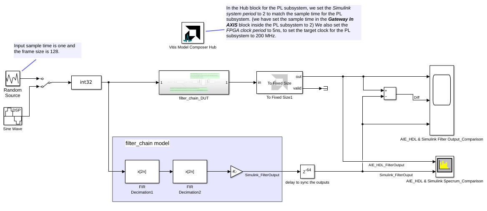

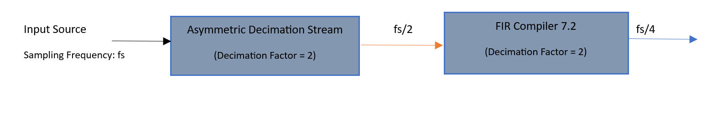

The filter chain is designed to achieve overall decimation factor 4.

Input Sampling Frequency: 1 Hz

Expected Output Sampling Frequency: 1/4 = 250 mHz

### Vitis Model Composer Hub Block Settings:

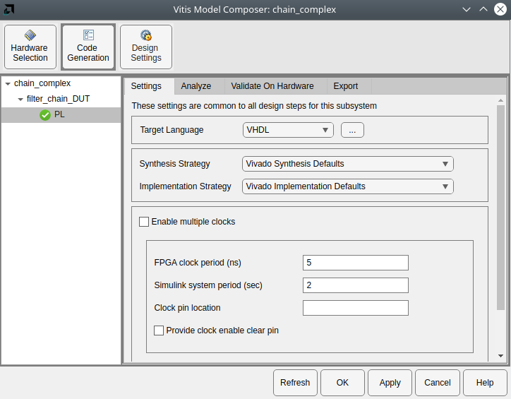

(1) Double-click on the Model Composer Hub block.

(2) Select "Code Generation".

(3) Select the PL subsystem.

(4) Select the "Settings" tab.

(5) Enter the period for both the FPGA and Simulink clocks.  Note that the FPGA clock period is in nanoseconds, while the Simulink period is in seconds.

(6) Set the FPGA clock period to 5ns, to set the target clock for the PL subsystem to 200 MHz. 

(7) Set the Simulink system period to 2 to match the input sample time for the PL subsystem.

(8) Select "OK" when done.

### Input Source:

Two simulation sources generate stimulus for simulation. A manual switch toggles between a random signal source and a sinusoidal signal.

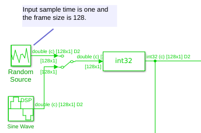

#### Random Source Settings:

Random Source with sample period 1 second and vector size is 128.

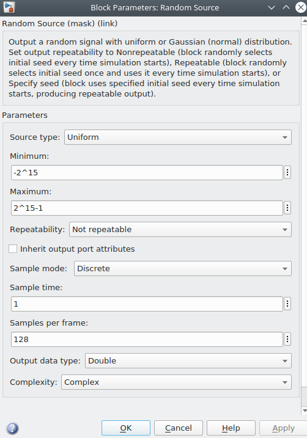

#### Sinusoidal Signal Settings:

Sinusoidal signal with sample period 1 second and vector size is 128.

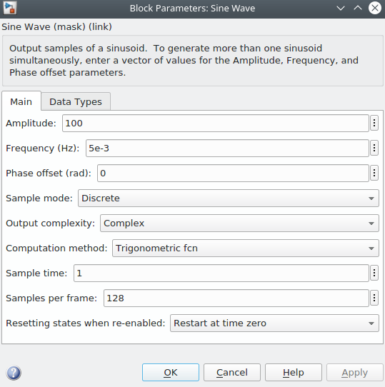

### filter_chain_DUT Subsystem

 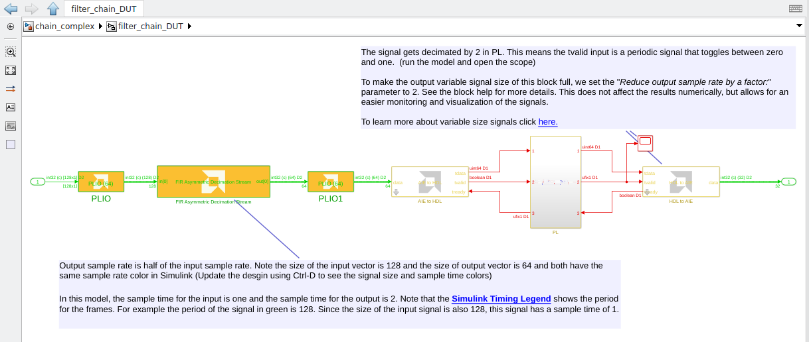

### Asymmetric Decimation Stream Filter Settings

 AI Engine Asymmetric Decimation Stream filter (with decimation factor 2) is placed between input source and PL subsystem.

 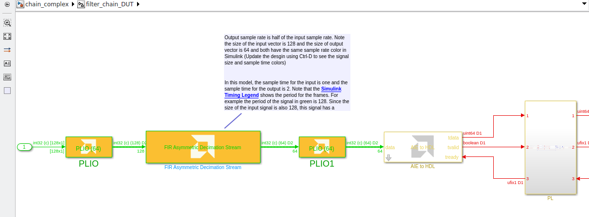

 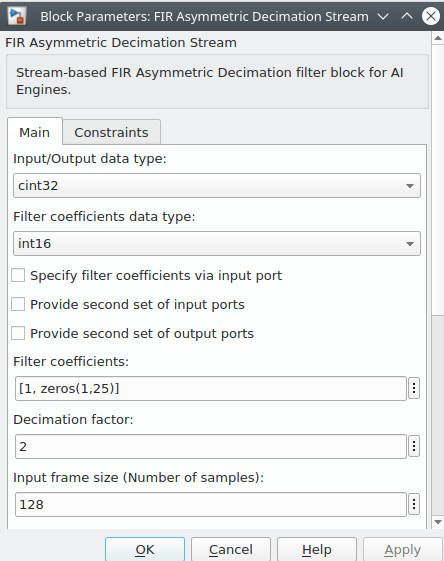

### PL Subsystem

#### Gateway In AXIS block Settings

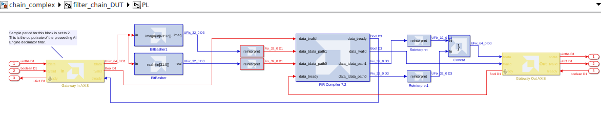

According to above example design, Input Sample Period for PL subsystem = (Input source sample period) * (Decimation Factor of AIE Asymmetric Decimation Stream).

Set the sample time in the Gateway In AXIS block inside the PL subsystem to 2.

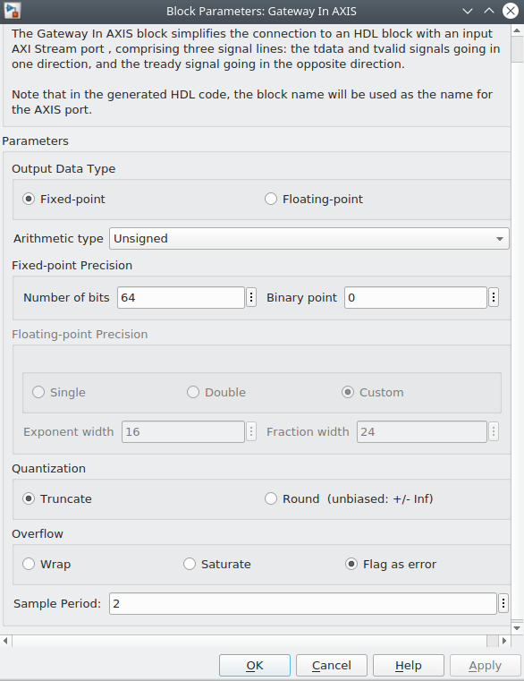

NOTE: In the Hub block for the PL subsystem, we set the Simulink system period to 2 to match the input sample time for the PL subsystem. 

#### FIR COMPILER 7.2 

(1)  FIR Compiler provides AXI4-Stream-compliant interfaces.

(2)  Support for up to 256 sets of coefficients, with 2 to 2048 coefficients per set when handling more than one set.

(3)  Input data and filter coefficients upto 49-bit precision.

(4)  Support for upto 1024 interleaved data channels.

(5)  Interpolation and decimation factors of up to 64 generally and up to 1024 for single channel filters.

#### FIR COMPILER 7.2 Settings to generate high-performance FIR Decimator:

#### Filter Specification Tab

Coefficient Vector : [6,0,-4,-3,5,6,-6,-13,7,44,64,44,7,-13,-6,6,5,-3,-4,0,6]
(User can specify the filter coefficients directly in the GUI). 

Number of Coefficient Sets : 1 (The number of sets of filter coefficients to be implemented).

Filter Type: Decimating FIR

Rate Change Type: Integer 

Interpolation Rate Value: N/A (This field is applicable to the interpolated filter only).

Decimation Rate Value: 2 

Zero Packing Factor : N/A (This field is applicable to the interpolated filter only. The zero packing factor specifies the number of 0s inserted between the coefficient data).

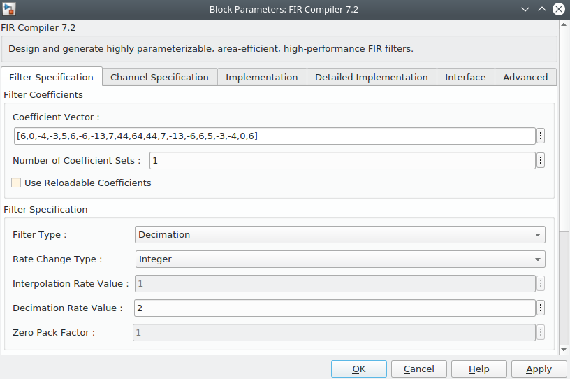

#### Channel Specification Tab

Channel Sequence: Basic

Note: The Basic implementation processes interleaved data channels starting at channel 0 incrementing in steps of 1 to Number of Channels - 1. 
The Advanced implementation can processes interleaved data channels in multiple predefined sequences. 
The desired sequences are specified using the Sequence ID List parameter.

Number of Channels : 1  (The maximum number of interleaved data channels to be processed by the filter).

Sequence ID List: N/A (This field is applicable when advanced channel sequence is selected).

Number Of Paths: 2 

Note: Two paths are selected for complex data, One for In-phase data and another is for quadrature-phase data.

Select Format: Input_Sample_Period

Note: When Input Sample Period is selected, you can specify the number of clock cycles between input samples

Sample Period: 1 (Number of clock cycles between input or output samples).

Note: When the multiple channels have been specified, this value should be the integer number of clock cycles between the time division multiplexed input sample data stream.

Hardware Oversampling Rate : N/A (This field is applicable when Hardware_Oversampling_Rate is selected as a format)

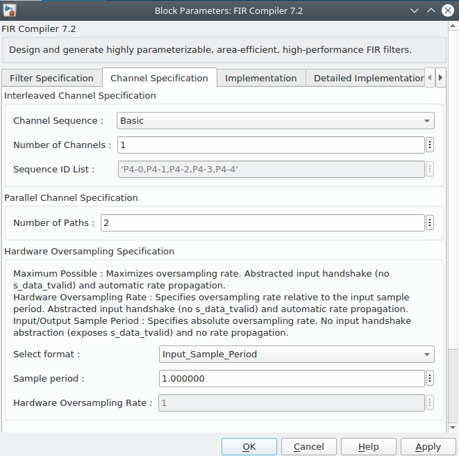

#### Implementation Tab

Coefficient Type: Signed

Quantization: Integer_Coefficients

Note: The Integer Coefficients option is only available when the filter coefficients have been specified using only integer values.

Coefficient Width: 16 bits

Coefficient Fractional Bits: N/A

Coefficient Structure: Inferred

Note: Non-symmetric, Symmetric, Negative Symmetric, Half-band and Hilbert coefficient structures are supported. 
The structure can also be inferred from the coefficients directly (default setting), or specified directly.

Output Rounding Mode: Truncate_LSBs

Note: This mode specifies the type of rounding to be applied to the output of the filter.

Output Width: 32 bits (Filter output bit width, including bit growth).

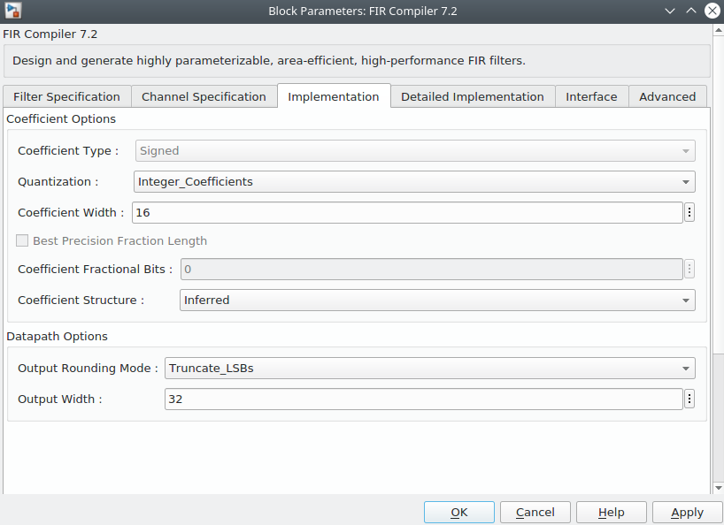

#### Detailed Implementation Tab

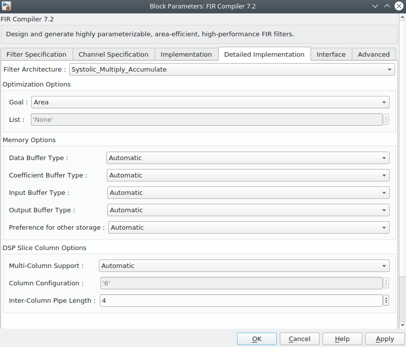

#### Interface Tab

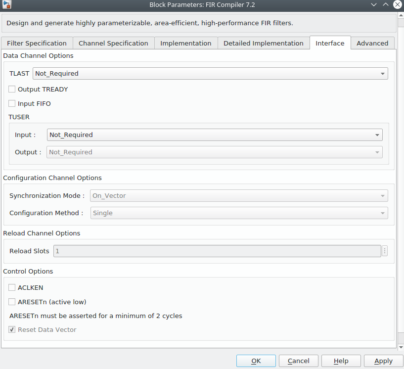

#### Advanced Tab

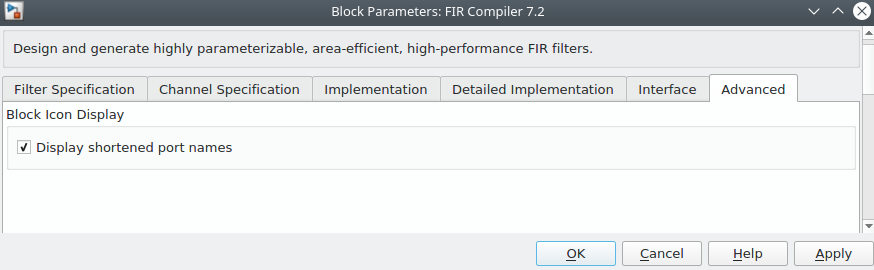

### Simulink Filter Chain Subsystem

Two FIR decimation filters, each with decimation factor 2 are cascaded.

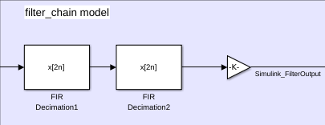

#### FIR Decimation1 block settings

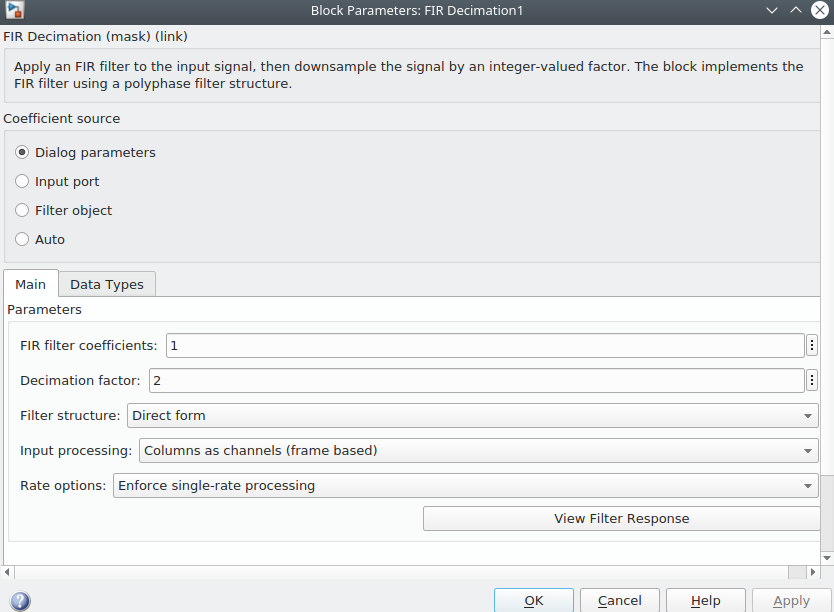

 
#### FIR Decimation2 block settings

### Comparison of AIE-HDL and Simulink Multirate Filter output spectrum when input is complex random source:

#### Observation on Multirate Filter chain output spectrum:

Output Sample Rate: (Input Sample Rate)/(Overall Decimation Factor)

Output Sample Rate = (1 Hz)/(4) = 250 mHz

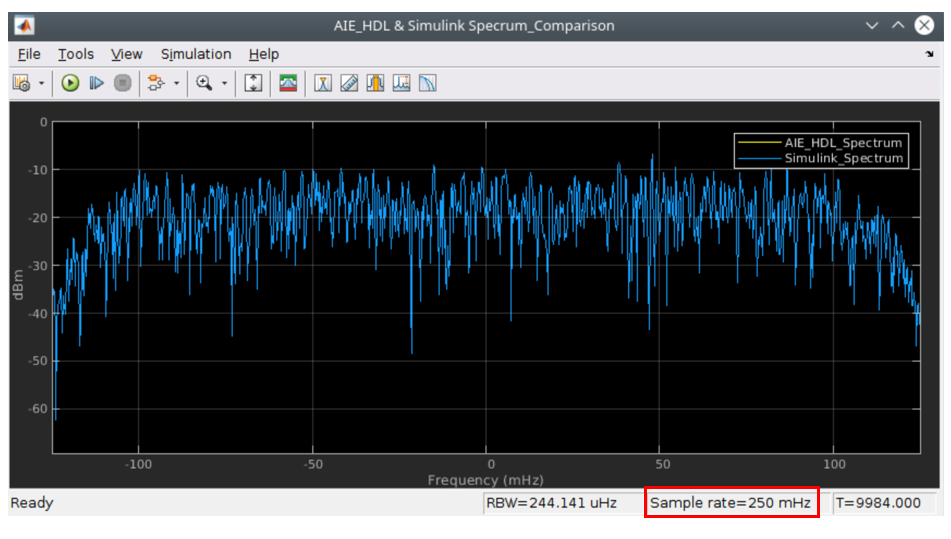

### Comparison of AIE-HDL and Simulink Multirate Filter output spectrum when input is complex sinusoidal signal:

#### Observation on Multirate Filter chain output spectrum:

Output Sample Rate = (1 Hz)/(4) = 250 mHz

Output Signal Frequency = 5 mHz

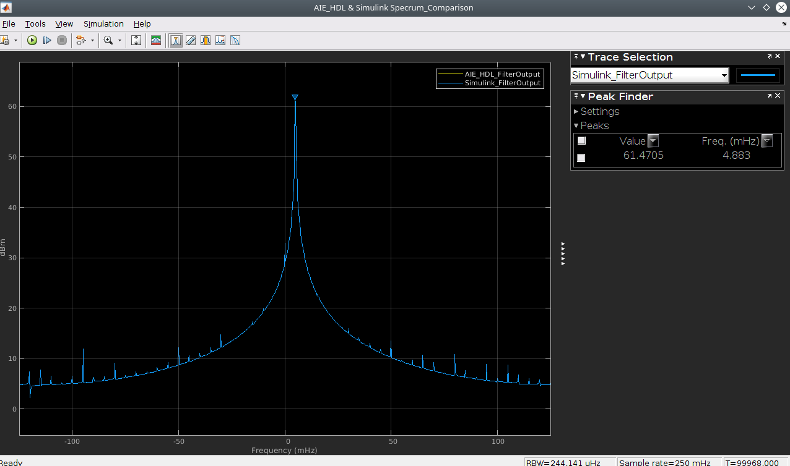

### Comparison of AIE-HDL and Simulink Multirate Filter time-domain data:

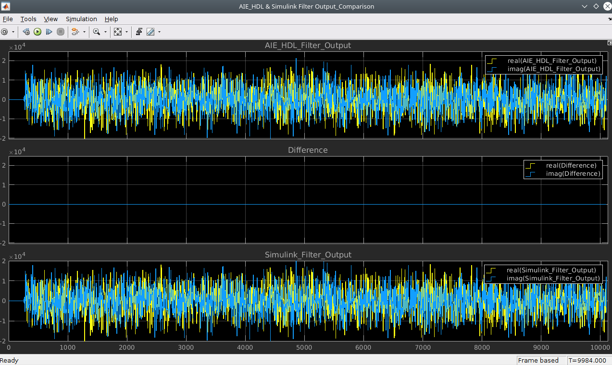

