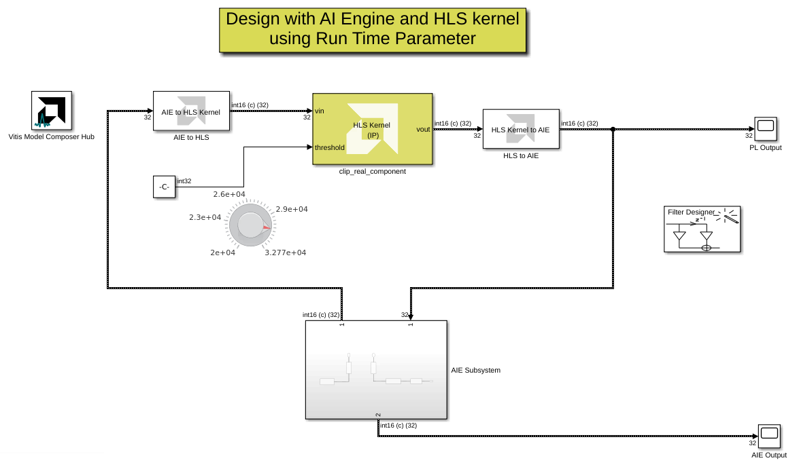

# Cosimulation of AI Engine and Programmable Logic (HLS)

This example showcases a design containing both AI Engine blocks and an HLS Kernel. The HLS Kernel incorporates a run-time parameter (RTP) to set a threshold in the kernel. This parameter can be modified while the model is running.

## Knowledge nuggets
:bulb: Vitis Model Composer supports importing HLS Kernels with run-time parameters.

:bulb: Unlike the other function inputs and outputs, the RTP does not use a streaming interface.

:bulb: The value of the RTP can be modified while the model is running.

-----------

------------
Copyright 2024 Advanced Micro Devices, Inc.

Licensed under the Apache License, Version 2.0 (the "License");
you may not use this file except in compliance with the License.
You may obtain a copy of the License at

    http://www.apache.org/licenses/LICENSE-2.0

Unless required by applicable law or agreed to in writing, software
distributed under the License is distributed on an "AS IS" BASIS,
WITHOUT WARRANTIES OR CONDITIONS OF ANY KIND, either express or implied.
See the License for the specific language governing permissions and
limitations under the License.
