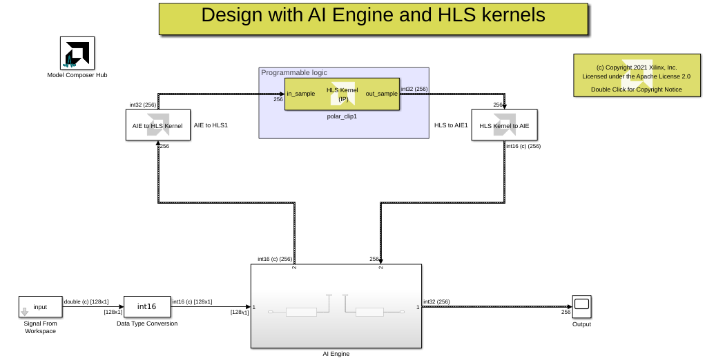

# Cosimulation of AI Engine and Programmable Logic (HLS)
This example showcases a design containing both AI Engine blocks and Programmable Logic (HLS). We are using the *HLS Kernel* block to import an HLS kernel into Vitis Model Composer as a block. To connect the AI Engine blocks to the HLS kernel block, we use the *AIE to HLS* and *HLS to AIE* interface blocks if there is a data type mismatch, otherwise, we can connect the blocks directly (Refer to the example [AIE HLS without interface](../AIE_HLS_without_interface/README.html)). 

## Knowledge nuggets
:bulb: In Vitis Model Composer, you can cosimulate HLS kernels and AI Engine blocks.

:bulb: The argument type for the HLS kernel should be hls::stream. The arguments can also be scalar or vector to model run-time parameter interfaces. 

:bulb: To import an HLS kernel, you need a [header file](./src/hls_kernels.h) to declare the function.

------------
Copyright 2022 Xilinx

Licensed under the Apache License, Version 2.0 (the "License");
you may not use this file except in compliance with the License.
You may obtain a copy of the License at

    http://www.apache.org/licenses/LICENSE-2.0

Unless required by applicable law or agreed to in writing, software
distributed under the License is distributed on an "AS IS" BASIS,
WITHOUT WARRANTIES OR CONDITIONS OF ANY KIND, either express or implied.
See the License for the specific language governing permissions and
limitations under the License.
