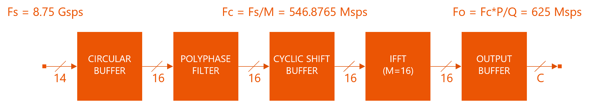
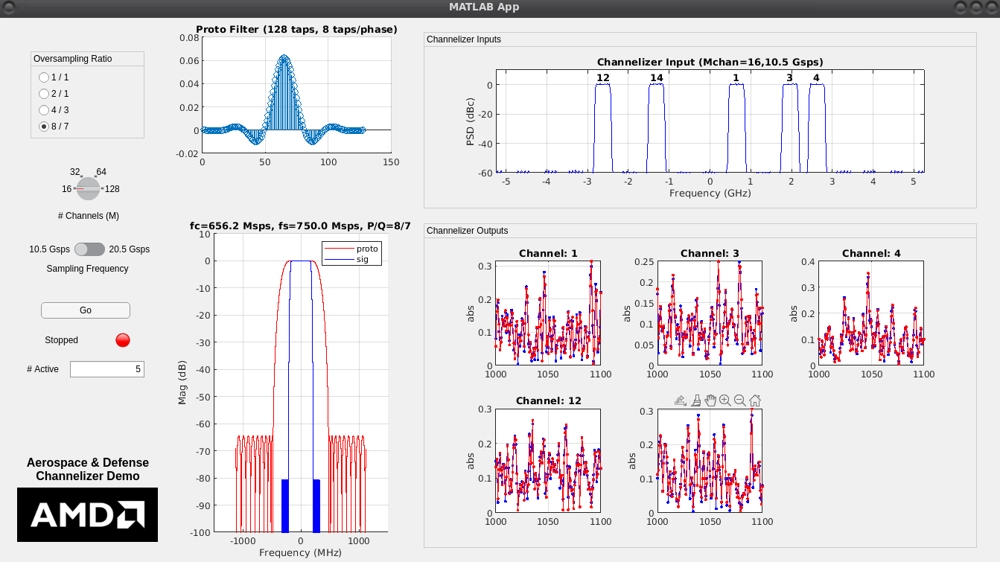
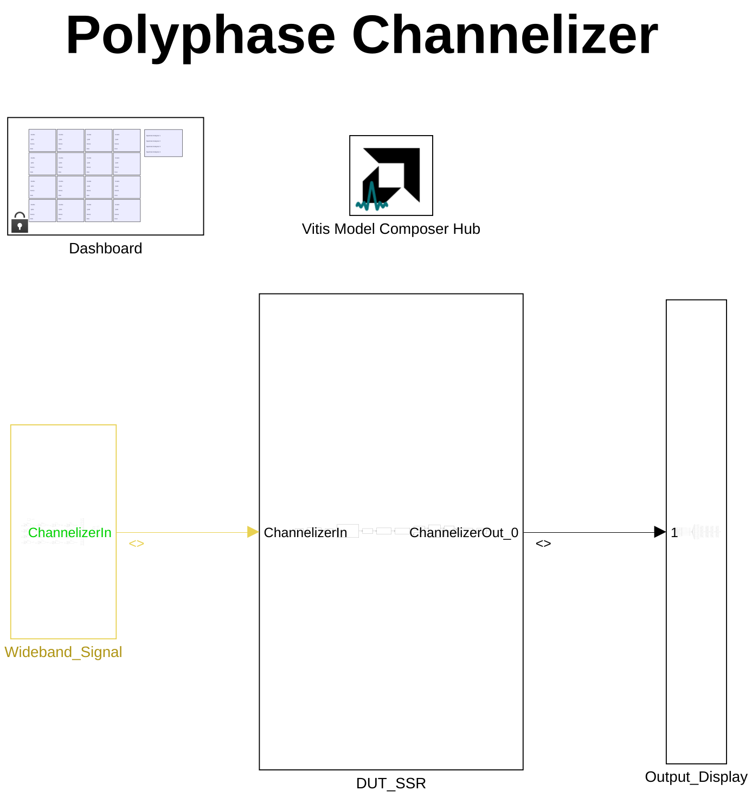
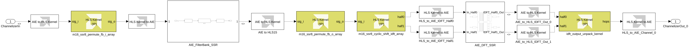
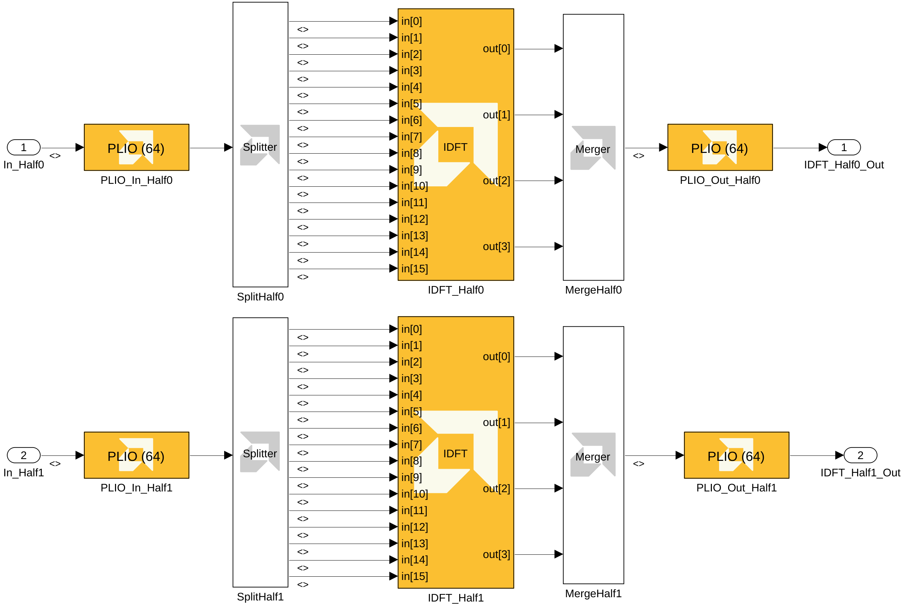
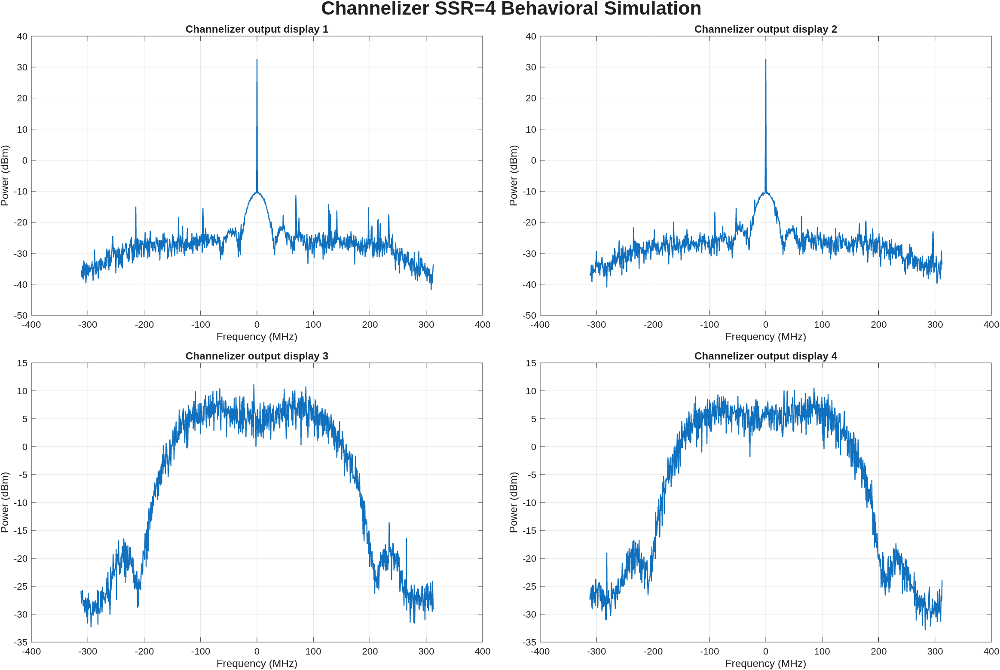
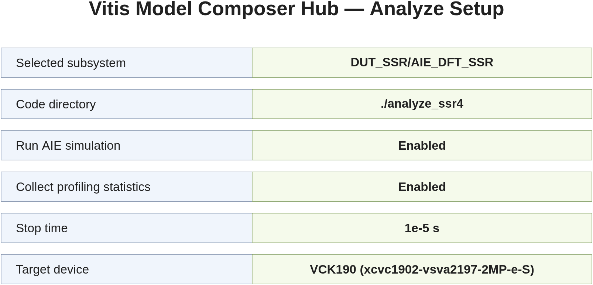
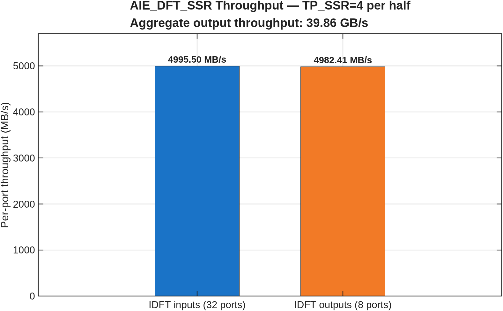

# Polyphase Channelizer

***Version: Vitis Model Composer 2026.2***

## Table of Contents

1. [Introduction](#introduction)
2. [Channelizer Requirements](#channelizer-requirements)
3. [Channelizer Implementation](#channelizer-implementation)
4. [MATLAB Model](#matlab-model)
5. [Simulink Model](#simulink-model)
6. [Functional Verification](#functional-verification)
7. [Estimating Throughput](#estimating-throughput)
8. [Conclusion](#conclusion)

[References](#references)

## Introduction

The polyphase channelizer down-converts a set of frequency-division multiplexed
channels carried in one wideband stream. This example models a high-throughput
implementation that combines AI Engine and programmable-logic (PL) processing
on a Versal adaptive SoC.

The AI Engine filter bank remains an SSR=8 custom kernel. The 16-point inverse
DFT is implemented with two Vitis Model Composer Buffer-IO **IDFT** library
blocks. Each block processes one half of the input sequence with `TP_SSR=4`,
so the complete design produces eight parallel rank streams. PL HLS kernels
pack the IDFT input windows and unpack the rank outputs into channel samples.

## Channelizer Requirements

| Parameter | Value | Units |
|---|---:|---|
| Input sampling rate (Fs) | 8.75 | Gsps |
| Number of channels (M) | 16 | channels |
| Interpolation factor (P) | 8 | n/a |
| Decimation factor (Q) | 7 | n/a |
| Channel bandwidth | 546.875 | MHz |
| Output sampling rate | 625 | Msps |
| Prototype-filter taps per phase (K) | 8 | taps |

The P/Q = 8/7 oversampling ratio produces one 16-channel output hop at
625 MHz. The 128-tap prototype filter contains 16 phases with 8 taps per phase.

## Channelizer Implementation

The channelizer contains four algorithmic stages:

* The **input circular buffer** converts the scalar input stream into the
  parallel sequence required by the polyphase filter and manages the 8/7
  oversampling state.
* The **polyphase filter bank** implements 16 phases with 8 coefficients per
  phase on the AI Engine.
* The **output permute and cyclic shift** kernels restore the required sample
  ordering and create the padded windows consumed by the library IDFT blocks.
* The **IDFT and output unpack** path transforms each 16-sample hop and restores
  the eight output streams used by the channel display.



The detailed implementation in this example differs from the hand-written DFT
used in earlier releases. The library IDFT provides the transform, while HLS
glue preserves the original channelizer stream ordering.

## MATLAB Model

The optional MATLAB app provides a configurable floating-point channelizer
model with a wider range of channel counts, rates, and oversampling ratios than
the fixed Versal implementation.



To run the app:

1. Navigate to the `app` folder.
2. Run `channelizer`.
3. Select the oversampling ratio, channel count, sample frequency, and active
   channels.
4. Click **Go**.

## Simulink Model

1. Open `Channelizer.slx`.
2. Press **Ctrl+D** to update the model and display signal dimensions and data
   types.



The input and output samples are signed 16-bit complex values with 15
fractional bits. The Simulink stimulus is scaled by 2^15 before entering the
fixed-point channelizer, and the channel outputs are scaled by 2^-15 for
display.

3. Open the `DUT_SSR` subsystem.



The processing sequence is:

```
input circular buffer (HLS)
  -> SSR=8 polyphase filter bank (AI Engine)
  -> output permute (HLS)
  -> cyclic-shift and IDFT-window pack (HLS)
  -> split IDFT halves (AI Engine)
  -> IDFT output unpack (HLS)
  -> channel outputs
```

### AI Engine Implementation

The AI Engine portion contains two subsystems:

* `AIE_FilterBank_SSR` imports the custom `polyphase_fir` class kernel with
  SSR=8.
* `AIE_DFT_SSR` contains two Buffer-IO library IDFT blocks.

Open `AIE_DFT_SSR` to inspect the transform architecture.



Each half has the following parameters:

| IDFT parameter | Value |
|---|---:|
| Data and twiddle type | `cint16` |
| `TP_POINT_SIZE` | 16 |
| `TP_NUM_FRAMES` | 256 |
| `TP_CASC_LEN` | 4 |
| `TP_SSR` | 4 |
| API | Buffer IO |

Each IDFT half therefore has 16 input windows (`TP_SSR * TP_CASC_LEN`)
and 4 output rank windows. The splitter fans the packed half-window into the
16 cascade/rank inputs; the merger collects the four rank outputs.

The library input window is 2048 `cint16` samples per lane. The size follows
the library's vector padding:

```
padded frame = ceil(16, 8 * TP_CASC_LEN) = 32 samples
lane window  = 256 frames * 32 / TP_CASC_LEN = 2048 samples
```

Each frame therefore carries four valid samples followed by four zeros on each
input lane. The output also contains four valid bins followed by four padded
zeros per rank and frame; the output-unpack HLS kernel drains those padding
words before processing the next frame.

The matrix PLIO blocks are configured for 64 bits at 625 MHz. During AI Engine
code generation they expand to 16 input PLIOs and 4 output PLIOs per half.

### Programmable Logic Implementation

Four imported HLS kernels implement the PL portion:

1. `m16_ssr8_permute_fb_i_array`: input circular buffer, 7 streams to 8.
2. `m16_ssr8_permute_fb_o_array`: filter-bank output permutation, 8 streams.
3. `m16_ssr8_cshift_idft_array`: cyclic shift and duplication into
   16 lanes for each IDFT half.
4. `idft_output_unpack_kernel`: consumes four rank streams from each half,
   discards padded bins, and restores eight channel-hop streams.

`AIE to HLS` and `HLS to AIE` blocks convert between vectors of four `cint16`
samples and one 128-bit HLS stream word. The IDFT input bridges produce 2048
samples per lane, and the AIE-to-HLS output-size setting is 1024 per half.

## Functional Verification

1. Open the `Dashboard` subsystem in a separate window.
2. Run the model with the default stop time of `1e-5`.
3. Enable or disable channels, QAM modulation, or frequency sweeps.
4. Select the channels displayed by the four spectrum analyzers.



## Estimating Throughput

The model is preconfigured to analyze `DUT_SSR/AIE_DFT_SSR`.

1. Open the **Vitis Model Composer Hub**.
2. Select `AIE_DFT_SSR`.
3. On the **Analyze** tab, enable AI Engine simulation and profiling.
4. Use the relative code directory `./analyze_ssr4`.
5. Click **Analyze**.



The design compiles to 32 active AI Engine cores. The cycle-approximate
AI Engine simulation reports:

| Port group | Count | Per-port throughput | Aggregate |
|---|---:|---:|---:|
| IDFT inputs | 32 | 4995.50 MB/s | 159.86 GB/s |
| IDFT outputs | 8 | 4982.41 MB/s | 39.86 GB/s |



All eight simulator output files match their Simulink reference
files (the generated `.diff` files are empty).

## Conclusion

This example demonstrates:

1. Combined AI Engine and PL/HLS simulation in Vitis Model Composer.
2. An SSR=8 custom AI Engine polyphase filter bank.
3. A two-half 16-point library IDFT using `TP_SSR=4` and
   `TP_CASC_LEN=4` per half.
4. Explicit padded-window packing and output-rank unpacking in HLS.
5. Approximately 39.86 GB/s aggregate IDFT output throughput using eight
   64-bit, 625 MHz PLIOs.

## References

F. J. Harris et al., "[Digital Receivers and Transmitters Using Polyphase
Filter Banks for Wireless Communications](https://ieeexplore.ieee.org/document/1193158)",
*IEEE Transactions on Microwave Theory and Techniques*, Vol. 51, No. 4,
April 2003.

For the original hardware architecture, see the
[Polyphase Channelizer tutorial](https://github.com/Xilinx/Vitis-Tutorials/tree/2026.2/AI_Engine_Development/AIE/Design_Tutorials/04-Polyphase-Channelizer).

---

Copyright (c) 2026 Advanced Micro Devices, Inc.

Licensed under the Apache License, Version 2.0 (the "License");
you may not use this file except in compliance with the License.
You may obtain a copy of the License at

<http://www.apache.org/licenses/LICENSE-2.0>

Unless required by applicable law or agreed to in writing, software
distributed under the License is distributed on an "AS IS" BASIS,
WITHOUT WARRANTIES OR CONDITIONS OF ANY KIND, either express or implied.
See the License for the specific language governing permissions and
limitations under the License.
