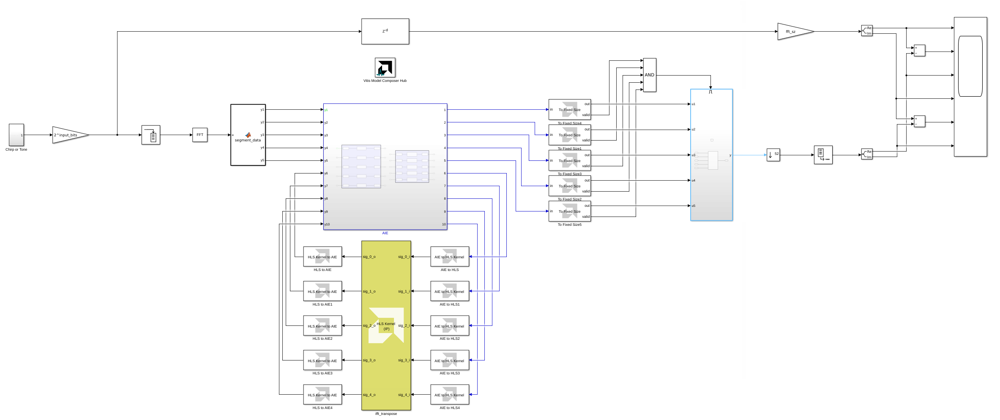
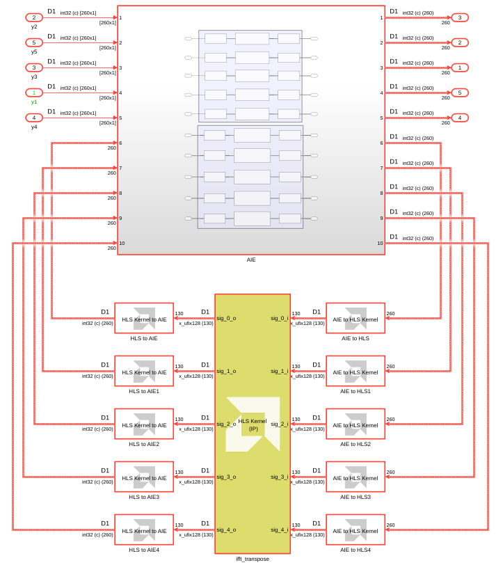
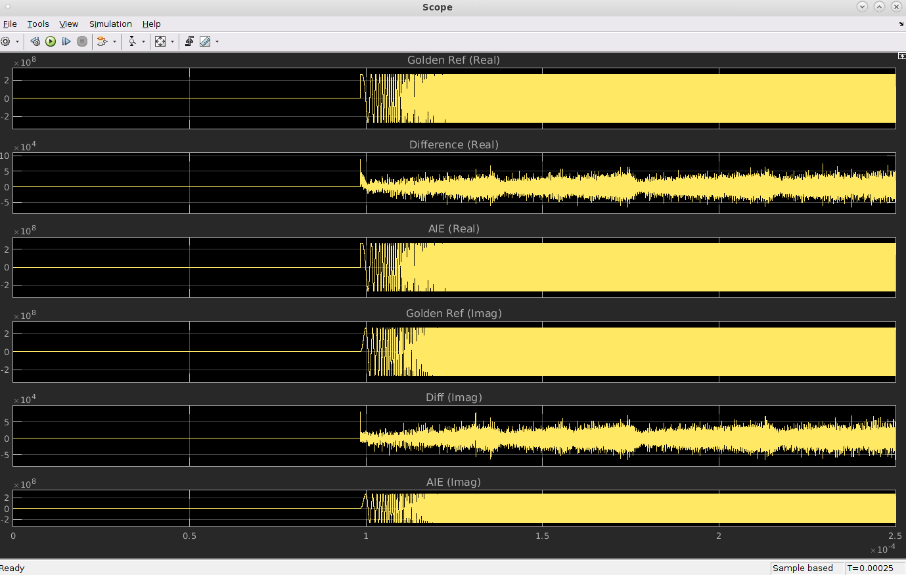

# 64K-Pt IFFT @ 2 Gsps Using a 2D Architecture

This example demonstrates a 2D architecture to implement large point transforms in the SSR > 1 regime: specifically a 64K-pt IFFT @ 2 Gsps.

***Version: Vitis Model Composer 2024.1***

## Introduction

The [Vitis DSP Library](https://docs.xilinx.com/r/en-US/Vitis_Libraries/dsp/index.html) currently implements the Fast Fourier Transform (FFT) using a Stockham algorithm. This algorithm computes the transform using a pair of buffers rather than the more popular in-place Cooley-Tukey approach, and maps more efficiently to the vector/SIMD architecture of the AI Engine. This approach yields excellent results, particularly for `N < 4096` where the processing and storage requirements may be serviced by a single tile. In higher performance cases where sampling rates exceed 1 Gsps (ie. the SSR > 1 regime), this Stockham approach continues to be feasible but leads to an excessive use of tile resources. A more efficient approach is needed for these high throughput use cases. 

A 1D FFT may be implemented on the AI Engine array using a 2D FFT algorithm with higher efficiency overall. This alternative "divide & conquer" approach provides a better solution on the AI Engine array since it is less reliant on "butterfly routing" and we can break large `N` point sizes into much smaller factors of size `sqrt(N)`. This results in a significant reduction in AI Engine tile memory and overall usage of fewer compute tiles. 

The 2D architecture is not new to AI Engine. [XAPP1356](https://docs.xilinx.com/r/en-US/xapp1356-fft-ai-engine) first explored its use several years ago to achieve 3.7 Gsps with 10 AI Engine tiles. In this tutorial, we explore using the 2D architecture to implement large point transforms in the SSR > 1 regime: specifically a 64K-pt IFFT @ 2 Gsps.

## Design Overview

The figure below shows a block diagram of a 64k-point 2D IFFT hardware design implemented in Versal using AI Engines and PL. The design targets a throughput of 2 GSPS.

The IFFT operation is performed by AI Engine kernels, 5 each for each data dimension. The results of the first dimension are transposed by an HLS kernel implemented in PL.

More details on each kernel design, as well as MATLAB models for the same, can be found in the [Vitis-Tutorials](https://github.com/Xilinx/Vitis-Tutorials/tree/2024.1/AI_Engine_Development/AIE/Design_Tutorials/12-IFFT64K-2D) repository.

## Simulink Model

The Simulink model contains a testbench that provides input to the IFFT algorithm and displays the output.

You can use any MATLAB code or Simulink blocks you want to generate input stimulus. In this design, the input consists of a single tone. The input signal is converted to frequency domain (using Simulink's FFT block) before being passed to the IFFT. The output of the IFFT should then be the original signal itself.

The DUT itself consists of the AI Engine design, containing the 10 IFFT kernels, connected to an HLS Kernel. The HLS Kernel performs the transpose operation, as depicted in the block diagram in the Design section above, in the PL.

## Simulation Results

When the model runs, the scope displays the real and imaginary output of the IFFT, which is compared to the original input signal. 

## References

[1]: [Vitis DSP Library](https://docs.xilinx.com/r/en-US/Vitis_Libraries/dsp/index.html)

[2]: [XAPP1356 Block-by-Block Configurable Fast Fourier Transform Implementation on AI Engine](https://docs.xilinx.com/r/en-US/xapp1356-fft-ai-engine)

------------

Copyright (c) 2024 Advanced Micro Devices, Inc.
