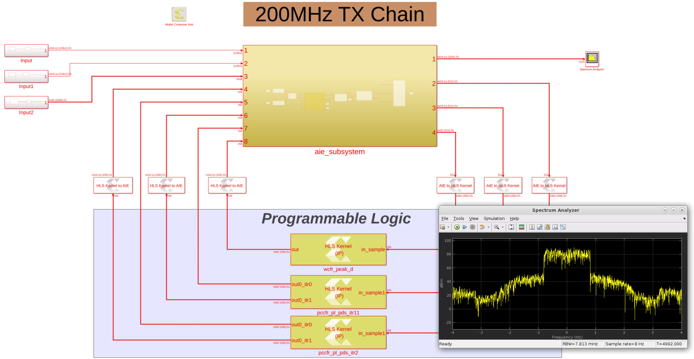

# TX Chain 200MHz
The TX Chain 200 MHz design is a Commslib example which is part of the Communications Library Early Access program. You can explore and analyze this design using the Vitis Model Composer flow.
tes
For more information on accessing the Commslib library and downloading the example, visit the [Versal AI Engine Communication Library Early Access Site](https://www.xilinx.com/member/versal_ai_engine_commslib_ea.html). 

------------
Copyright 2021 Xilinx

Licensed under the Apache License, Version 2.0 (the "License");
you may not use this file except in compliance with the License.
You may obtain a copy of the License at

    http://www.apache.org/licenses/LICENSE-2.0

Unless required by applicable law or agreed to in writing, software
distributed under the License is distributed on an "AS IS" BASIS,
WITHOUT WARRANTIES OR CONDITIONS OF ANY KIND, either express or implied.
See the License for the specific language governing permissions and
limitations under the License.
