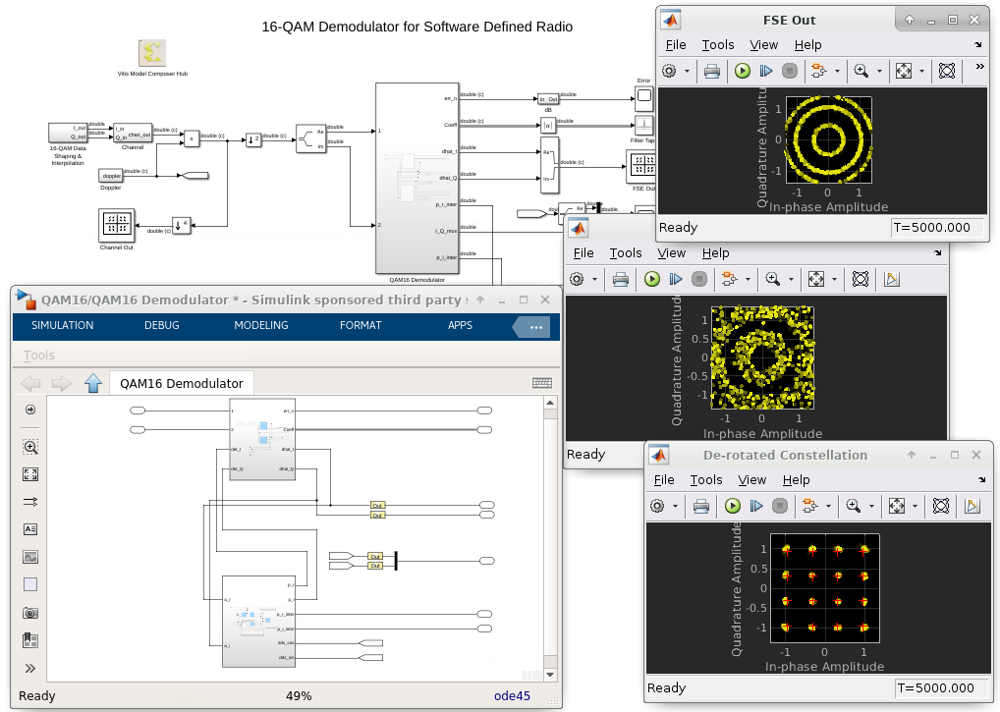

# 16-QAM demodulator

This design implements an equalized 16-QAM demodulator for use in a software defined radio. The receiver architecture provides subsystems that demonstrate adaptive channel equalization and carrier tracking on a random QAM data source.

In addition to the Model Composer HDL demodulator components, the model includes Simulink subsystems that introduce channel effects and Doppler content into the data source. Scopes are provided at important nodes for analysis purposes. The operation of receiver is best illustrated with a long simulation duration, so that the points in the de-rotated constellation have sufficient time to converge.

Additional information on software radios can be found at:

Chris H. Dick, "Design and implementation of high-performance FPGA signal processing datapaths for software-defined radios" VMEbus Systems, August 2001

------------
Copyright 2020 Xilinx

Licensed under the Apache License, Version 2.0 (the "License");
you may not use this file except in compliance with the License.
You may obtain a copy of the License at

    http://www.apache.org/licenses/LICENSE-2.0

Unless required by applicable law or agreed to in writing, software
distributed under the License is distributed on an "AS IS" BASIS,
WITHOUT WARRANTIES OR CONDITIONS OF ANY KIND, either express or implied.
See the License for the specific language governing permissions and
limitations under the License.
