# Digital Upconversion (DUC)

## Introduction

This example demonstrates a Digital Upconversion (DUC) algorithm implemented on Programmable Logic using AMD IP blocks.

See also the [DUC implemented on AI Engine devices](https://github.com/Xilinx/Vitis_Model_Composer/tree/2026.1/Examples/AIENGINE/DSPlib/DUC/README.md).

## Algorithm

The DUC design consists of multi-stage finite impulse rate (FIR) filters, a direct digital synthesizer (DDS) and a mixer. 

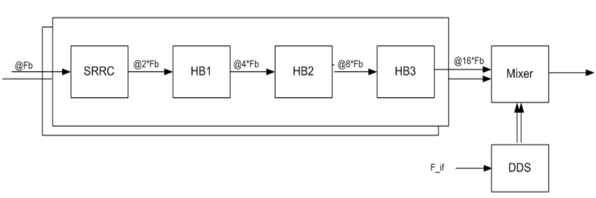 

The DUC specification is as follows:
* 4 stages of FIR filter, with interpolation ratio of 2 in each stage and an overall interpolation ratio of 16.
* The first stage is a 64 tap square raised root cosine (SRRC) filter, and the next three stage filters are half-band (HB) interpolate by 2 FIR filters. 

## Example Model

The example model compares a Simulink implementation of the DUC with an HDL implementation.

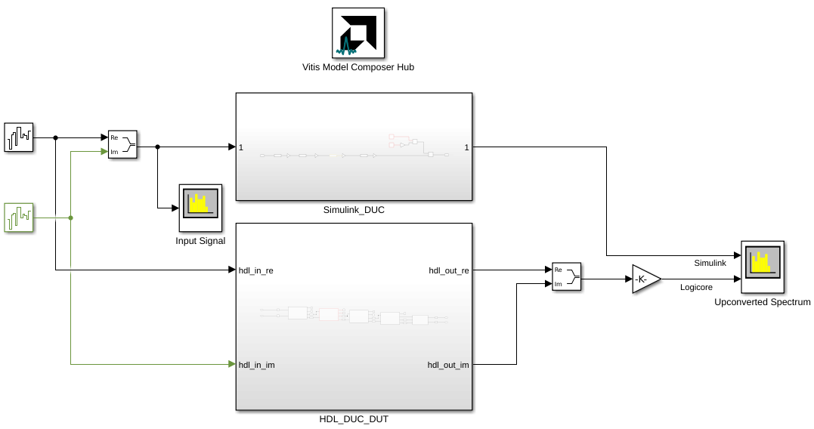 

The input to both designs is white noise with a sample rate of 50 MSPS.

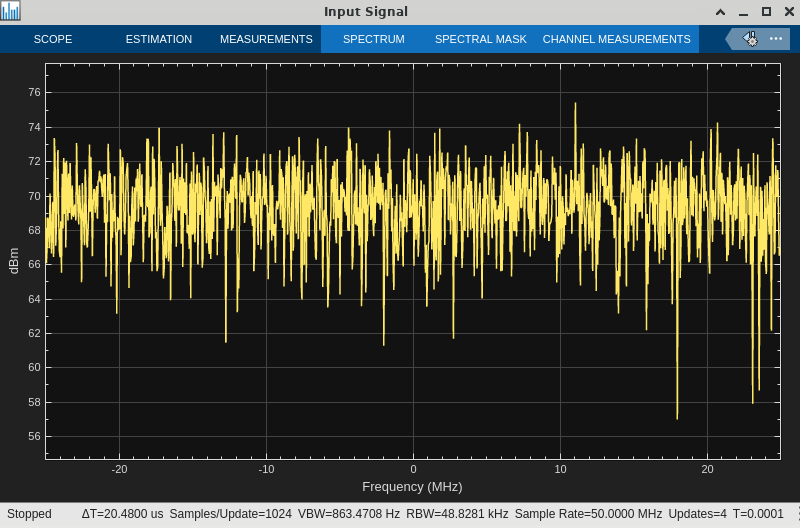 

### Simulink Reference Design

In the reference design, the 4 filter stages are implemented with Simulink's **FIR Interpolation** block.

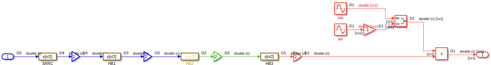 

The **Gain** blocks between each stage control the range of the filter output and ensure that the next stage's filter will not saturate.

### PL DUC Design

The filters in the PL design are implemented using the FIR Compiler block from the **HDL/DSP/AXI-S** library.

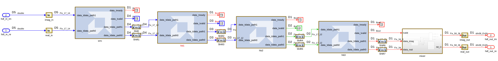 

The **Shift** blocks accomplish what the **Gain** blocks did in the Simulink reference design; they control the range of the filter output and ensure that the next stage's filter will not saturate.

The mixer is implemented using:

* DDS Compiler block to implement a complex sinusoid.
* DSP58 blocks to implement a complex multiply operation. DSP58 is the dedicated DSP element on Versal devices, containing evolved functionality over the DSP48 while maintaining backwards compatibility. In this design, 4 DSP58s are arranged in cascade to achieve high performance and close timing at 800 MHz.

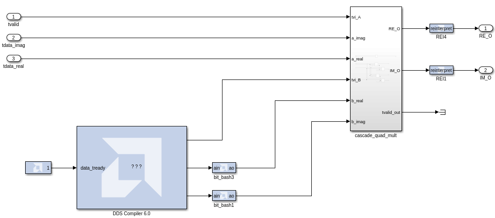 

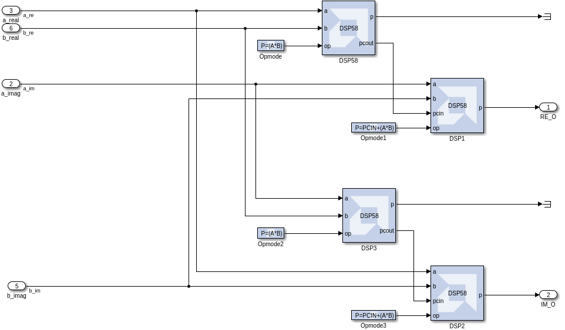 

## Results

### DUC Output

The DUC upconverts the white noise input to center it on 80 MHz with a bandwidth of 50 MHz. The sample rate of the output signal is 800 MSPS. The PL implementation is compared to the Simulink golden reference model. Note the raised noise floor of the PL implementation compared to the Simulink floating-point golden reference.

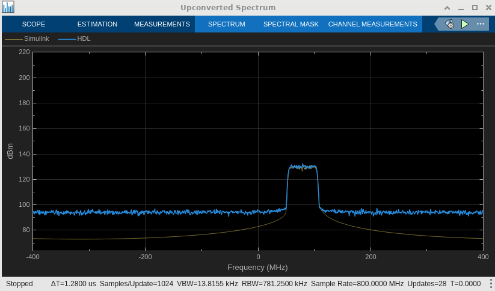 

### Hardware Implementation

In the **Vitis Model Composer Hub** block, the selected hardware is a Versal VCK190 evaluation platform. This board contains a Versal AI Core `xcvc1902-vsva2197-2MP-e-S` part with `-2MP` speed grade.

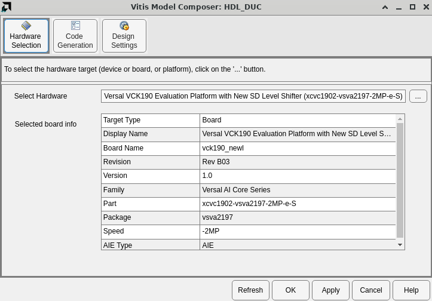 

Also note on the **Code Generation->Settings** tab that the design is configured for an FPGA clock period of 1.25 ns (rate of 800 MHz). This clock constraint will be passed to Vivado for implementation.

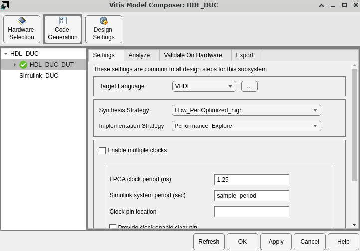 

### Timing Closure

To determine whether or not the design will meet timing, run Timing Analysis from the **Analyze** tab. 

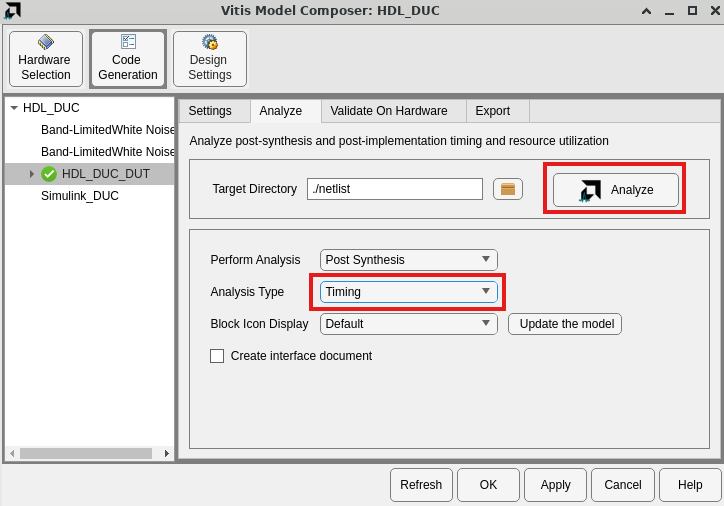 

After running Vivado Synthesis and Implementation, the **Timing Analyzer** window will display the post implementation critical paths of the design.

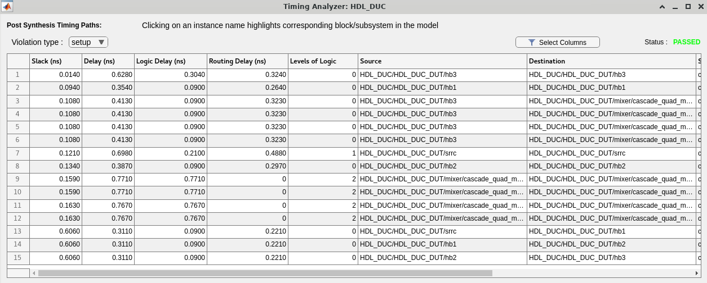 

The analysis indicates the design meets timing at 800 MHz.

### Resource Utilization

To determine the FPGA resources the design will use, run Resource Analysis from the **Analyze** tab. 

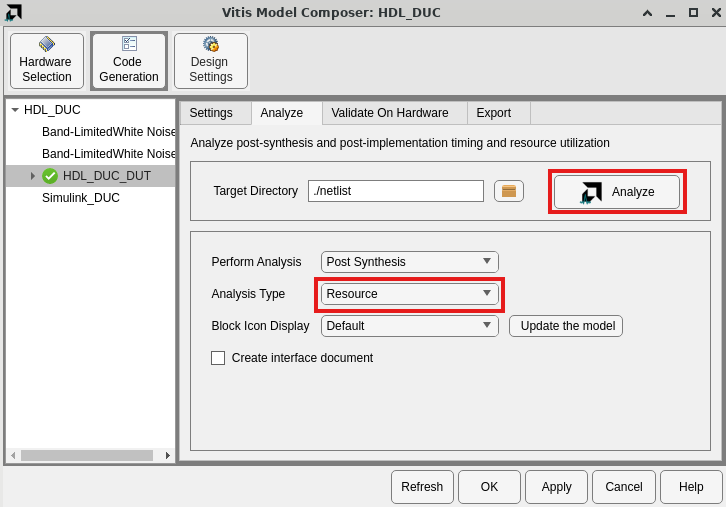 

After running Vivado Synthesis and Implementation, the **Resource Analyzer** window will show the various resources (URAM, BRAM, DSP, LUT, registers) used by each component of the design.

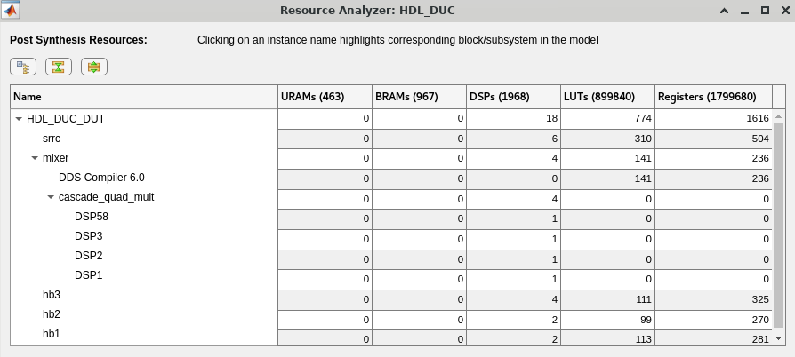 

The architecture (17 bit inputs and 17 bit coefficients) of each filter allows them to map to the dedicated [DSP58](https://docs.amd.com/r/en-US/ug1485-versal-architecture-premium-series-libraries/DSP58) resources in the Versal device. 

## Conclusion

AMD PL IP blocks, accessible in Vitis Model Composer, can be used to implement high performance signal processing algorithms, including Digital Upconversion (DUC). Vitis Model Composer can be used to analyze their timing and resource requirements.

------------
Copyright (c) 2026 Advanced Micro Devices, Inc.