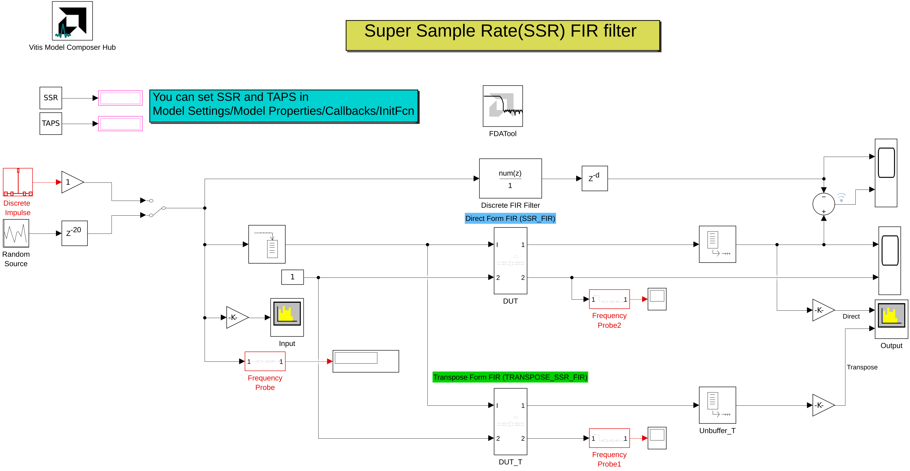

# High Speed SSR FIR — Direct and Transpose Forms

This reference design can be used as a starting design point when efficient implementations of very high data rate (over 1 Gsps) Single Rate FIRs are required. This PL based design can be used in any modern AMD device - 7-Series/UltraScale/UltraScale+/Versal.
<br/><br/>

 <p align="center">
  
</p>

<br/><br/>

The model now contains **two functionally-equivalent FIR architectures side by side**, both driven by the same stimulus. The Direct form is checked sample-by-sample against a golden floating-point reference, and the Direct and Transpose outputs are overlaid in the **Output** spectrum analyzer to confirm the two architectures produce equivalent results (matching to within one LSB):

- **`DUT` – Direct Form** (`SSR_FIR.vhd`): partial products cascade from the first to the last tap through the DSP `PCOUT` chain. The cascade is `TAPS` deep.
- **`DUT_T` – Transpose Form** (`TRANSPOSE_SSR_FIR.vhd`): the input is broadcast to all DSPs and partial sums accumulate stage-by-stage through the DSP `PREG`/`PCOUT` registers. For SSR>1 each of the SSR lanes implements a transposed sub-FIR, so the cascade is only **`TAPS/SSR` deep per lane**.

The two architectures are **functionally equivalent, with outputs agreeing to within one output LSB (2^-16)**. Each form is independently verified against the golden floating-point reference. The two forms have different pipeline latencies (direct = TAPS+2 clocks, transpose = 3×SSR+2 clocks), so the transpose output leads the direct output in time.

To generate code for one architecture, point the **Vitis Model Composer Hub** block's subsystem selection at `DUT` (direct) or `DUT_T` (transpose).

## Why two forms?

The critical path of the direct form grows with `TAPS` (the `PCOUT` cascade), while the transpose form's critical path is one DSP multiply-accumulate that is **independent of `TAPS`**. This lets the transpose form close timing at high `SSR` and large `TAPS` where the direct form's cascade does not.

| Property | **Direct Form** | **Transpose Form** |
|---|---|---|
| SSR range | 1, 2, 4, 8, 16 (2^n) | 1, 2, 4, 8, 16 (2^n) |
| Fmax, Versal (SSR≤4) | ~822 MHz (device ceiling) | ~834–841 MHz |
| Fmax, SSR=8 | ~670–740 MHz | ~834 MHz |
| Latency (SSR>1, NS) | TAPS + 2 | 3×SSR + 2 |
| PCOUT/PREG chain depth | TAPS hops | **TAPS/SSR hops per lane** |
| DSP count, NS | SSR × TAPS | SSR × TAPS |

**Rule of thumb:** use the **direct form** for SSR 2–4 with TAPS ≤ 64 (shorter latency, simplest dataflow); use the **transpose form** for SSR ≥ 8, or for TAPS > 64 at SSR = 4, or whenever a TAPS-independent (short, fixed) latency is required.

## Model configuration

The model is parameterized through `Model Settings → Model Properties → Callbacks → InitFcn`:

```matlab
SSR  = 8;               % clocks per sample — MUST be a power of two (1,2,4,8,16,...)
TAPS = 64;              % number of FIR coefficients
Ts   = 1/SSR;           % input sample time; SSR*Ts must equal the Simulink system period (1)
FCOEFF = fir1(TAPS-1,0.25);  % shared coefficient set (hardware + golden reference)
```

Notes:

- **`SSR` must be a power of two.** Both cores assert this; non-power-of-2 SSR is not supported by the SSR>1 accumulation chain.
- **`Ts = 1/SSR`** keeps the buffered input frame rate aligned with the Vitis Model Composer Hub's Simulink system period so the golden-vs-DUT comparison lines up. Changing `SSR` automatically rescales `Ts`.
- The remaining FIR parameters (input/output/coefficient fixed-point ranges, rounding, symmetry, optional DSP floorplanning) are set on the `SSRFIR` Model Composer block mask inside each DUT.

--------------
Copyright (c) 2026 Advanced Micro Devices, Inc.
