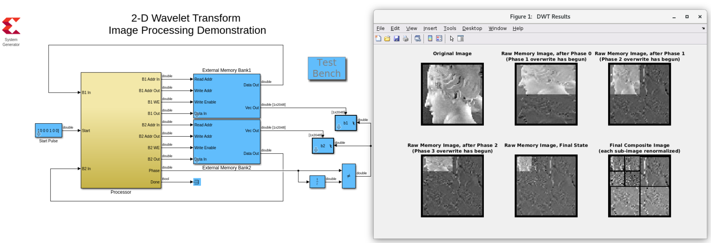

# 2D DWT filter

The test bench for this wavelet design consists of a processor and behavioral models for a pair of external, dual-port memories. The two memories are initialized with the pixel values of a grayscale image. The pixels from the initial image are interleaved into the two banks in a column first indexing strategy. If the image contained a checkerboard of black and white pixels, then all of the black pixels will end up in the one bank, and all of the white pixels in the other. The processor includes a memory controller that schedules the reads and writes to memory, and an image processing filter kernel that computes the 2D DWT decomposition of the image. The processor has been configured to compute two levels of decomposition on a 64 x 64 pixel image. The computation is done "in place" in the single image memory space, and the initial pixel ordering is preserved throughout.

A full color version of the design would easily fit in the same part as only the DWT datapath would require replication (the memory control could remain unchanged).

------------
Copyright 2020 Xilinx

Licensed under the Apache License, Version 2.0 (the "License");
you may not use this file except in compliance with the License.
You may obtain a copy of the License at

    http://www.apache.org/licenses/LICENSE-2.0

Unless required by applicable law or agreed to in writing, software
distributed under the License is distributed on an "AS IS" BASIS,
WITHOUT WARRANTIES OR CONDITIONS OF ANY KIND, either express or implied.
See the License for the specific language governing permissions and
limitations under the License.
