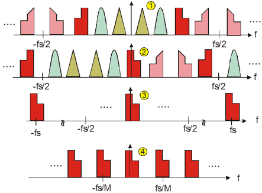
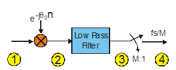
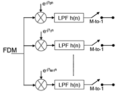
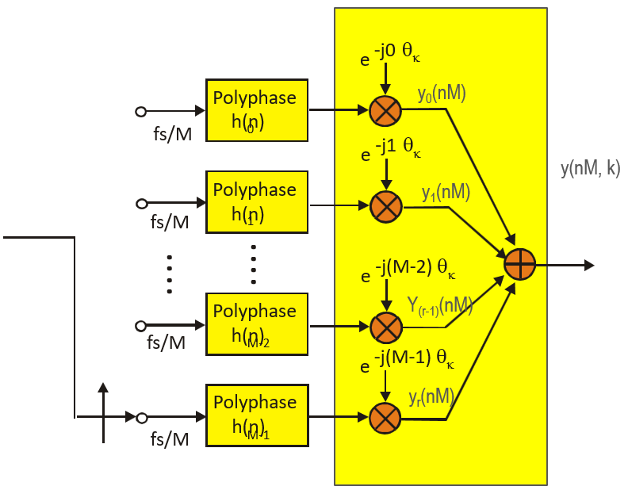
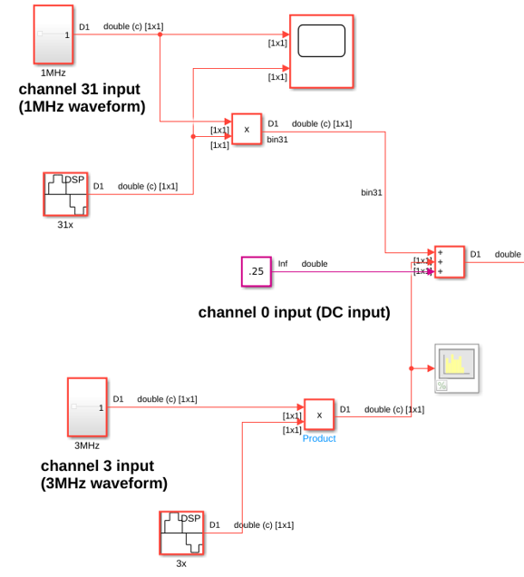
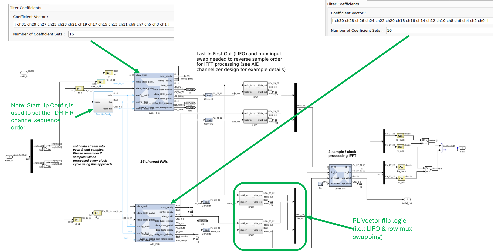
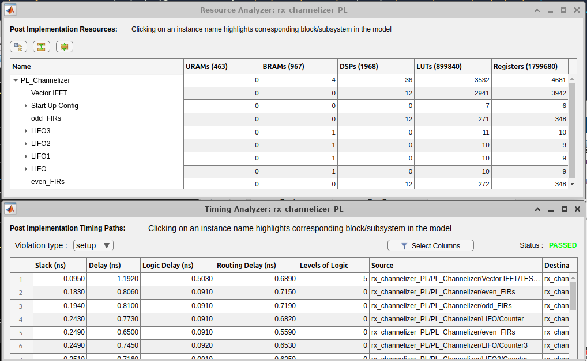
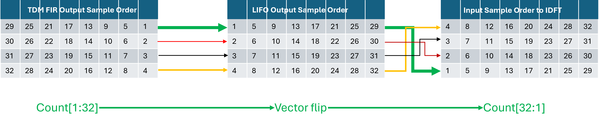

# Polyphase Channelizer – Programmable Logic (PL) Implementation

## Table of Contents
1. [Introduction](#introduction)
2. [General Channelizer Overview](#general-channelizer-overview)
3. [PL Implementation Details](#pl-implementation-details)

## Introduction
This document summarizes the Programmable Logic (PL) implementation of a Polyphase Channelizer that achieves an overall throughput of greater than 1.4 GSPS.

## Channelizer Overview

The channelizer applies a polyphase filter bank approach to perform digital down conversion (DDC) across many frequency-domain multiplexed (FDM) channels simultaneously. Compared to per-channel mixers and multirate decimators, the polyphase structure shares computation, reducing resource cost.

### Digital Down Converter

- Per-channel operations in an FDM receiver: translate to baseband, spectrally shape, and decimate to the channel bandwidth.

- Traditional approach is resource-expensive: a complex mixer (sin/cos and complex multiply) **and** a full multirate decimation chain per channel.

- A polyphase channelizer can reduce cost by factoring the filter and using a DFT stage to separate channels.

### Polyphase Filterbank

- Output is a phase-coherent sum of M polyphase paths; this coherent sum is a DFT of the M path outputs (analogous to beamforming across phases).
- Prototype low-pass filter coefficients are split column-major across M phases, reducing compute.
- Commutator loads phases starting from M−1 down to 0.

## Test Bench 

- Two reference models are created for design debug, verification and validation: 
    1. Simulink single-precision floating-point *golden* model 
    2. Simulink *fine-grain* fixed-point detailed model with coefficient quantization per channel. This enables direct comparison to implementation for debug and validation.

- The input consists of 32 channels sampled at 41 MSPS per channel, for a total input sample rate of 1.312 GSPS.
- Three inputs are used with distinct frequencies to make it easy to verify channel-bin placement: 
    1. DC 
    2. 1 MHz FM swept up to channel 31 
    3. 3 MHz FM swept up to channel 3.

**Note:**
- DC input should only appear in ch0 — if it appears elsewhere, the design has an issue.
- A 6-tap FIR implies some leakage between channels; this is acceptable given the short FIR length.
- Channel locations can be stepped (walking-ones) to verify all channels.

## PL Implementation Details

To process the 1.312 GSPS input stream, we split the design into 2 streams operating at an achievable PL clock rate of 656 MHz. The channelizer's 32 channels are partitioned into 2, 16-channel TDM FIRs.

The design then consists of:
* **FIR TDM** (implemented using the _FIR Compiler_ block)
* **LIFO buffers** to reverse the vector sample order (implemented using _Dual Port RAM_, see [Vector Flip Implementation Example](#vector-flip-implementation-example) below)
* **IDFT** (implemented using the _Vector IFFT_ block)

The design closes timing at 656 MHz:

### Vector Flip Implementation Example

In addition to reversing order (LIFO), **manual row swapping** is required on LIFO output for SSR designs prior to the IDFT. Below shows how the combination of LIFO kernels and swapping the channels (for SSR=4) affects the input to the IDFT.

------------
Copyright (c) 2026 Advanced Micro Devices, Inc.

Licensed under the Apache License, Version 2.0 (the "License");
you may not use this file except in compliance with the License.
You may obtain a copy of the License at

    http://www.apache.org/licenses/LICENSE-2.0

Unless required by applicable law or agreed to in writing, software
distributed under the License is distributed on an "AS IS" BASIS,
WITHOUT WARRANTIES OR CONDITIONS OF ANY KIND, either express or implied.
See the License for the specific language governing permissions and
limitations under the License.
