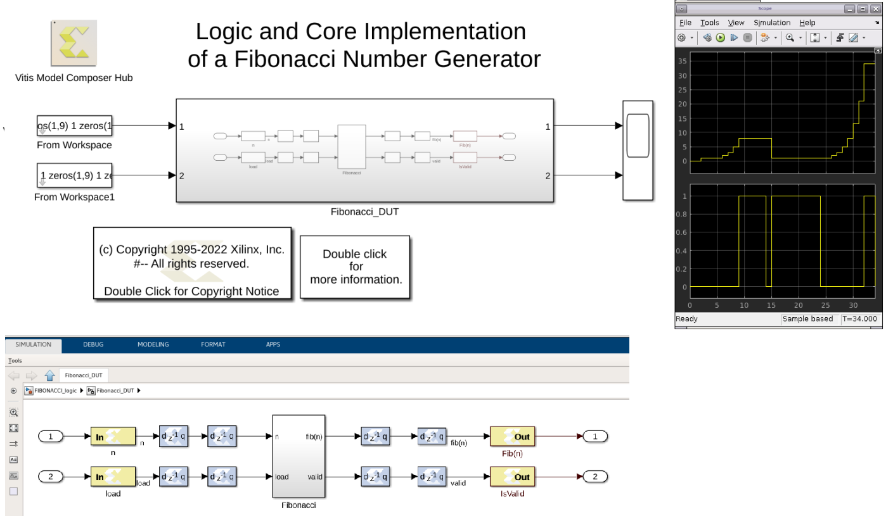

# Logic and Cores Fibonacci Number Generator

This design is a logic and cores implementation of a Fibonacci number generator. That is, given a non-negative integer n, it computes the recursively defined sequence x_0 = 1, x_1 = 1, ... , x_n = x_{n-2} + x_{n-1}.

This design should be compared to sysgenFIBONACCI_synth which implements the same computation in a more software-centric way. The two designs are functionally equivalent, and use the same amount of FPGA resources.

------------
Copyright 2020 Xilinx

Licensed under the Apache License, Version 2.0 (the "License");
you may not use this file except in compliance with the License.
You may obtain a copy of the License at

    http://www.apache.org/licenses/LICENSE-2.0

Unless required by applicable law or agreed to in writing, software
distributed under the License is distributed on an "AS IS" BASIS,
WITHOUT WARRANTIES OR CONDITIONS OF ANY KIND, either express or implied.
See the License for the specific language governing permissions and
limitations under the License.
