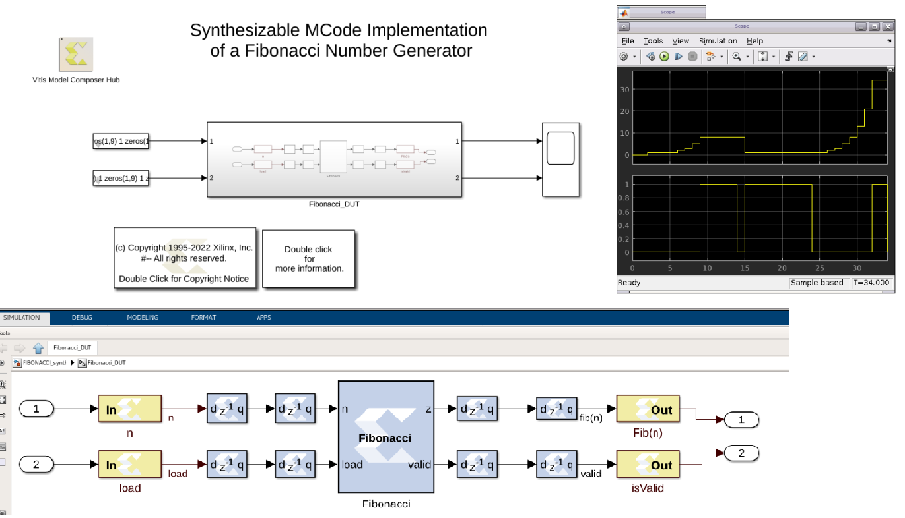

# MCode-Based Fibonacci Number Generator

This design implements a Fibonacci number generator in an MCode block. That is, given a non-negative integer n, it computes the recursively defined sequence x_0 = 1, x_1 = 1, ... , n_n = x_{n-2} + x_{n-1}.

This design should be compared to FIBONACCI_logic which implements the same computation in a more hardware-centric way. The m-code implementing the MCode block is written so as to be as close as possible to the logic in FIBONACCI_logic. It is instructional to look at the m-code to learn how to implement an efficient MCode block.

The two designs are functionally equivalent, and use the same amount of FPGA resources.

For correctness of the design in practice, all the I/O gateways should be double buffered. This design does not do this for simplicity. The comparison of the logic design and the MCode design is simpler without the double buffering.

------------
Copyright 2020 Xilinx

Licensed under the Apache License, Version 2.0 (the "License");
you may not use this file except in compliance with the License.
You may obtain a copy of the License at

    http://www.apache.org/licenses/LICENSE-2.0

Unless required by applicable law or agreed to in writing, software
distributed under the License is distributed on an "AS IS" BASIS,
WITHOUT WARRANTIES OR CONDITIONS OF ANY KIND, either express or implied.
See the License for the specific language governing permissions and
limitations under the License.
