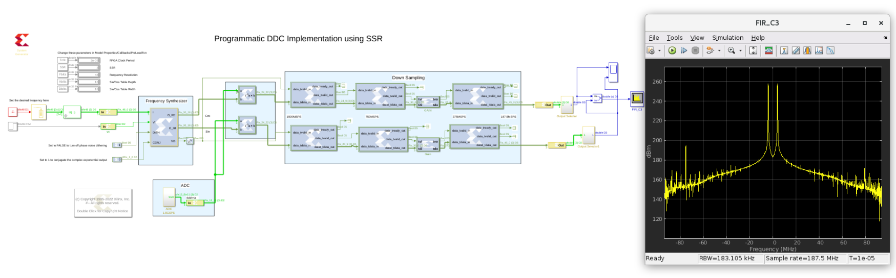

# Programmatic Digital Down converter using SSR

This design implements a digital down converter that reduces the sampling rate of the input signal to match the desired output sampling rate. In this example we go from 1.5GSPS to 187.5MSPS.

There are two steps in this design. The first step is to tune to the desired frequency of interest using the Numerical Controlled Oscillator (NCO) to generate sin and cosine values for the desired output frequency.

The second step is to down sample the data by configuring the FIR (Vector) block as a decimation filter with a decimation value of '2'. Decimation happens in 3 stages, from 1.5GSPS to 750 MSPS to 375MSPS, and finally to 187.5MSPS.

In this case the SSR parameter is set to 3. This lets 3 data samples to process per PL clock cycle. 

------------
Copyright 2020 Xilinx

Licensed under the Apache License, Version 2.0 (the "License");
you may not use this file except in compliance with the License.
You may obtain a copy of the License at

    http://www.apache.org/licenses/LICENSE-2.0

Unless required by applicable law or agreed to in writing, software
distributed under the License is distributed on an "AS IS" BASIS,
WITHOUT WARRANTIES OR CONDITIONS OF ANY KIND, either express or implied.
See the License for the specific language governing permissions and
limitations under the License.
