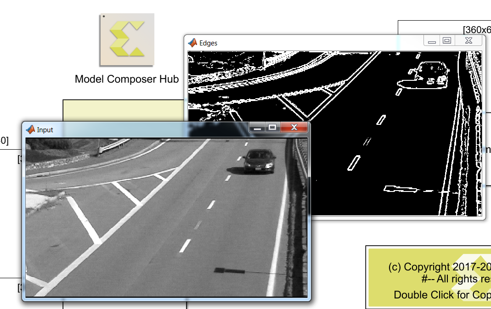

# Sobel Edge Detection
This example demonestrates an implementation of sobel edge detection algorithm in Vitis Model Composer.

This example uses the following MathWorks toolboxes.  
* [MATLAB Computer Vision System Toolbox](https://www.mathworks.com/products/computer-vision.html)  
* [DSP System Toolbox](https://www.mathworks.com/products/dsp-system.html)

Sobel Edge Detection algorithm calculates the gradient of the image intensity in the x and y directions by convolving the image with a separable filter in each direction.

------------
Copyright (c) 2025 Advanced Micro Devices, Inc.

Licensed under the Apache License, Version 2.0 (the "License");
you may not use this file except in compliance with the License.
You may obtain a copy of the License at

    http://www.apache.org/licenses/LICENSE-2.0

Unless required by applicable law or agreed to in writing, software
distributed under the License is distributed on an "AS IS" BASIS,
WITHOUT WARRANTIES OR CONDITIONS OF ANY KIND, either express or implied.
See the License for the specific language governing permissions and
limitations under the License.
