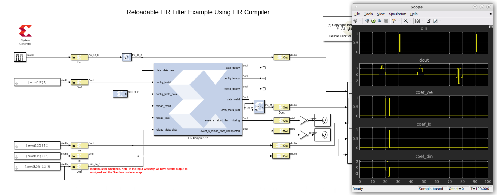

# Reloadable FIR Filter

This example shows how to reload the 5-tap symmetric FIR with the coefficient values of 7 8 9 8 7.

:bulb: The reloadbale filter must be of the same specification and size of the intial filter. For example, if the initial filter is symetric, (for example specified as [1 2 3 2 1] in the filter mask), then the reloadable coffeicients should be [-1 2 -3], if the relaodable filter needs to be [-1 2 -3 2 -1].

------------
Copyright 2020 Xilinx

Licensed under the Apache License, Version 2.0 (the "License");
you may not use this file except in compliance with the License.
You may obtain a copy of the License at

    http://www.apache.org/licenses/LICENSE-2.0

Unless required by applicable law or agreed to in writing, software
distributed under the License is distributed on an "AS IS" BASIS,
WITHOUT WARRANTIES OR CONDITIONS OF ANY KIND, either express or implied.
See the License for the specific language governing permissions and
limitations under the License.
