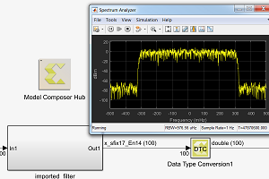

# HLS Examples

## [Color Detection](./color_detection/README.md)

This example demonstrates color detection on an input video.

## [Importing an FIR Filter](./fir_import/README.md)

This example demonstrates porting an FIR filter written in C++ into Model Composer.

## [Examples for importing C/C++ functions](./import_function/README.md)

A set of simple examples demonstrating importing C/C++ functions as custom blocks into Model Composer.

## [Optical_flow](./optical_flow/README.md)

This example demonstrates dense optical flow in Model Composer.

## [Sobel edge detection](./sobel_edge_detection/README.md)

This example demonstrates Sobel edge detection in Model Composer.

## [Video frame rotation](./video_frame_rotation/README.md)

This example demonstrates rotation of video frames in Model Composer.

 
 --------------
Copyright 2020 Xilinx

Licensed under the Apache License, Version 2.0 (the "License");
you may not use this file except in compliance with the License.
You may obtain a copy of the License at

    http://www.apache.org/licenses/LICENSE-2.0

Unless required by applicable law or agreed to in writing, software
distributed under the License is distributed on an "AS IS" BASIS,
WITHOUT WARRANTIES OR CONDITIONS OF ANY KIND, either express or implied.
See the License for the specific language governing permissions and
limitations under the License.
