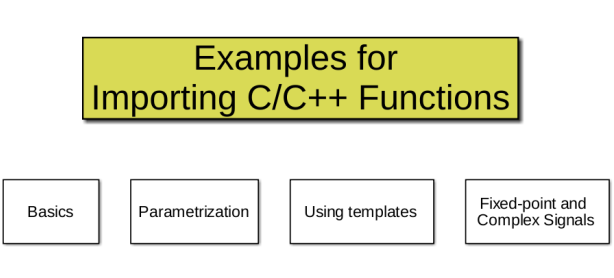

# Import Function feature examples
This is a set of simple examples to demonstrate importing C/C++ functions into Model Composer as a blocks..

## Importing C/C++ code as custom blocks

Model Composer lets you import C or C++ code to create new blocks that can be added to a library for use in models along side other Xilinx Model Composer blocks. This feature lets you build custom block libraries for use in Model Composer. Xilinx Model Composer provides the xmcImportFunction command, for use from the MATLAB command line, to let you specify functions defined in source and header files to import into Model Composer and create Model Composer blocks or block library

## How to use this example?

When you click on the "Open Example" button above, you will find four categories of simple examples. Each category is designed to help you quickly familiarize yourself with the different aspects of importing C/C++ functions into Model Composer. The categories are:

* Basics
* Parametrization
* Using templates
* Fixed-point and Complex signals

Each category has multiple simple examples to help you quickly familiarize yourself with the capabilities of the C/C++ Function Import feature. For each example, you can view the source code associated with the blocks and an import_function.m script that shows the corresponding xmcImportFunction syntax used to create the block.

------------
Copyright 2020 Xilinx

Licensed under the Apache License, Version 2.0 (the "License");
you may not use this file except in compliance with the License.
You may obtain a copy of the License at

    http://www.apache.org/licenses/LICENSE-2.0

Unless required by applicable law or agreed to in writing, software
distributed under the License is distributed on an "AS IS" BASIS,
WITHOUT WARRANTIES OR CONDITIONS OF ANY KIND, either express or implied.
See the License for the specific language governing permissions and
limitations under the License.
