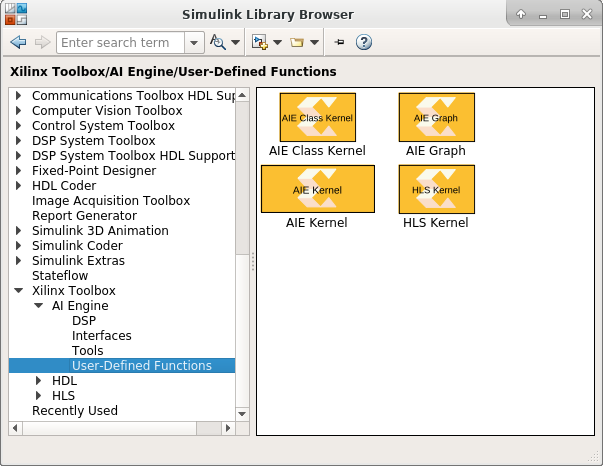

# Importing AIE kernels or graphs into Model Composer
You can import AIE Kernels or graphs into Model Composer as blocks. To do that you can use the blocks in the Simulink library 
browser under Xilinx Toolbox/AI Engine/User-Defined Functions.

## Examples
Here we provide few examples on how to use these blocks to import AIE Kernels or graphs into Model Composer.

- [Importing a kernel class as a block](AIE_Class_Kernel_FIR)
- [Importing a graph as a block](AIE_Graph)

## Knowledge nuggets

:bulb: The Graph import example shown here uses the *.h(header file)* flow. The [matrix_multiply](../DSPlib/matrix_multiply/README.m) example in DSPlib/ directory shows how to import the graph using *.cpp(source file)* flow.

--------------
Copyright 2020 Xilinx

Licensed under the Apache License, Version 2.0 (the "License");
you may not use this file except in compliance with the License.
You may obtain a copy of the License at

    http://www.apache.org/licenses/LICENSE-2.0

Unless required by applicable law or agreed to in writing, software
distributed under the License is distributed on an "AS IS" BASIS,
WITHOUT WARRANTIES OR CONDITIONS OF ANY KIND, either express or implied.
See the License for the specific language governing permissions and
limitations under the License.
