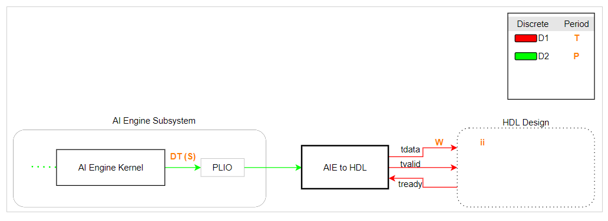
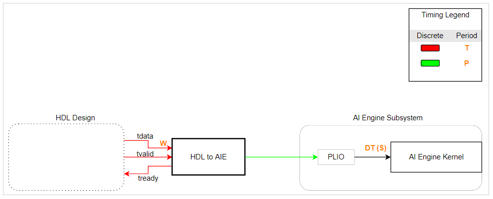

# Connecting AI Engine blocks with HDL blocks
In Vitis Model Composer, simulation of the AI Engine blocks is untimed while the simulation of HDL blocks is timed (cycle accurate). 
If you are simulating a heterogeneous system with both PL (modeled with HDL blocks) and AI Engine, you need to use “AIE to HDL” and “HDL to AIE” blocks to properly 
manage the sampling times across the two domains. This Quick Guide explains how to set these two blocks properly and what to be aware of.

# Setting the AIE to HDL block

The image below depicts the components that are needed to connect an AI Engine subsystem to an HDL desgin. In setting this connection, we should keep few input design criteria in mind and set the parameters of the blocks accordingly. These input design criteria are:

1. In the HDL design, the bit width of the tdata signal line (**W**). This is the bit width of the data in the programmable logic.
1. HDL design sample time (**T**). This sample time determines the target clock rate for which the HDL design will be synthesized.
1. The initilization interval (**ii**) of the HDL design. As mentioned earlier, simulation in HDL domain is cycle accurate. An HDL design may not be ready to accept a new sample at every cycle (the tready signal from the HDL design will be set to zero when the HDL design cannot accept new samples). For example, if an HDL design accepts a new sample every 10 cycles, the design would have an initiation interval of 10. A design that can accept a new sample at every clock cycle has an initiation interval of one.
1. Number of samples in the output of the AI Engine kernel (**S**).
1. Output data type of the AI Engine kernel (**DT**).

Let's set **P** to be the period of the AI Engine subsystem. Note that all the inputs and outputs signals of the AI Engine subsystem must have the same period. Later we will determine a lower limit to **P**.

Also note that the PLIO block is a pass through block and only impacts code generation. 

Keeping the above five input design criteria in mind, we can set the parameters of the blocks accordingly as described below:

## Step 1 Set the PLIO bit width in the PLIO block
Set the PLIO bit width to **W**.

## Step 2 Set parameters of the AIE to HDL block
#### Output Data Type
Set the _Output Data Type_ such that the output bit width is **W**. If **W** is larger than the bit width of the input, the output should be unsigned, or else the output should have the same signedness of the input. Note that the input bit width cannot be larger than **W**. 
#### Output Sample Time
Set the _Ouptut Sample Time_ to **T**. Note that the bit rate into the block is

and the output bit rate of the block is 

 

For the internal buffers of the block not to overflow, the input rate should be less than or equal to the output rate. However, the HDL design has an initialization interval of **ii**. As such,

 

or

# Setting the HDL to AIE block

The image below depicts the components that are needed to connect an HDL design to an AI Engine subsystem. In setting this connection, we should keep few input design criteria in mind and set the parameters of the blocks accordingly. These input design criteria are:

1. The bit width of the tdata signal line (**W**). This is the bit width of the data in programmable logic.
1. HDL design sample time (**T**). This sample time determines the target clock rate for which the HDL design will be synthesized.
1. Input data type to the AI Engine kernel block (**DT**). This is determined by the AI Engine kernel.
1. Number of samples in the input to the AI Engine kernel block (**S**). For an AI Engine kernel with a window input type, this is typically the size of the input window. For an AI Engine kernel with a stream input, this is typically the number of samples the AI Engine kernel consumes at every invocation.
1. The period of all the input and output signals going into or out of the AI Engine subsystem (**P**). All the input and output signals of the AI Engine subsystem must have the same period.

Knowing the five design criteria above we can set the parameters of the blocks accordingly as described below:

## Step 1 Set the PLIO bit width in the PLIO block
Set the PLIO bit width to **W**.

## Step 2 Set parameters of the HDL to AIE block

* Set Output Data Type to **DT**.
* Set Output frame size to **S**.
* Set Output Sample Time to **T** x (bit width of **DT**)/(**W**) if this input is driving the AI Engine Subsystem period or to **P**/**S** if the period of the AI Engine subsystem (**P**) is determined by another input to AI Engine subsystem.
* Set tready Sample Time to **T**

# Examples
In this GitHub repository, you can find several examples in which the AIE to HDL and HDL to AIE blocks are being used:

* <a href="../../Designs/FFT2D/README.md">2D FFT (AI Engines + HDL/HLS) </a>
* <a href="../../AIE_HDL/README.md">Designs with both AI Engine and RTL blocks</a>

--------------
Copyright 2020 Xilinx

Licensed under the Apache License, Version 2.0 (the "License");
you may not use this file except in compliance with the License.
You may obtain a copy of the License at

    http://www.apache.org/licenses/LICENSE-2.0

Unless required by applicable law or agreed to in writing, software
distributed under the License is distributed on an "AS IS" BASIS,
WITHOUT WARRANTIES OR CONDITIONS OF ANY KIND, either express or implied.
See the License for the specific language governing permissions and
limitations under the License.
