# Debugging C/C++ Source Code

This quick guide will show how to debug C/C++ source code that has been imported into a Vitis Model Composer model. We will demonstrate with an AI Engine kernel, but the same process can be followed to debug imported HLS functions or kernels as well.

## Testbench Model and AI Engine Code

1. Open the model **detect_test.slx**.

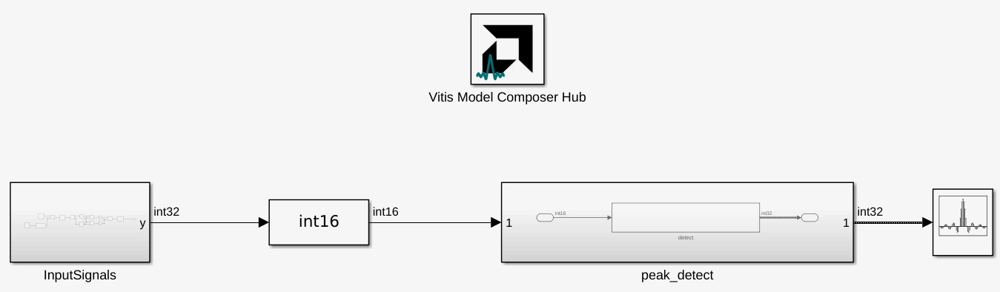

This model is a simple unit testbench for an energy detection algorithm that has been implemented as an AI Engine kernel. 

2. Double-click on the **peak_detect** subsystem to open it.

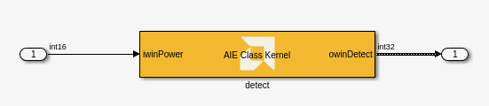

The AI Engine kernel has been brought into Vitis Model Composer using the **AIE Class Kernel** block. The kernel source code can be viewed in the source files `detectSingleWindow.cpp` and `detectSingleWindow.h`.

Now we will simulate the model to see whether the AI Engine kernel produces the desired behavior.

3. On the Simulink toolstrip, click .

This will initialize the simulation and pause it at the first time step (`t=0`). The Array Plot shows the output of the AI Engine kernel.

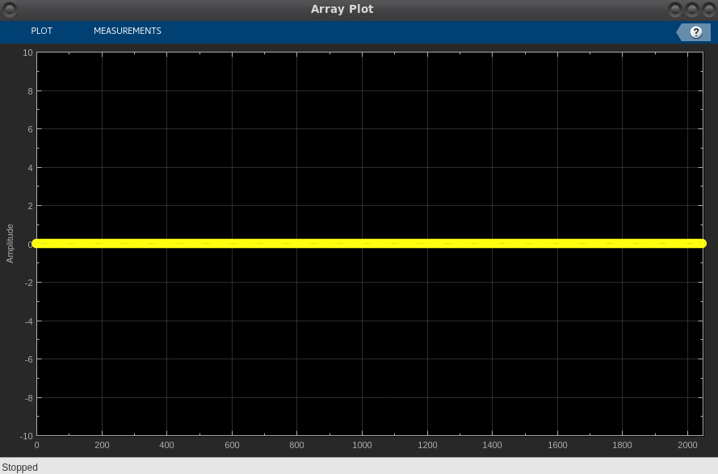

4. Click  several times to move to the next time step of the simulation.

On some of the execution time steps, the AI Engine kernel will appear to produce garbage samples like this:

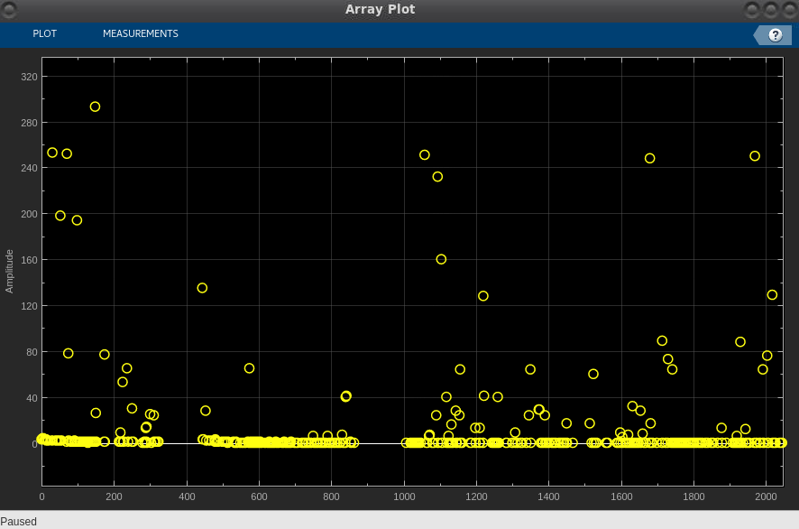 

5. Continue clicking  several times.

Eventually after advancing several more time steps, the AI Engine kernel output will settle into a steady state that looks like below. 

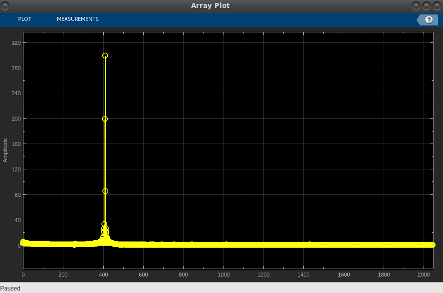 

This is the desired output of the energy detection algorithm.

The odd transient behavior at the beginning of the algorithm execution is what we would like to debug.

6. Stop the model.

## Debugging the Code using GDB

We will use the **gdb** debugger for C/C++ source code to debug the execution of the AI Engine kernel. First, let's look at the source code.

1. Open the source file `detectSingleWindow.cpp`.

The bulk of the AI Engine kernel's processing is contained within a `for` loop:

    for (size_t ctr=0; ctr<NUMSAMPLES/8; ctr++)
        chess_prepare_for_pipelining
        chess_loop_range(NUMSAMPLES/8,)
    {
        pWin = window_readincr_v<8>(iwinPower);
        if (mode)
        {
            mWin0 = *mem0in;
            accWin0.from_vector(mWin0,0);
            accWin0 = aie::add(accWin0, pWin);
            *mem0out = accWin0.to_vector<int32>(0);           
            if (count == 1 && !prevmode)
            {
                mWin1 = *mem1in;
                mWin1 = aie::downshift(mWin1,m_bit_avg);
                window_writeincr(owinDetect, mWin1);
                (*mem1out) = pWinZero;
            }
        } else {
            mWin1 = *mem1in;
            accWin0.from_vector(mWin1,0);
            accWin0 = aie::add(accWin0, pWin);
            *mem1out = accWin0.to_vector<int32>(0);          
            if (count == 1 && !prevmode)
            {
                mWin0 = *mem0in;
                mWin0 = aie::downshift(mWin0,m_bit_avg); 
                window_writeincr(owinDetect, mWin0);
                (*mem0out) = pWinZero;
            }
        }
        mem1out++;
        mem0out++;
        mem0in++;
        mem1in++;
    }

This kernel iterates over frames of 2048 samples, 8 samples at a time, while computing the moving average of the past 32 samples. The output of the kernel is the moving average.

There is also an initialization function that prepares variables for function execution. A `for` loop clears two buffers that will be used for accumulation:

    for (int ctr=0; ctr < NUMSAMPLES/8; ctr++)
    {
        *clearMem0 = pWinZero;
        *clearMem1 = pWinZero;
    }

We would expect the accumulator buffers to be zeroed out at the beginning of execution, so the AI Engine kernel should output all zeros initially. For some reason, this loop is not operating as expected. We can set breakpoints and debug this loop using gdb.

Initialize the **gdb** debugger from within Vitis Model Composer:

2. Type the following in the MATLAB Command Window: `xmcImportFunctionSettings('build','debug')`.

The following output appears in the Command Window:

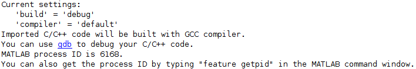

Note the MATLAB process ID; we will need this information later.

3. Click the hyperlink to open **gdb**.

A terminal window will open to the gdb prompt:

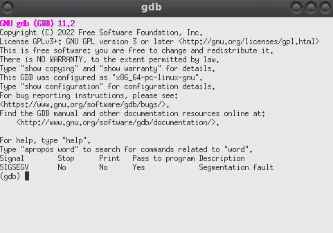

**NOTE:** If the hyperlink doesn't work, execute the following command from any terminal window: `gdb -ex "handle SIGSEGV nostop noprint" -ex "set breakpoint pending on"`.

This guide will show some of the most useful gdb commands, but you may also refer to a [cheat sheet](https://darkdust.net/files/GDB%20Cheat%20Sheet.pdf).

4. Set a breakpoint in the AI Engine code at the beginning of the line `*clearMem0 = pWinZero;` by typing the following command:

    `break detectSingleWindow.cpp:82`

The `break` command has the syntax `break (source file name):(line number)`.

5. Attach gdb to the MATLAB process. In place of (process ID), use the process ID from step 2 above.

    `attach (process ID)`

Once you do this, your MATLAB session will freeze because gdb is now controlling its execution. It may take a moment for the gdb prompt to return.

6. Continue MATLAB's execution by typing `continue` at the gdb prompt.

MATLAB is now responsive. Now that we've added a breakpoint to our AI Engine code and attached the MATLAB process to gdb, we are ready to run the Simulink model.

7. In the `detect_test.slx` model, click **Run**.

After the model compiles but before it begins simulating, the AI Engine kernel's `init` function is invoked. gdb halts execution when the breakpoint is reached.

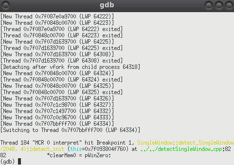

To make debugging easier, we can display the source code alongside the gdb prompt and execution status.

8. Press `Ctrl+X`, followed by 'A'.

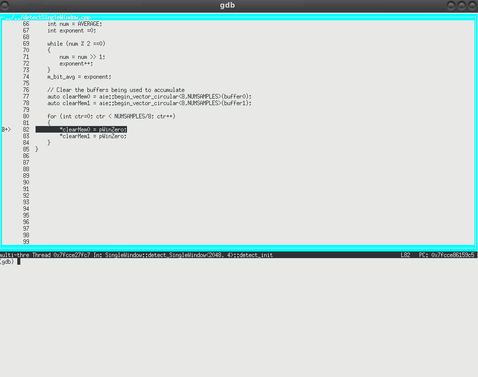

Now we can clearly see where the execution has paused within the code. We can also use gdb to look at variable values, such as the location of the `clearMem0` and `clearMem1` pointers.

9. Type the following commands:

    `display clearMem0`
    `display clearMem1`

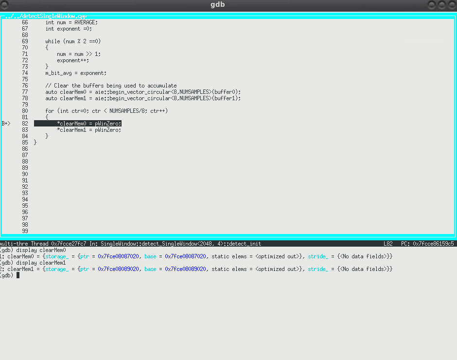

The `display` commands will show the variable values every time you step forward in the execution. We will use the `next` command to step to the next line of the code (without advancing into any subfunctions).

10. Type the `next` command at least 3 times.

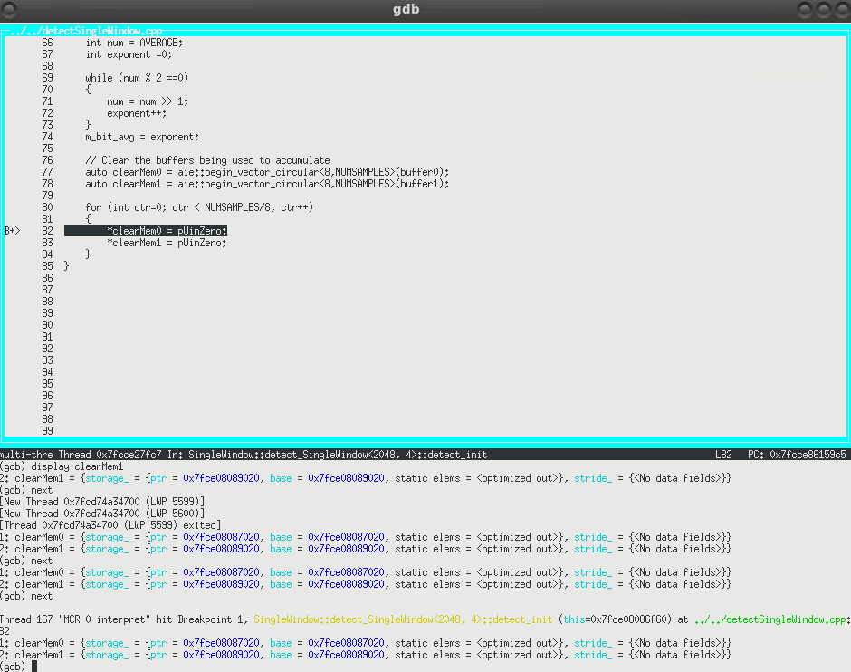

This advances execution through one iteration of the `for` loop. The interesting thing here is that the pointer locations `clearMem0` and `clearMem1` do not change. As a result, this `for` loop will repeatedly write zeros to the first location in each buffer. This is not the intended behavior. We need to iterate (increase) the pointer on each iteration of the loop so that the entire buffer is full of zeros. 

Now that we understand what's wrong with this code, we can exit gdb and fix the code.

11. Type `clear 1` to remove the breakpoint from the code.

12. Type `continue` to allow the Simulink model to finish execution.

13. Type `quit` to exit gdb. Type `y` when asked if you want to detach the process.

## Debugging the Code using Vitis 

1. Run `vmcLaunchVitisDebugger('detect_test')` from the model directory on the MATLAB Command Window.

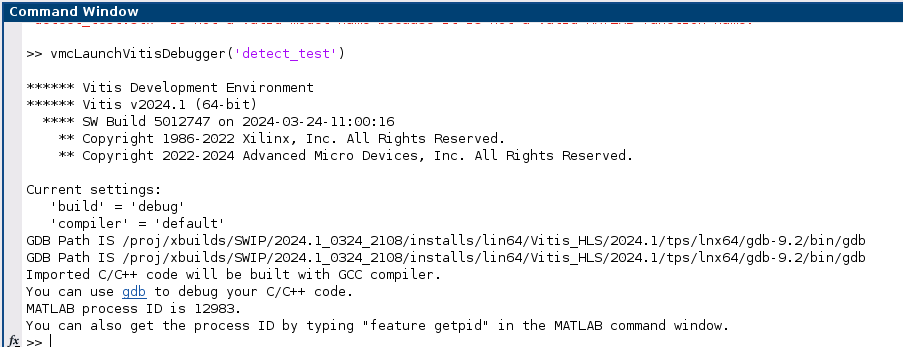

Note the GDB path and the process ID listed in the Command Window. They will be used in Step 5.

`vmcLaunchVitisDebugger` creates the required `.vscode/launch.json` file in the current directory and launches AMD Vitis IDE for debugging AI Engine kernel code.

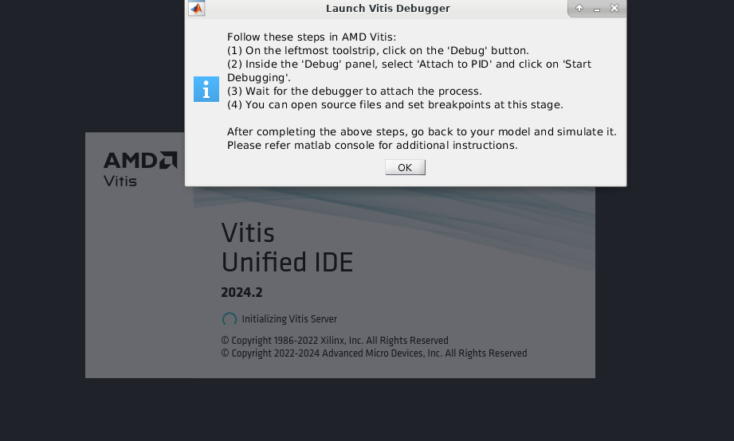

3. Click on the **Debug** icon.

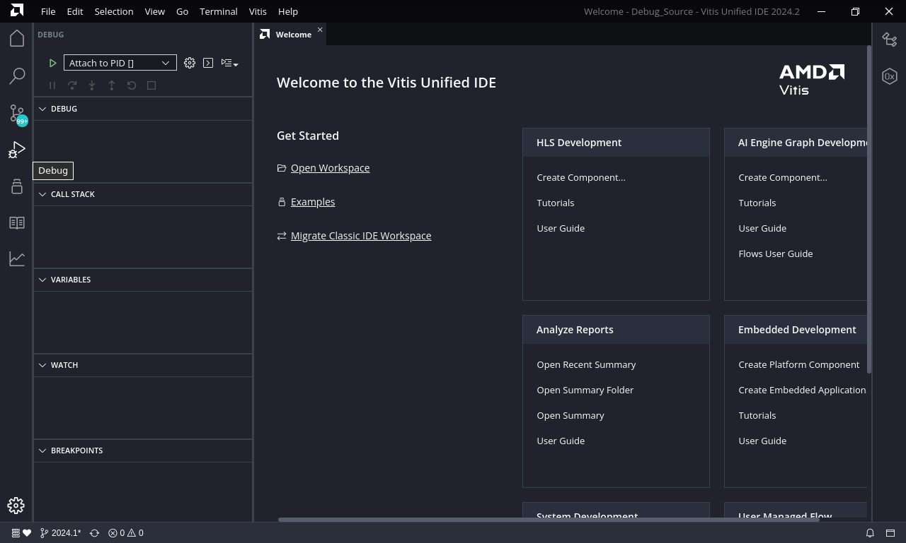

4. Click on the **Settings** icon next to **Attach to PID** to open `launch.json` file.

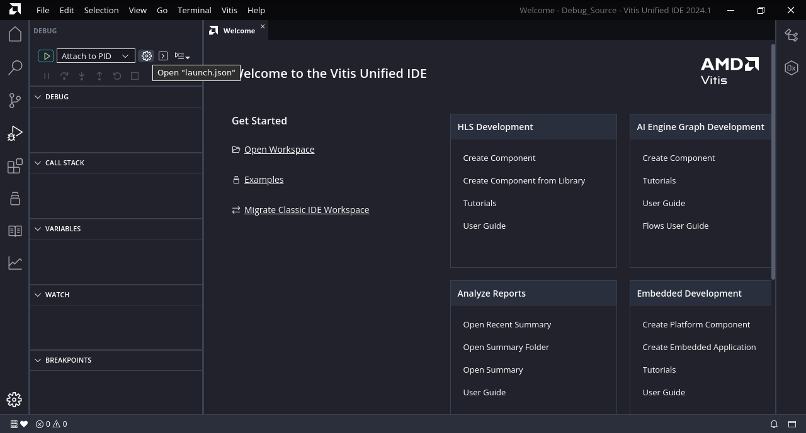

5. Make sure the GDB path and process ID listed in the `launch.json` file are the same as in Step 1. 

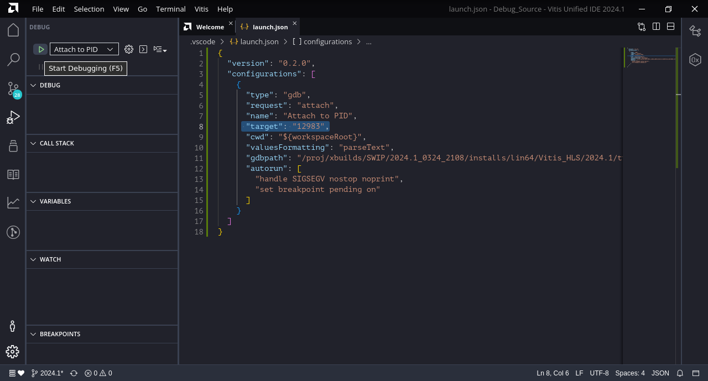

6. Open detectSingleWindow.cpp file and set a break point as shown below.

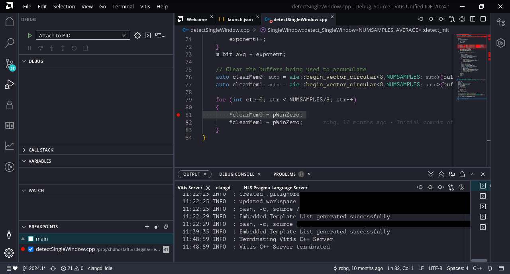

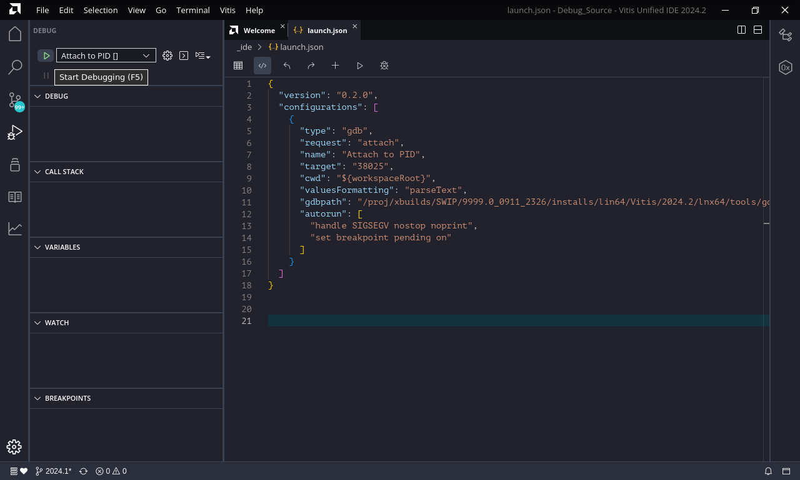

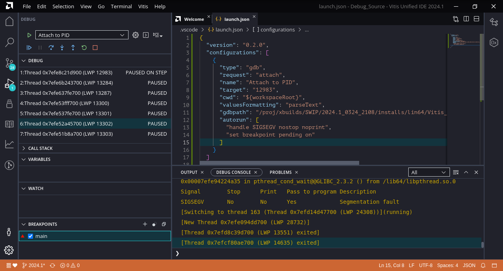

## Fix The Bug

We learned in the previous section that there is a bug in our code that zeros out the 2 accumulator buffers before execution begins. We can fix this error by advancing the memory pointer location on each loop iteration.

1. Add 2 lines to the loop inside `detectSingleWindow.cpp` to increment the pointers as follows:

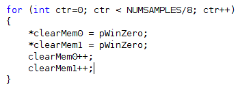

2. Save `detectSingleWindow.cpp`. 

3. Run the `detect_test` model.

The AI Engine kernel is rebuilt with the source code changes. We no longer see the transient behavior in the output signal at the beginning of execution.

## Conclusion

In this example, you saw how to use gdb to debug source code that is running in Vitis Model Composer. This approach can be used with AI Engine and HLS C/C++ code.

--------------
Copyright 2023-2024 Advanced Micro Devices, Inc.

Licensed under the Apache License, Version 2.0 (the "License");
you may not use this file except in compliance with the License.
You may obtain a copy of the License at

    http://www.apache.org/licenses/LICENSE-2.0

Unless required by applicable law or agreed to in writing, software
distributed under the License is distributed on an "AS IS" BASIS,
WITHOUT WARRANTIES OR CONDITIONS OF ANY KIND, either express or implied.
See the License for the specific language governing permissions and
limitations under the License.
