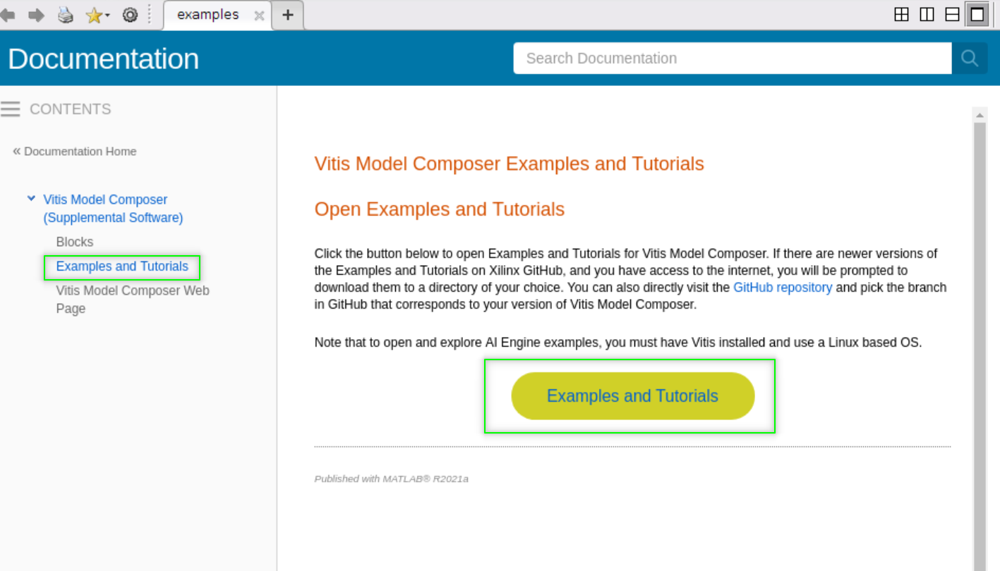

# How to access the examples?

The GitHub repository contains the examples for the latest release of Vitis Model Composer. Examples for the older versions of the product 
are on branches with the same name as the version of the product.

<br/>:warning:**To see the examples for older versions of the tool in GitHub, switch to the branch corresponding to your version of Model Composer by clicking 'main' above**


To get the examples and explore them in Model Composer, use one of the three methods below:

## Directly download the examples from Model Composer
This is the recommended way to get the latest examples for Model Composer. Type 'doc' in the MALTAB command window. In the 'Supplemental Software' section, click on 'Xilinx Model Composer', and then click on 'Model Composer Examples'. This method will automatically get you the right version of the examples.


## Clone this repository
You can directly use git locally to clone this repository or use [MATALB git integration](https://www.mathworks.com/help/simulink/ug/clone-git-repository.html). After you clone this repository, switch the branch to the version of the Model Composer version you have. For example:
```
git checkout 2020.2
```

## Download a zipped version directly from GitHub
First switch to the branch corresponding to the version of Model Composer you have. Then click "Download ZIP".

